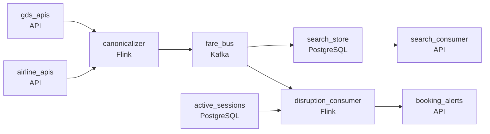

# The Fare Aggregator
_Airfares shift every minute. Catch the best ones._

- **Domain:** pipeline_architecture
- **Difficulty:** Medium
- **Est. time:** 10 min
- **URL:** https://datadriven.io/problems/the_fare_aggregator

## Problem

We aggregate airfares from dozens of airline APIs and global distribution systems, checking 80 billion prices per day to power flight search for 100 million users, but every GDS and direct airline API has a completely different schema (one calls it departure_time, another dep_utc, another sends it as a Unix timestamp). Our prices go stale within seconds during booking surges, so the price shown when a user clicks book has to be the live price rather than a stale cache. Design a pipeline that keeps search fast and fresh across every source and, when a flight is delayed or cancelled, alerts the users already on the booking page for that route before they pay.

**Concepts tested:** `paApiIngestion`, `paBackfill`, `paBatchProcessing`, `paBatchVsStreaming`, `paCompression`, `paDagOrchestration`, `paDeadLetterQueue`, `paDeduplication`, `paEltVsEtl`, `paEventDriven`, `paFullVsIncremental`, `paIdempotency`, `paLambdaArch`, `paMedallion`, `paMicroBatchVsTrue`, `paMonitoring`, `paPartitioning`, `paRetryHandling`, `paSchemaEvolution`, `paSmallFiles`, `paStreamProcessing`

## Requirements

- Users on flight search expect a result within a couple seconds, and the price they see at booking has to be the real price, not a stale cached one.
- Around fifty GDS and airline sources each use their own fields and tax breakdowns; downstream search and booking can't branch on the source.
- When a flight is delayed or cancelled, users actively on the booking page for that route have to be alerted before they pay.

## Must-have components

- Disruption alerts have to reach users with active sessions within roughly a minute, and search prices have to be validated against the live source before booking. Add a streaming layer on the airline status and search-session paths or set SLA Freshness to real-time / < 1min.
- Around fifty sources feed normalisation and a price cache with route-tuned TTLs; without a queue/log tier between sources and the cache there's no fan-in or buffer. Add Kafka, Kinesis, Pub/Sub, or equivalent.

**Expected stages:** `price_cache` → `airline_status` → `itinerary_availability` → `search_sessions`

## Solution walkthrough

### Why this problem exists in real interviews

Aggregating airfares from many GDSs and APIs into one search experience under a couple-second latency, with disruption alerts to users actively on the booking page. The trap is per-source branching downstream of search and treating disruption as a separate batch system that finds out about cancellations after users do.

The default reach is for search and booking to branch on source schema. Each source change ripples through search and booking; the first format change costs a quarter to land. Disruption notifications run in a separate nightly system; users who are actively on the booking page when a flight cancels find out at the airport.

> **Trick to Solving**
>
> Canonical fare shape on the bus, streaming search reads canonical only, disruption events stream to active sessions.
>
> 1. Each source's events normalize to a canonical fare shape on the bus; downstream search and booking read one schema regardless of the source.
> 2. Search reads from a low-latency store fed by the streaming canonicalizer; the price the user sees is fresh, not stale-cached.
> 3. Disruption events ride the same bus and route to a session-aware alert path; users on the booking page for the affected route get notified before they pay.

---

### Walk the requirements

**Step 1: Canonical fare shape on the bus; downstream reads one schema**

Each source's events normalize to a canonical (origin, destination, `departure_time`, fare, taxes, source) shape at ingest; the bus carries canonical events. Search and booking read the canonical shape; a new source adds a normalizer mapping, not a search-or-booking change. A 'branch on source' design is the version where every source change ripples through every consumer; canonical-up-front is what keeps the consumers stable.

**Step 2: Search results within the page's latency budget against fresh prices**

Search queries hit a low-latency store fed by the streaming canonicalizer. The price the user sees is the latest canonical price, not a stale cache; booking confirms against the same store so the price doesn't change between search and book. A request-time aggregation across sources is the version where the page hangs at peak; pre-canonicalized fresh prices in a search-sized store is what makes search feel instant.

**Step 3: Disruption events route to active booking sessions**

When a flight is delayed or cancelled, the airline emits a disruption event onto the bus. A session-aware consumer matches it to users currently on the booking page for the affected route and pushes an alert before they pay. A 'nightly disruption batch' is the version where users find out at the airport; the streaming path matched to active sessions is what makes the alert actionable.

---

### The shape that fits

| node | type | tech | details |
|---|---|---|---|
| gds_apis | source | API |  |
| airline_apis | source | API |  |
| canonicalizer | transform | Flink | slaFreshness: real-time; idempotencyStrategy: upsert |
| fare_bus | queue | Kafka | parallelism: 16 partitions |
| search_store | storage | PostgreSQL | slaFreshness: real-time |
| disruption_consumer | transform | Flink | slaFreshness: real-time |
| active_sessions | storage | PostgreSQL | slaFreshness: real-time |
| search_consumer | consumer | API | slaFreshness: real-time |
| booking_alerts | consumer | API | slaFreshness: real-time |

> **What this design gives up**
>
> The canonical shape requires every source to map at ingest; the search store is sized for query latency at peak which is more expensive than a warehouse; session-aware disruption matching needs active-session state. Implementation cost is the price; the win is search that doesn't branch on source, prices that aren't stale, and disruption alerts that reach users before they pay.

> **What reviewers check**
>
> A reviewer looks at the canvas for these properties:
> - An event bus carries canonical fare events from all sources; search and booking read one schema.
> - A streaming path serves search results within the page's latency budget against fresh prices.
> - Disruption events route to active booking sessions for the affected route within seconds.

> **The mistake that ships**
>
> What gets shipped lets search and booking branch on source schema and runs disruption notifications as a nightly batch. Every source change ripples through every consumer; the first format update costs a quarter. Users on the booking page when a flight cancels find out at the airport. The eventual rebuild adds canonicalization, the search-sized store, and session-aware disruption.

---

- **A new GDS source signs on with a more complex tax breakdown than the canonical shape. What in this design lets it land without changing search or booking?**
  - _Tests whether the candidate sees the canonical shape's tax breakdown either accommodating the new source's structure (additive evolution) or the canonicalizer mapping the new source down to the canonical shape with the extra detail dropped or summarized. Search and booking don't change; the canonicalizer absorbs the difference._
- **Disruption events for a route burst as a major weather event hits. What does this design do, and how does it avoid notifying users twice?**
  - _Tests whether the candidate sees the disruption consumer dedup on (flight, `event_type`) and notify each session once per route per event. Active-session state tracks notified status. Without dedup, users would get repeated notifications and tune them out._
