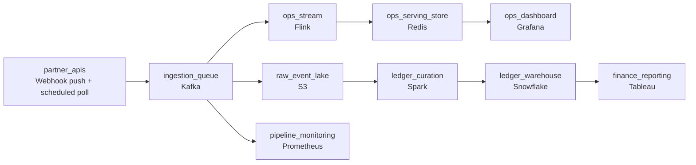

# The Firehose and the Ledger

- **Domain:** pipeline_architecture
- **Difficulty:** Hard
- **Est. time:** 25 min
- **URL:** https://datadriven.io/problems/the_firehose_and_the_ledger

## Problem

We ingest payment events from a few hundred partner APIs, some pushing webhooks and some we poll on a schedule, totaling around 2 billion events a day. Operations needs a near-real-time view of transaction volume and error rates within seconds, while finance needs an exactly-once daily ledger that reconciles to the cent. Partners go down and resend the same events when they recover, so the platform has to retry, deduplicate, and never lose or double-count a transaction.

**Concepts tested:** `paApiIngestion`, `paBatchProcessing`, `paBatchVsStreaming`, `paDataLake`, `paDataQuality`, `paDeadLetterQueue`, `paDeduplication`, `paEventDriven`, `paEventPlatforms`, `paFullVsIncremental`, `paIdempotency`, `paLambdaArch`, `paLateData`, `paMedallion`, `paMonitoring`, `paPartitioning`, `paRetryHandling`, `paStreamProcessing`

## Requirements

- Operations: I need to see transaction volume and error rate per partner within a few seconds, so I can catch a partner going bad before it becomes an incident. I do not care if a count is off by a handful in flight.
- Finance: my daily ledger has to reconcile to the cent. Every settled transaction counted once, no duplicates, no drops, even when a partner resends yesterday's events today.
- Platform: partners drop offline and replay their backlog when they recover. The pipeline must absorb retries and resends without losing or double-counting anything, and let us reprocess a day if our own logic was wrong.
- Platform: a few hundred partner APIs, some webhook push, some scheduled pull. One slow or bursty partner cannot be allowed to back up ingestion for everyone else.

## Must-have components

- Webhook bursts and scheduled polls from a few hundred partners arrive unevenly. Put a durable queue at the front so a partner storm or a slow consumer never drops events; it also decouples ingestion from the two downstream budgets.
- Operations needs volume and error-rate within seconds. Add a stream processor on the real-time path; a batch job cannot deliver a seconds-fresh operational view.
- The operations view is a sub-minute requirement. Mark the serving tier that feeds the ops dashboard as sub-minute freshness so the design states the SLA it is built to.
- Land every raw event from the queue into an immutable lake before any processing. This is the replay source: when the dedup logic or the ledger is wrong, you reprocess from the raw lake rather than re-pulling from partner APIs.
- Finance reconciles the daily ledger to the cent. The curated, exactly-once ledger needs a warehouse the finance team queries, separate from the approximate ops view.
- The exact daily ledger is built by a batch curation job that deduplicates the day's raw events idempotently and writes the reconciled result into the warehouse. Wire a batch stage feeding the warehouse.
- At 2 billion events a day across hundreds of partners you need observability: ingestion lag, dedup rate, per-partner error rates, and queue depth. Add a monitoring component so failures are seen before finance reconciliation catches them.

**Expected stages:** `partner_api_ingestion` → `ingestion_queue` → `raw_event_lake` → `ops_stream_processor` → `ops_serving_store` → `ops_dashboard` → `batch_ledger_curation` → `ledger_warehouse` → `pipeline_monitoring`

## Solution walkthrough

### Why this problem exists in real interviews

This is two correctness budgets fed by one unreliable firehose, dressed up as a platform. Operations wants an approximate view in seconds; finance wants an exact ledger once a day. The trap is the single pipeline that aggregates everything into one table both teams read: too slow to feel live for ops, too approximate to bill on for finance, and the day a partner replays its backlog it double-counts the ledger. The skill probed is whether you split the budgets and put exactness in batch, not the stream.

The other half is the ingestion edge: a few hundred partner APIs, some webhook push, some polled, bursting and failing independently. Read partners directly and one slow partner backs up everyone while a recovering partner's replay floods the system. Those retries and day-late resends are exactly what the design must absorb without dropping or double-counting a cent.

> **Split the budget, don't split the data**
>
> One source, two budgets, decoupled at the edge. A durable queue at the front absorbs webhook bursts and scheduled polls. Every raw arrival lands immutably in the lake first, the replay source, never the partner APIs. Ops reads a streaming path: approximate, sub-minute. Finance reads a batch path: dedup on a stable `transaction_id` over the full day, exactly-once, into the warehouse.

---

### Walk the requirements

**Step 1: Buffer the ingestion edge before processing reads anything**

Webhook pushes and scheduled pulls land in a durable queue first, so one bursty or offline partner is a non-event for everyone else: producers write at their pace, consumers drain at theirs. Read partner APIs straight into the stream and a single partner's recovery backlog stalls the platform during business hours.

**Step 2: Land raw events immutably as the replay source**

Every event is written as-is into the raw lake before any dedup. When your own logic is wrong, reprocess the day from the lake and overwrite the partition. Re-pulling hundreds of rate-limited partner APIs, some of which have aged the data out, is not a recovery plan.

**Step 3: Give ops an approximate, seconds-fresh stream**

A stream processor reads the queue and emits per-partner volume and error rate into a serving store the dashboard reads within seconds. Approximate is the budget: a transaction counted twice for a few seconds during a retry is invisible on a trend line. Put the exact ledger logic here and the view lags until ops stops trusting it.

**Step 4: Make exactness a property of the daily batch, on a stable id**

A batch job reads the day's raw events and deduplicates on the partner-assigned `transaction_id` over the full day, because a resend can arrive a day late. The result is written idempotently into the warehouse: rerun the day, get the same ledger. This is the only place exactly-once holds, because the window is the whole day, not a short streaming window.

---

### The shape that fits

| node | type | tech | details |
|---|---|---|---|
| partner_apis | source | Webhook push + scheduled poll | parallelism: ~300 partners |
| ingestion_queue | queue | Kafka | parallelism: high-partition |
| raw_event_lake | storage | S3 | backfillStrategy: partition_overwrite |
| ops_stream | transform | Flink | slaFreshness: real-time |
| ops_serving_store | storage | Redis | slaFreshness: < 1min |
| ops_dashboard | consumer | Grafana | slaFreshness: < 1min |
| ledger_curation | transform | Spark | backfillStrategy: partition_overwrite; idempotencyStrategy: staging_table |
| ledger_warehouse | storage | Snowflake | slaFreshness: < 24h |
| finance_reporting | consumer | Tableau | slaFreshness: < 24h |
| pipeline_monitoring | transform | Prometheus | monitorAlert: Ingestion lag, queue depth, per-partner error and dedup rate |

| One pipeline both teams read | Two paths, one source |
|---|---|
| A single stream aggregates everything into one table. Ops sees lag because the table carries the heavier exactness logic; finance double-counts a day-late replay because the streaming dedup window is too short. Both teams unhappy, differently. | Ops reads a light streaming path tuned for seconds and approximate counts; finance reads a daily batch that dedups over the whole day and reconciles to the cent. Same raw events feed both; the budgets diverge after the lake. |

> **The daily dedup is the bottleneck, not the stream**
>
> At 2 billion events/day near 600 bytes each, ~1.2 TB/day lands in the lake, peaking ~5x in business hours. Cost concentrates in the queue partitioning that sustains peak ingest and the batch dedup shuffle over a day of events. Keep the stream cheap and approximate; spend the compute where exactness is required.

> **Hot-partner skew starves the dedup**
>
> A few large partners contribute most volume, so partitioning the batch by partner creates hour-long stragglers while the rest finish in minutes, one hot-key stage in the `Spark` UI. Partition by a hash of `transaction_id`, or salt the hot keys, so dedup spreads evenly. Adding executors does nothing; it is a layout problem, not a compute problem.

> **Naming the dedup key and the window out loud**
>
> Say the dedup key and window explicitly: stable `transaction_id`, full day, because resends arrive late. Treat the raw lake as the replay source, not the partner APIs. State that ops is approximate and finance is exact, and that this is why there are two paths. Instrument per-partner error and dedup rate so a bad partner is caught before finance reconciliation is.

---

- **A partner was offline all day and replays 400 million events at 2am, after your daily ledger ran. How does the design produce a correct ledger?**
  - _Tests using the immutable lake plus idempotent `partition_overwrite` to reprocess the day, not patching the warehouse in place or losing late events._
- **Operations now wants per-partner error alerts within 5 seconds, not just a dashboard. What changes?**
  - _Tests pushing alerting onto the streaming path with an alert destination while keeping exact accounting on batch._
- **The daily dedup job has started missing its morning SLA as volume grew. Where do you look first?**
  - _Tests skew diagnosis, lake file layout, and shuffle sizing before reaching for a bigger cluster._
