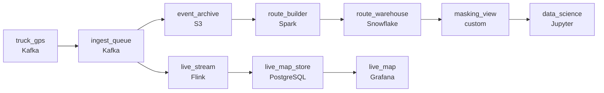

# The Fleet That Never Stops
_Every truck is talking. Not everyone can hear them yet._

- **Domain:** pipeline_architecture
- **Difficulty:** Hard
- **Est. time:** 30 min
- **URL:** https://datadriven.io/problems/the_fleet_that_never_stops

## Problem

We run a large last-mile delivery fleet where every truck streams its GPS location continuously, and operations needs a live map showing each vehicle within seconds of it reporting, plus alerts when telemetry looks anomalous. Trucks routinely drop off the network in tunnels and rural stretches, then reconnect and dump hours of buffered pings at once, and the ingested history still has to come out complete. The data science team needs a clean archive of that history to train route-optimization models, but driver location is treated as personal data, so analytics can see it only masked or aggregated, never as raw coordinates. Design the pipeline.

**Concepts tested:** `paApiIngestion`, `paBatchProcessing`, `paBatchVsStreaming`, `paDagOrchestration`, `paDataLake`, `paDataQuality`, `paDeadLetterQueue`, `paDeduplication`, `paEltVsEtl`, `paEventDriven`, `paEventPlatforms`, `paFullVsIncremental`, `paIdempotency`, `paLateData`, `paMicroBatchVsTrue`, `paMonitoring`, `paPartitioning`, `paRetryHandling`, `paSchemaEvolution`, `paStreamProcessing`

## Requirements

- Operations watches every truck on a live map; a position has to appear there within seconds of the device emitting it.
- Trucks lose connectivity and dump buffered events when they reconnect; the history has to come out complete.
- Driver location is treated as personal data under company policy; data science can't see raw GPS coordinates.

## Must-have components

- Operations needs live truck positions while the analytics team needs hourly batch loads; one shared cadence under-serves one of them. Show at least one streaming path and at least one batch path.
- Multi-terabyte daily archives at retention require cheap cold storage; without a cold-storage tier there's no place to apply lifecycle policies. Add S3, GCS, ADLS, or equivalent.

**Expected stages:** `GPS Device` → `Ingestion Layer` → `Stream Processor` → `Storage Layer` → `Serving Layer`

## Solution walkthrough

### Why this problem exists in real interviews

Live ops dashboards plus an archive for route-optimization training plus a privacy boundary on driver location. Trucks lose connectivity and replay events. The trap is one stream that updates the map and lets data science read raw GPS.

The default reach is one streaming pipeline that writes positions to a map store, with a side write to a warehouse for the data science team. Replayed buffered events from disconnects land as 'now' and the historical route teleports. Data science reads raw lat/long because the masking lives in a downstream view nobody enforces. Privacy review takes a finding.

> **Trick to Solving**
>
> Streaming for the live map, event-time replay for the archive, masked location for data science.
>
> 1. The streaming path serves the live map within seconds; the same events also land in cold storage partitioned by event-time.
> 2. Replayed buffered events sort into the right historical hour; the route history is built off the event-time partitions, not arrival time.
> 3. Data science reads from a masked-location view that exposes coarse cells (or distance-from-stop), not raw GPS.

---

### Walk the requirements

**Step 1: Live map within seconds, archive for the historical truth**

GPS pings flow through a streaming consumer that updates the live map within seconds. The same events also land in cold storage partitioned by event-time. Operations sees vehicles live; data science reads the archive for training. Without two cadences either ops is on a slow path or training is paying streaming compute it doesn't need.

**Step 2: Replayed events sort into the right route by event-time**

When a truck reconnects after a tunnel and dumps buffered events, each event carries the device's event-time. A durable queue holds those buffered pings so nothing is dropped on reconnect, and the archive partitions on event-time. The route-builder for analytics sorts events by event-time before stitching. A truck that buffered an hour of pings replays them and the historical route comes out smooth, not teleporting. Arrival-time-keyed storage with no durable buffer is the version where the route looks wrong; a replayable queue plus event-time partitioning is the contract.

**Step 3: Data science reads masked location, not raw GPS**

Driver location is personal data under company policy. The data science view exposes a coarse spatial cell (or distance-from-stop, or another bucketed feature) rather than raw lat/long. The masking lives in a warehouse view tied to the data science role; raw GPS is restricted to operations. A 'we'll trust people not to query the raw column' approach is what fails the privacy review; the masked view is the contract.

---

### The shape that fits

| node | type | tech | details |
|---|---|---|---|
| truck_gps | source | Kafka | parallelism: 8 partitions |
| ingest_queue | queue | Kafka | slaFreshness: real-time |
| live_stream | transform | Flink | slaFreshness: real-time; idempotencyStrategy: upsert |
| live_map_store | storage | PostgreSQL | slaFreshness: < 1min |
| event_archive | storage | S3 | backfillStrategy: partition_overwrite |
| route_builder | transform | Spark | slaFreshness: < 24h |
| route_warehouse | storage | Snowflake | slaFreshness: < 24h; backfillStrategy: partition_overwrite |
| masking_view | quality_gate | custom | errorAction: alert |
| live_map | consumer | Grafana | slaFreshness: < 1min |
| data_science | consumer | Jupyter | slaFreshness: < 24h |

> **What this design gives up**
>
> Two paths are more pieces than one shared consumer; event-time partitioning means the route-builder waits for a watermark before finalizing routes; the masked view requires a coarsening step and access policies. Implementation cost is the price; the win is a live map that feels live, route history that survives connectivity gaps, and data science training that doesn't expose raw GPS.

> **What reviewers check**
>
> A reviewer looks at the canvas for these properties:
> - A streaming path serves the live map within seconds.
> - A durable buffer or queue retains and replays events so a reconnecting truck's backlog is ingested, and a cold-storage archive holds events partitioned by event-time.
> - Data science reads location through a masked view that doesn't expose raw GPS coordinates.

> **The mistake that ships**
>
> What gets shipped runs one stream into a map store with a side write keyed on arrival. Replayed events from disconnects teleport on the historical route. Data science reads raw GPS because masking lived in a downstream view that nobody enforced. Privacy review takes a finding. The eventual rebuild adds event-time partitioning and the warehouse-enforced masked view.

---

- **A truck buffers events for hours and replays after the `route_builder` has already produced today's routes. What in this design picks them up?**
  - _Tests whether the candidate sees the `route_builder`'s idempotent rebuild on the affected event-time partition: late events land in yesterday's partition and the rebuild for that day produces the corrected route. The route warehouse for that day is replaced._
- **Data science wants to study driver behavior at specific stop locations. What in this design lets them, and what does it not let them see?**
  - _Tests whether the candidate's masked view exposes distance-from-stop or stop-level activity without raw lat/long; the data science role can study behavior without identifying location. Raw GPS stays in the operations-only view._
