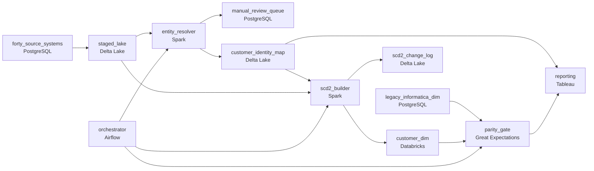

# The Identity Problem
_Old systems. New demands. The same customer appears under three different names._

- **Domain:** pipeline_architecture
- **Difficulty:** Hard
- **Est. time:** 10 min
- **URL:** https://datadriven.io/problems/the_identity_problem

## Problem

Our client has been running an Informatica ETL that populates a customer dimension with SCD Type 2 history for 15 years, but it breaks every time the source schema changes and takes 8 hours to run on a 10M-row table. We need to rewrite it in PySpark on Databricks while keeping the legacy system live during migration. The hardest part: the same customer appears under different IDs in 40 source systems and we need to unify them without losing the historical SCD trail.

**Concepts tested:** `paBackfill`, `paBatchProcessing`, `paDagOrchestration`, `paDataQuality`, `paDeduplication`, `paDependencyMgmt`, `paFullVsIncremental`, `paIdempotency`, `paMonitoring`, `paPartitioning`, `paRetryHandling`, `paScdPipeline`, `paSchemaEvolution`

## Requirements

- Reporting cannot tolerate a customer dimension outage; the new pipeline has to run alongside the legacy one until they match.
- The same customer appears under different identifiers in 40 systems; reporting needs one golden record.
- Reports run on past dates have to show each customer's name, address, and email as they were on that date, not today's.
- Fifteen years of fact tables join to the customer dimension by surrogate key; existing reports can't break overnight.

## Must-have components

- The customer dimension and SCD2 history live in a warehouse / lakehouse; the migration target requires Delta Lake, Snowflake, or equivalent. Add a warehouse / lakehouse tier as the modernized destination.
- The cutover plan runs the new pipeline alongside the legacy one with a daily diff and a parity gate; without an orchestration layer there's nothing to coordinate the dual run, the diff, or the cutover. Add Airflow, Dagster, Prefect, or Composer.

**Expected stages:** `customer_dim` → `customer_identity_map` → `scd2_change_log`

## Solution walkthrough

### What this really is

This is a live migration with an identity merge inside it, dressed up as a PySpark rewrite. Anyone can port Informatica logic to Spark. What separates candidates is proving the new dimension equals the old one before anyone depends on it, while three things quietly change underneath: the customer key, the merge of 40 identities, and the clock that stamps each history row. Treat it as a code rewrite and cutover day hands reporting a dimension with new surrogate keys, merged customers missing their pre-merge history, and past-date reports showing today's addresses. Reporting calls a halt and the migration backs out.

> **Parity is the deliverable, not the new code**
>
> The Spark job is the easy half. The design is the shadow window: both pipelines run nightly, the orchestrator runs a diff, and cutover waits until every differing row is explained. Everything else (identity map, transaction-time history, key mapping) exists so that diff can converge.

### Four decisions, in order

**Step 1: Run both pipelines and gate cutover on a daily diff**

Legacy stays live. Each night the orchestrator builds `customer_dim`, reads the legacy dimension, and runs the parity gate. A non-empty diff alerts; it never flips reporting. Without orchestration owning the dual run, cutover is one engineer's heroics.

**Step 2: Resolve 40 identities into `customer_identity_map`**

Deterministic rules map every source ID to one golden key; uncertain matches go to a manual review queue instead of guessing. Merging unions the per-source histories. 'Merge to latest' throws away the older record's trail, which is exactly what the prompt forbids.

**Step 3: Stamp `valid_from` with source transaction time**

The `scd2_change_log` orders changes by when they happened in the source, not when Spark loaded them. Anchor on load time and every backfill rewrites history: a March report run today shows April's address.

**Step 4: Carry legacy surrogate keys forward**

Fifteen years of facts join on the old key. The identity map also records `legacy_sk` to golden key, so existing joins resolve through it during and after cutover instead of breaking overnight.

| node | type | tech | details |
|---|---|---|---|
| forty_source_systems | source | PostgreSQL |  |
| legacy_informatica_dim | source | PostgreSQL |  |
| orchestrator | transform | Airflow | errorAction: alert; monitorAlert: Daily diff non-empty between new and legacy dimensions |
| staged_lake | storage | Delta Lake | backfillStrategy: partition_overwrite |
| entity_resolver | transform | Spark | idempotencyStrategy: staging_table |
| manual_review_queue | storage | PostgreSQL | monitorAlert: Uncertain merges awaiting review |
| customer_identity_map | storage | Delta Lake |  |
| scd2_builder | transform | Spark | backfillStrategy: partition_overwrite; idempotencyStrategy: upsert |
| scd2_change_log | storage | Delta Lake |  |
| customer_dim | storage | Databricks | slaFreshness: < 24h |
| parity_gate | quality_gate | Great Expectations | errorAction: alert |
| reporting | consumer | Tableau | slaFreshness: < 24h |

> **Shipping after one clean-looking run**
>
> The team runs the new pipeline once, eyeballs it, and points reporting at `customer_dim` on Monday. No diff, no key mapping, `valid_from` set to load time. By Wednesday reports are broken and the rollback costs a quarter.

> **Say 'shadow window' before you say 'Spark'**
>
> The senior tell is opening with how legacy stays live and how parity is proven, then naming transaction-time `valid_from` and the legacy key mapping unprompted. Candidates who start with partitioning the 10M rows are answering the easy question.

> **The price is double compute for weeks**
>
> Two pipelines run in parallel on the same dimension and someone staffs the review queue. That cost buys zero reporting outage, which is the only requirement the business will not trade.

- **After weeks of shadow running a few rows still differ. When is the diff good enough to cut over?**
  - _Tests treating the diff as triage: each row classified as legacy bug, new bug or ambiguous merge, and cutover when every one is explained._
- **A merged golden customer turns out to be two people. How do you split them?**
  - _Tests an un-merge path: new golden keys issued, `customer_identity_map` updated, facts re-resolve through the map._
