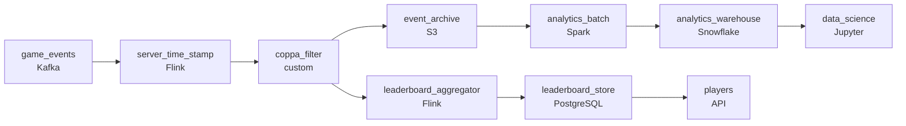

# The Leaderboard That Costs $25K a Month
_Product wants it live. Engineering has a price tag._

- **Domain:** pipeline_architecture
- **Difficulty:** Hard
- **Est. time:** 30 min
- **URL:** https://datadriven.io/problems/the_leaderboard_that_costs_25k_a_month

## Problem

We run a large online gaming platform with tens of millions of active players. The product team wants a real-time leaderboard showing top players by score, a live matchmaking dashboard, and post-game session analytics for the data science team. We currently batch-process all game events daily. Design the analytics pipeline and justify your architecture decisions.

**Concepts tested:** `paApiIngestion`, `paBatchProcessing`, `paBatchVsStreaming`, `paDagOrchestration`, `paDataQuality`, `paDataSkew`, `paDeduplication`, `paEventDriven`, `paEventPlatforms`, `paIdempotency`, `paLambdaArch`, `paLateData`, `paMemoryManagement`, `paMonitoring`, `paPartitioning`, `paRetryHandling`, `paScdPipeline`, `paSchemaEvolution`, `paStreamProcessing`

## Requirements

- Product wants the leaderboard and matchmaking to feel live to players; analytics for data science can wait until tomorrow.
- Some players have manipulated their device clock to climb the leaderboard; rankings have to use server-side time, not what the device claims.
- Players under thirteen can't have their data used for personalized analytics under COPPA; their events have to be filtered before reaching personalization.

## Must-have components

- Leaderboard and matchmaking have to feel live to players; without a streaming / sub-minute path the leaderboard is too slow. Add a streaming layer on the score-update path or set SLA Freshness to real-time / < 1min on the aggregator.
- Session analytics and model training need an archive of the same events used by the streaming layer; without a cold-storage / archive tier replaying historical events requires re-ingesting from the game servers. Add S3, GCS, or ADLS.

**Expected stages:** `Game Servers` → `Event Ingestion` → `Stream Processor` → `Batch Processor` → `Serving Layer`

## Solution walkthrough

### Why this problem exists in real interviews

A live leaderboard plus matchmaking dashboard plus session analytics, with three constraints that keep the design honest: server-time as the canonical clock (not device time), COPPA-protected under-13 events filtered before personalization, and a daily batch path for analytics. The trap is one streaming aggregator counting events as they arrive; that's how device-time manipulators climb leaderboards and underage events leak.

The default reach is a streaming consumer that updates the leaderboard from event timestamps. A player manipulates their device clock and climbs the leaderboard; legitimate players notice and complain. Under-13 events flow into the personalization features because filtering was a downstream view. Analytics is built off the same streaming aggregator and pays for streaming when daily would suffice.

> **Trick to Solving**
>
> Server-time on every event, COPPA filter at ingest, leaderboard from streaming, analytics from a daily batch off the archive.
>
> 1. The server stamps an authoritative time on every event at ingest; downstream consumers use server-time, not device-time.
> 2. Under-13 events filter at ingest; the personalization path only sees the filtered stream.
> 3. The leaderboard runs on a streaming consumer keyed by player; analytics runs on a daily batch off the shared archive.

---

### Walk the requirements

**Step 1: Leaderboard live; analytics daily**

Game events flow into a streaming consumer that updates the leaderboard and matchmaking dashboard within seconds. The same events also land in cold storage; analytics runs a daily batch off the archive. Without two cadences either analytics pays streaming compute or the leaderboard is a daily snapshot. Without a shared archive replay isn't possible.

**Step 2: Server-time stamps events at ingest; leaderboard ranks on server-time**

The server stamps the authoritative event time at ingest; the leaderboard's ordering uses server-time. A player who manipulates their device clock can't climb because the device's claimed time is recorded but not authoritative. Trusting the device's timestamp is the version where the leaderboard reflects clock manipulation; server-time is the contract.

**Step 3: Under-13 events filter before reaching personalization**

COPPA forbids using under-13 data for personalized analytics. A filter at ingest tags each event with the player's age band and the personalization path subscribes only to the >=13 stream. Filtering downstream of personalization is the version where the data has briefly been in personalization's reach; the filter at the boundary keeps the under-13 events out.

---

### The shape that fits

| node | type | tech | details |
|---|---|---|---|
| game_events | source | Kafka |  |
| server_time_stamp | transform | Flink | slaFreshness: real-time |
| coppa_filter | quality_gate | custom | errorAction: alert |
| event_archive | storage | S3 | backfillStrategy: partition_overwrite |
| leaderboard_aggregator | transform | Flink | slaFreshness: real-time; idempotencyStrategy: upsert |
| leaderboard_store | storage | PostgreSQL | slaFreshness: < 1min |
| analytics_batch | transform | Spark | slaFreshness: < 24h |
| analytics_warehouse | storage | Snowflake | slaFreshness: < 24h |
| players | consumer | API | slaFreshness: < 1min |
| data_science | consumer | Jupyter | slaFreshness: < 24h |

> **What this design gives up**
>
> Server-side stamping requires the server to be the trusted clock and adds a hop; the COPPA filter at ingest needs the age band on each event reliably; two paths are more machinery than one. Implementation cost is the price; the win is a leaderboard nobody can game with their device clock, COPPA compliance for personalization, and analytics on a cadence that fits its budget.

> **What reviewers check**
>
> A reviewer looks at the canvas for these properties:
> - A streaming layer feeds the leaderboard within seconds; analytics runs on a daily batch path off the shared archive.
> - Server-side time stamps events at ingest; the leaderboard ranks on server-time, not device-claimed time.
> - Under-13 events filter before reaching personalization paths.

> **The mistake that ships**
>
> What gets shipped runs one streaming aggregator off device timestamps. A player manipulates their device clock and climbs the leaderboard; legitimate players complain. Under-13 events flow into personalization through a downstream view filter. Analytics is built off the same streaming aggregator and pays streaming compute. The eventual rebuild adds server-time stamping, the COPPA filter at ingest, and the daily analytics batch.

---

- **A player who was under thirteen turns thirteen. What in this design lets their events flow into personalization going forward, and what doesn't?**
  - _Tests whether the candidate sees the age band as a property the COPPA filter reads at ingest; once the player crosses the threshold, new events flow into personalization. Historical under-13 events stay filtered out and don't retroactively become available; the filter is on the event's age band at the time of the event._
- **The leaderboard's ranking has to handle ties and tie-breaks. What does this design do, and where does the rule live?**
  - _Tests whether the candidate sees the tie-break rule (earliest server-time, highest score-streak, etc.) live in the leaderboard aggregator's logic. Both the streaming aggregator and any analytics rebuild share the rule so the leaderboard's view is consistent with retrospective analysis._
