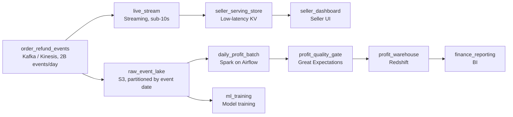

# The Ledger and the Live Wire

- **Domain:** pipeline_architecture
- **Difficulty:** Hard
- **Est. time:** 30 min
- **URL:** https://datadriven.io/problems/the_ledger_and_the_live_wire

## Problem

We run an online retail marketplace that emits about 2 billion order and refund events a day across 300 million listings. Seller-facing inventory and sales dashboards have to reflect a purchase within seconds, while finance needs an exactly-once daily profit-per-product number that stays correct even when refunds land days after the original order. Data science also wants the full raw event history retained for model training.

**Concepts tested:** `paBatchProcessing`, `paBatchVsStreaming`, `paColumnarVsRow`, `paCompression`, `paDataLake`, `paDataQuality`, `paDeduplication`, `paEventPlatforms`, `paFullVsIncremental`, `paIdempotency`, `paLambdaArch`, `paLateData`, `paMedallion`, `paMonitoring`, `paPartitioning`, `paRetryHandling`, `paStreamProcessing`

## Must-have components

- Sellers need a live view within seconds while finance and ML are fine reading a daily number, so the design has to carry two freshness tiers, not one. Show at least one streaming / sub-minute path for the seller dashboards and at least one batch path for finance and ML.
- The daily profit-per-product number is a finance-grade analytical output the reporting layer queries, so it belongs in a warehouse tier, not the live seller store. Add Snowflake, BigQuery, Redshift, or Databricks.

**Expected stages:** `event ingest` → `stream processing` → `real-time serving store` → `raw event lake` → `daily profit aggregation` → `profit warehouse` → `quality checks`

## Solution walkthrough

### Why this problem exists in real interviews

One event stream feeds two consumers with opposite correctness budgets. Sellers want a live count where approximate-but-fast is fine; finance wants a daily profit number that is exactly-once and stays right even when a refund shows up three weeks after the sale. The trap is a single pipeline that serves neither well: a live-ish aggregate finance can't trust, or an exact nightly batch sellers find useless because it's a day stale.

The default reach is a streaming job that maintains a profit table both the seller dashboard and finance read. It looks elegant until a producer retries and double-counts revenue, or a refund lands on day 20 and the profit for the original order date is silently wrong because the stream attributed nothing back to it. Now finance is restating numbers to leadership and nobody trusts the dashboard either.

> **Trick to Solving**
>
> Split by correctness budget, not by tech fashion. Live and approximate for sellers; exactly-once and restatable for finance.
>
> 1. Land every raw order and refund in a partitioned lake first. That lake is the replayable source of truth for both batch jobs and ML.
> 2. A streaming path maintains approximate live counts in a serving store the seller dashboard reads within seconds.
> 3. A daily orchestrated batch computes exact profit-per-product, dedup-keyed and idempotent, attributing profit to the original order's event date so late refunds restate the right partition.

---

### Break down the requirements

**Step 1: Absorb the firehose, then fan out**

Two billion events a day with a 3x peak spike is not something you push straight into a database. A durable queue sits at the front so the streaming and batch consumers each read at their own pace, and a slow consumer never applies backpressure to the sellers. From the queue, raw events also land in the lake before anything aggregates them; that raw copy is what lets you reprocess when a refund arrives late.

**Step 2: Give sellers a live, approximate path**

Seller inventory and sales dashboards target under ten seconds, and they can tolerate a count that is briefly off as long as it self-corrects. A streaming processor maintains running counts and writes them into a low-latency serving store the dashboard queries directly. This path deliberately does NOT try to be the finance number; forcing exactly-once here is what makes it slow enough that sellers notice the lag.

**Step 3: Make finance exactly-once and restatable**

Profit per product per day is computed by a daily batch reading the raw lake. Dedup on a stable order/refund event id so producer retries never double-count revenue, and write with partition-overwrite keyed on product and event date so a re-run is idempotent. Crucially, profit is attributed to the ORIGINAL order's date, not ingest time, so when a refund lands on day 20 you re-run and overwrite only the affected product-day partitions and the historical number becomes correct again.

**Step 4: Gate the number before finance sees it**

A data-quality check runs between the aggregation and the warehouse: row counts, non-negative units, profit within sane bounds. Finance reads a published number that already passed the gate, and the orchestrator owns the schedule with a before-6am deadline and an alert if the run is at risk.

---

### The reference architecture

| node | type | tech | details |
|---|---|---|---|
| order_refund_events | source | Kafka / Kinesis, 2B events/day |  |
| live_stream | transform | Streaming, sub-10s | slaFreshness: real-time |
| seller_serving_store | storage | Low-latency KV | slaFreshness: < 1min |
| seller_dashboard | consumer | Seller UI | slaFreshness: real-time |
| raw_event_lake | storage | S3, partitioned by event date | backfillStrategy: partition_overwrite |
| daily_profit_batch | transform | Spark on Airflow | idempotencyStrategy: partition_overwrite |
| profit_quality_gate | quality_gate | Great Expectations | errorAction: alert |
| profit_warehouse | storage | Redshift | slaFreshness: < 24h |
| finance_reporting | consumer | BI | slaFreshness: < 24h |
| ml_training | consumer | Model training |  |

> **Scale + Cost**
>
> At ~300 GB/day, streaming the full firehose just to keep finance exact would cost far more than the daily batch and buy nothing, since finance reads once a day. Partitioning the raw lake by event date is what keeps refund reprocessing cheap: a late refund re-runs only the handful of affected day-partitions, not fifteen years of history. The cost concentrates in the streaming path, which is why only the seller view rides it.

> **Interviewers Watch For**
>
> A strong candidate justifies streaming vs batch PER consumer instead of defaulting to real-time everything; names a dedup key and idempotent partition-overwrite for the exactly-once finance number; and, without being asked, raises late-arriving refunds and event-time (not ingest-time) attribution. Mentioning backpressure at the queue and schema evolution on the event contract signals seniority.

> **Common Pitfall**
>
> Computing profit in the streaming job and letting finance read it. It double-counts on producer retries, and it attributes refunds to their arrival date, so the profit for the day of the original sale is permanently wrong. The moment a refund lands late, there is no clean way to restate it, and finance ends up reconciling by hand every month.

---

- **A flash sale drives 10x the normal event rate for two hours. What in this design keeps the seller dashboards and the nightly finance run both healthy?**
  - _Tests queue-based backpressure and consumer isolation: the durable queue absorbs the spike, the streaming path may lag slightly but self-corrects, and the batch reads the lake later regardless of the spike._
- **The product taxonomy changes and 'cpu' (cost per unit) is now sent as a nested field. How does the pipeline handle the schema change without breaking the daily profit job?**
  - _Tests schema-registry / contract awareness and whether the candidate versions the event schema and evolves the batch read rather than letting a silent parse failure zero out profit._
