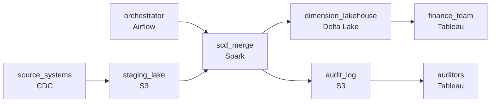

# The Living Table
_Data lands continuously. History must survive every update._

- **Domain:** pipeline_architecture
- **Difficulty:** Medium
- **Est. time:** 20 min
- **URL:** https://datadriven.io/problems/the_living_table

## Problem

We're migrating our data platform to a lakehouse. Our source systems have a mix of reference data that changes over time: product catalog updates, customer profile changes, store-to-region assignments. Finance needs to be able to report historical revenue using the values that were in effect at the time of each sale. Design a data pipeline with proper CI/CD to land this data correctly.

**Concepts tested:** `paBatchProcessing`, `paCdc`, `paCiCd`, `paDataLake`, `paDataQuality`, `paEltVsEtl`, `paFullVsIncremental`, `paIdempotency`, `paMedallion`, `paMonitoring`, `paPartitioning`, `paScdPipeline`, `paTableFormats`

## Requirements

- Finance reports historical revenue using prices, addresses, and store assignments as they were at the time of each sale; using today's values produces the wrong number.
- If a bad deploy corrupts a dimension table, the team has to restore it to a known-good state within minutes; reports can't wait days.
- Regulators require that every customer address change be auditable with who changed it and when; a silent overwrite is a compliance violation.

## Must-have components

- SCD history lives in a lakehouse / warehouse with point-in-time queries; without a warehouse / lakehouse tier there's nowhere for the dimension history. Add Databricks (Delta), Snowflake, or equivalent.
- SCD merges run on a schedule with rerun safety, rollback to a known-good state, and CI gating. Without an orchestration layer none of that is owned. Add Airflow, Dagster, Prefect, or Composer.

**Expected stages:** `source_systems` → `cdc_extraction` → `raw_landing` → `scd_transform` → `delta_lakehouse`

## Solution walkthrough

### Why this problem exists in real interviews

An L5 lakehouse pipeline that's really about three properties together: as-of historical accuracy, fast rollback after a bad deploy, and an audit trail for every change. The trap is treating dimensions as overwritten tables and trusting that 'we'll restore from backup' will work fast enough on the day a bad deploy lands.

The default reach is to merge the source's latest values into a dimension table and report off it. Finance reports historical revenue and the numbers don't match what was actually charged because the dimension was overwritten. A bad deploy corrupts the dimension; the team finds the last clean backup and restores hours later. An auditor asks for a customer's address-change history and the answer is what the column says today.

> **Trick to Solving**
>
> Slowly-changing dimensions with effective dates, time-travel snapshots for fast rollback, every change captured to an audit log.
>
> 1. Dimensions are slowly-changing: each change writes a new row keyed on (`entity_id`, `valid_from`, `valid_to`). Sales facts join on `sale_date BETWEEN valid_from AND valid_to`.
> 2. Lakehouse table format with time-travel lets the team restore a corrupted table to a prior version in minutes; no full rebuild from raw history.
> 3. Every change writes to an audit log with source, timestamp, prior value, and new value. Auditors query the log for the change history of any column.
> 4. An orchestrator runs the SCD merge with CI tests gating the deploy.

---

### Walk the requirements

**Step 1: Slowly-changing dimensions so finance reports the right historical number**

Each dimension (product, customer, store) writes a new row on each change, keyed on (`entity_id`, `valid_from`, `valid_to`). The sales fact joins on `sale_date BETWEEN valid_from AND valid_to` so a sale from last March picks up last March's price, address, and store assignment. A 'overwrite the dimension on every change' approach silently rewrites historical revenue; the SCD plus point-in-time join is the version that matches what was actually charged.

**Step 2: Time-travel rollback so a bad deploy is recoverable in minutes**

The lakehouse table format keeps versioned snapshots of the dimension; if a bad deploy writes a corrupted version, the rollback is `RESTORE TABLE dim TO VERSION x` (or equivalent) and the dimension reverts in minutes. A 'restore from nightly backup' approach takes hours and doesn't include the day's good changes; time-travel is the contract that makes the rollback fast and complete.

**Step 3: Audit log for every change**

Regulators require every address change be auditable. The SCD merge writes a row to an audit log on every change with (`entity_id`, column, source, timestamp, prior value, new value). Auditors query the log for the change history of any column. A 'check the dimension for current state' approach loses the trail because the SCD shows the row but not the source or the audit context; the dedicated log is the boundary that captures who and when.

---

### The shape that fits

| node | type | tech | details |
|---|---|---|---|
| source_systems | source | CDC |  |
| orchestrator | transform | Airflow | errorAction: alert; monitorAlert: SCD merge failure or CI gate fail |
| staging_lake | storage | S3 | backfillStrategy: partition_overwrite |
| scd_merge | transform | Spark | idempotencyStrategy: staging_table |
| dimension_lakehouse | storage | Delta Lake | slaFreshness: < 24h; backfillStrategy: partition_overwrite |
| audit_log | storage | S3 | backfillStrategy: incremental |
| finance_team | consumer | Tableau | slaFreshness: < 24h |
| auditors | consumer | Tableau | slaFreshness: < 24h |

> **What this design gives up**
>
> SCDs grow the dimension table over time and add the as-of join cost on every fact query; time-travel snapshots cost storage proportional to the snapshot retention window; the audit log grows with every change. Implementation cost is the price; the win is finance reporting that matches what was charged, rollback that takes minutes instead of hours, and an audit answer that's a query.

> **What reviewers check**
>
> A reviewer looks at the canvas for these properties:
> - Dimensions are slowly-changing with effective dates so historical facts join the values that were in effect.
> - The lakehouse's time-travel lets a corrupted dimension restore to a prior version within minutes.
> - An audit log captures every change with source, timestamp, prior value, and new value.
> - An orchestration layer schedules the SCD merge with CI gating before deploy.

> **The mistake that ships**
>
> What gets shipped overwrites the dimension on every source change. Finance reports historical revenue using today's prices and the numbers don't match what was actually charged. A bad deploy corrupts the dimension; the team restores from a nightly backup hours later and loses the day's good updates. An auditor asks for an address-change history and the answer is current state. The eventual rebuild is SCD + time-travel + audit log , each was reachable in the original conversation if 'historical revenue' had been treated as a contract about the dimension's history rather than a query-time problem.

---

- **A source's address change is corrected after the fact (the original was wrong). How does this design represent the correction without losing the prior history?**
  - _Tests whether the candidate sees that the correction writes a new SCD row with the corrected value and the prior incorrect row stays in place; the audit log captures the correction with its prior and new values. Historical sales joined to the address as-of-then now pick up either the original or the corrected value depending on what the design treats as the canonical story (a documented choice)._
- **A CI test fails on a SCD merge change. What in this design blocks the deploy, and what does the team see?**
  - _Tests whether the candidate has a CI gate at the orchestrator: the merge job's tests run pre-deploy, a failed test blocks the merge into the dimension, and the team sees the test failure with the diff. Without CI, a bad deploy reaches production; with it, the test catches it before the dimension is touched._
