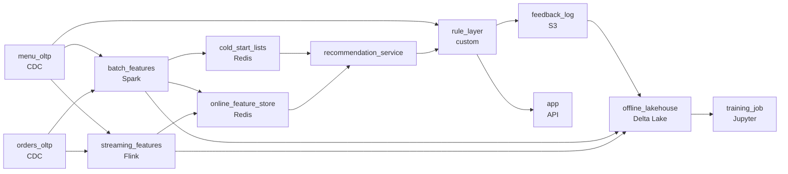

# The Meal Kit That Knows You
_What they ordered says a lot about what they want next._

- **Domain:** pipeline_architecture
- **Difficulty:** Medium
- **Est. time:** 20 min
- **URL:** https://datadriven.io/problems/the_meal_kit_that_knows_you

## Problem

We're a meal-kit delivery company. We want to personalize which recipes we show each customer when they open the app. Design a pipeline that ingests data about orders and matches them to menus for recommendations.

**Concepts tested:** `paBackfill`, `paBatchVsStreaming`, `paDagOrchestration`, `paDataQuality`, `paDependencyMgmt`, `paEltVsEtl`, `paEventDriven`, `paFullVsIncremental`, `paIdempotency`, `paLambdaArch`, `paLateData`, `paMedallion`, `paMonitoring`, `paPartitioning`, `paRetryHandling`, `paScdPipeline`, `paSchemaEvolution`, `paStreamProcessing`

## Requirements

- When a customer opens the app, the recommendation list has to load right away or they'll bounce.
- About 15% of users each day are first-time customers with no order history; they still need a useful list, not an empty screen.
- Sold-out items can never appear, dietary restrictions have to be respected, and new recipes get a launch boost.
- Today there's no feedback loop; the model never learns from which recommendations customers actually clicked, so quality can't improve.

## Must-have components

- Recommendations need a low-latency feature store for serving and an offline path for batch feature computation and training; one tier serves neither. Show at least one streaming path and at least one batch path.
- Training reads historical features from the warehouse / lakehouse and the menu reference is mostly stable but updated; without a warehouse tier there's nowhere for the offline store. Add Snowflake, BigQuery, Redshift, Databricks, or a lakehouse format.

**Expected stages:** `order_stream` → `menu_reference` → `feature_engineering` → `feature_store` → `recommendation_service`

## Solution walkthrough

### What this really is

This is a feature-store problem dressed up as recipe personalization. The skill being probed is splitting the work into two clocks: features computed ahead of time on a streaming path and a batch path, and a request path that only looks features up and scores them. Most candidates draw a service that joins order history to the menu when the app opens. That design hangs at the dinner-hour peak, shows first-time customers an empty screen, and recommends a sold-out kit, because nothing sits between the model and the customer.

| node | type | tech | details |
|---|---|---|---|
| orders_oltp | source | CDC |  |
| menu_oltp | source | CDC |  |
| streaming_features | transform | Flink | slaFreshness: real-time; idempotencyStrategy: upsert |
| batch_features | transform | Spark | slaFreshness: < 1h |
| online_feature_store | storage | Redis | slaFreshness: < 1min |
| cold_start_lists | storage | Redis |  |
| offline_lakehouse | storage | Delta Lake | backfillStrategy: partition_overwrite |
| recommendation_service | transform |  | slaFreshness: real-time |
| rule_layer | quality_gate | custom |  |
| feedback_log | storage | S3 | backfillStrategy: incremental |
| training_job | consumer | Jupyter | slaFreshness: < 24h |
| app | consumer | API | slaFreshness: real-time |

**Step 1: Move feature work off the request**

`streaming_features` keeps recent-order signals fresh in `online_feature_store`; `batch_features` recomputes the heavy history hourly. At app open, `recommendation_service` does a key lookup plus a model call. Any join at request time is the part that melts at peak.

**Step 2: Give the lookup miss somewhere to land**

About 15% of daily opens have no user row. The service treats the miss as a branch, not an error, and reads `cold_start_lists`: popular-this-week lists per dietary segment, rebuilt by the batch job.

**Step 3: Put `rule_layer` after scoring**

The model ranks for relevance; the rules guarantee deliverability. `rule_layer` reads live availability from `menu_oltp`, drops sold-out items, enforces dietary filters, and applies the launch boost. Rules before scoring would force retraining every time inventory changes.

**Step 4: Log what was shown, not only what was clicked**

`rule_layer` writes every impression to `feedback_log` with the final rank. Clicks and orders join onto it, land in `offline_lakehouse`, and feed `training_job`. Clicks without impressions give you no negatives to learn from.

| Request-time join | Pre-computed lookup |
|---|---|
| Joins order history to the menu per open. Latency grows with history and traffic. New users join to nothing. | Reads one row from `online_feature_store`. Latency is flat. A miss routes to `cold_start_lists`. |

> **Rules inside the model go stale in minutes**
>
> Candidates encode 'available' as a model feature. The model is only as fresh as its last training run, so the first mid-evening sellout still shows up in lists. Availability belongs in `rule_layer`, read live.

> **The miss path is the seniority tell**
>
> Juniors draw the happy path. Seniors say what happens when the lookup returns nothing, and where the impression gets written, before anyone asks.

> **Two clocks, one store**
>
> Streaming writes `upsert`, so a replayed event overwrites and never double counts. The hourly batch rewrites the same keys, so a late order is picked up by the next run. `partition_overwrite` on the lakehouse makes a backfill a rerun, not a cleanup.

- **A new recipe has zero engagement. How does it get enough exposure to learn from without flooding lists?**
  - _Launch boost as a bounded `rule_layer` parameter, with `feedback_log` measuring the result._
- **An item sells out mid-session. Where would a delay in hiding it show up?**
  - _The freshness of the availability read from `menu_oltp` into `rule_layer`, not the model._
