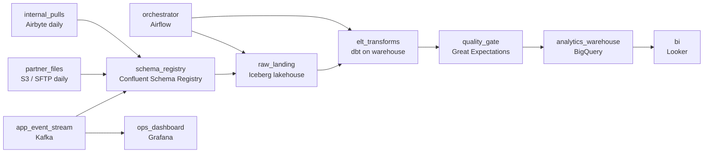

# The Metric That Moved

- **Domain:** pipeline_architecture
- **Difficulty:** Medium
- **Est. time:** 20 min
- **URL:** https://datadriven.io/problems/the_metric_that_moved

## Problem

We run a social media platform that pulls engagement events from the mobile apps in real time, alongside daily monetization files from ad partners and a handful of internal service pulls. Analysts need all of it queryable in the warehouse, but the team keeps redefining metrics like what counts as an active story viewer, so past numbers must stay rebuildable from each source's original, untouched records. Design the pipeline that lands these varied-cadence sources and shapes them for analytics.

**Concepts tested:** `paApiIngestion`, `paBackfill`, `paBatchProcessing`, `paBatchVsStreaming`, `paDataLake`, `paDataQuality`, `paDependencyMgmt`, `paEltVsEtl`, `paFileIngestion`, `paIdempotency`, `paLateData`, `paMedallion`, `paMonitoring`, `paPartitioning`, `paSchemaEvolution`, `paStreamProcessing`

## Requirements

- When we redefine a metric, we need to recompute the last two years of it from the original data, not just going forward.
- The data comes in as a live app event stream, as daily partner files, and from a few internal service pulls, all in different shapes.
- Analysts have to trust the warehouse tables; a malformed partner file should not quietly poison a dashboard.

## Must-have components

- Analysts query the modeled data in a warehouse. Add a warehouse serving tier as the destination the transforms write into.
- Recomputing past metrics from original records requires the raw source data to still exist. Add a raw landing zone (a lakehouse or object store) that holds every source's records untransformed before anything reshapes them.
- Partner files and app events arrive malformed or late. Add a quality-check stage so bad rows are caught before analysts build on them.
- Real-time app events and daily partner files do not share a cadence. Give the pipeline at least two freshness tiers so the streaming path and the batch path are sized independently.

**Expected stages:** `Multi-source ingest` → `Raw landing zone` → `In-warehouse transforms` → `Quality checks` → `Analytics serving`

## Solution walkthrough

### Why this problem exists in real interviews

The prompt reads like a generic extract-transform-load question, but the load-bearing clause is the one about redefining what counts as an active story viewer and recomputing the past from it. That single sentence decides the whole architecture: it rules out transforming before you load. If you shape the data on the way in and only keep the shaped tables, then the first time a definition changes you have no originals to replay, and two years of history are frozen at the old definition. The real skill being probed is whether you place the transform after the load, not before it, and whether you can say why that costs more warehouse compute and why it is worth it here.

The default answer people reach for is a transform-then-load pipeline: parse the app events and partner files, apply the business rules, and write clean, narrow tables straight into the warehouse. It is cheaper and the tables look tidy. Then the metrics team changes the definition of an active viewer, asks for the last 24 months recomputed, and the pipeline cannot do it: the raw signal that the new rule needs was dropped at ingest. Now you are re-ingesting from partners who no longer have the files, and app events that were never stored raw are simply gone.

> **Trick to Solving**
>
> Land every source raw first, transform inside the warehouse second, and keep the raw layer forever. That ordering is the entire answer.
>
> 1. Ingest each source in its native shape into a partitioned raw landing zone. No business logic yet.
> 2. Run the metric definitions as in-warehouse transforms reading from raw, so a definition change is a rerun over old partitions, not a re-ingest.
> 3. Only stream what needs to be live (app events for the ops dashboard); batch the daily partner files.

---

### Break down the requirements

**Step 1: Decide where the transform runs before anything else**

The reproducibility requirement is not a nice-to-have here; it is the axis the design turns on. Because a metric changes about once a quarter and each change triggers a 24-month backfill, the transforms must be a pure function of a raw layer you still hold. That forces load-raw-then-transform. State the tradeoff out loud: in-warehouse transforms burn more warehouse compute and storage than transform-on-ingest, and that is the price you pay to be able to rebuild history.

**Step 2: Split streaming from batch per source, not globally**

Live app engagement events are the only source that earns a streaming path, and mostly for the small real-time ops dashboard. Partner monetization files land daily; internal service pulls are batch. Most app-event analytics tolerate a few hours of lag. Streaming all of it would multiply cost for zero analyst benefit. Two freshness tiers, sized independently, is the correct shape.

**Step 3: Guard the boundary between raw and analyst tables**

Partners rename fields without warning and the app team versions its schema weekly. A schema registry versions each source and flags drift at ingest, so a rename fails loudly instead of quietly nulling a column three tables downstream. Quality checks sit between the raw landing zone and the warehouse tables analysts read, and an orchestration layer owns the cross-source dependencies and the reruns.

---

### The reference architecture

| node | type | tech | details |
|---|---|---|---|
| app_event_stream | source | Kafka |  |
| partner_files | source | S3 / SFTP daily |  |
| internal_pulls | source | Airbyte daily |  |
| schema_registry | transform | Confluent Schema Registry |  |
| raw_landing | storage | Iceberg lakehouse |  |
| orchestrator | orchestrator | Airflow |  |
| elt_transforms | transform | dbt on warehouse |  |
| quality_gate | quality_gate | Great Expectations |  |
| analytics_warehouse | storage | BigQuery |  |
| ops_dashboard | consumer | Grafana |  |
| bi | consumer | Looker |  |

| Transform-then-load (the trap) | Load-raw-then-transform (the fit) |
|---|---|
| Business rules run at ingest; only shaped tables are stored. Cheaper storage, tidy tables. But when the active-viewer definition changes, the raw signal the new rule needs is gone, and the 24-month backfill is impossible. | Sources land raw and partitioned; rules run as warehouse transforms over raw. Costs more warehouse compute and storage, but a definition change is a deterministic rerun over historical partitions. History is always rebuildable. |

> **Scale + Cost**
>
> At roughly 5B app events/day plus a few hundred GB/day of partner files, the raw layer is where storage cost concentrates, but object storage for raw is cheap next to warehouse compute. The expensive part is the in-warehouse transforms, and a quarterly 24-month backfill is the peak load. Partition raw by event date so a backfill scans only affected partitions instead of the whole table; that is what keeps the replay affordable.

> **Interviewers Watch For**
>
> The tell is whether you place the transform after the load and can name the reprocessing reason, rather than defaulting to whichever pattern you used last. Strong candidates also raise schema drift from partners, backfill idempotency (partition overwrite, not append), and the fact that only the app stream justifies streaming.

> **Common Pitfall**
>
> The most common mistake is over-streaming: putting every source on a real-time path because real-time sounds strictly better. Daily partner files and internal pulls gain nothing from it and the cost balloons. The second is appending backfill output instead of overwriting partitions, which double-counts a metric every time it is recomputed.

---

- **A partner silently renames a field mid-quarter and three dashboards go blank two days later. Where in this design should that have been caught, and what changes so it fails at ingest instead?**
  - _Tests whether the candidate leans on the schema registry and quality gate as an enforced contract, not decoration._
- **The metrics team redefines active viewer and wants 24 months recomputed by Friday. Walk through exactly what runs, and how you keep the old numbers available until the new ones are validated.**
  - _Tests backfill mechanics: partition-scoped reruns, idempotent overwrites, and a blue/green or versioned-table cutover so live dashboards do not flicker mid-rebuild._
