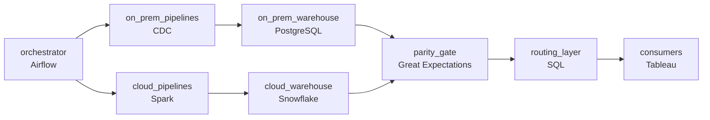

# The Migration That Cannot Break Morning
_It all works today. Moving it without losing a single report is the hard part._

- **Domain:** pipeline_architecture
- **Difficulty:** Hard
- **Est. time:** 30 min
- **URL:** https://datadriven.io/problems/the_migration_that_cannot_break_morning

## Problem

Our data platform grew on-premises over many years, and the business is moving all of it to the cloud while the morning reports keep running every day. Design an architecture for the migration itself, where the on-prem pipelines and their cloud replacements run side by side, their outputs are reconciled before anything switches over, and any single pipeline can be pointed back to on-prem if its cloud version misbehaves.

**Concepts tested:** `paBackfill`, `paBatchProcessing`, `paCiCd`, `paCompression`, `paCostOptimization`, `paDagOrchestration`, `paDataLake`, `paDataQuality`, `paDependencyMgmt`, `paEnvironmentMgmt`, `paFileIngestion`, `paFullVsIncremental`, `paIdempotency`, `paMonitoring`, `paPartitioning`, `paRetryHandling`, `paSchemaEvolution`, `paSmallFiles`

## Requirements

- During the migration the existing on-prem pipelines must keep running and producing output alongside the new cloud pipelines, so nothing depends on the cloud side being correct before it is proven.
- Before any pipeline is cut over, the on-prem and cloud outputs must be compared and reconciled; consumers only move to the cloud side once the two agree.
- If a migrated pipeline misbehaves, that one pipeline has to be pointed back to its on-prem output within hours without affecting any others; the design needs a per-pipeline switch, not an all-or-nothing cutover.

## Must-have components

- The strangler-fig migration runs on-prem and cloud pipelines in parallel with daily diffs and per-pipeline cutover; without an orchestration layer there's nothing to express phasing or parity gates. Add Airflow, Dagster, Prefect, or Composer.
- The migration target is a cloud warehouse; without a warehouse tier there's no destination for analytics. Add Snowflake, BigQuery, Redshift, or Databricks.

**Expected stages:** `On-Prem Pipelines` → `Cloud Pipelines` → `Migration Orchestrator` → `Reconciliation Gate` → `Routing to Consumers`

## Solution walkthrough

### Why this problem exists in real interviews

Migrating 60 production pipelines to the cloud without missing a 6am business-report SLA, with inter-DAG dependencies and per-pipeline rollback. The trap is migrating an upstream before its downstream and breaking consumers, or scheduling high-risk changes mid-week.

The default reach is to migrate pipeline by pipeline as the team gets to them. The first time an upstream is migrated before its downstream, the downstream's input format changes and the morning report breaks. A bad cutover happens midweek and rolling back takes most of a day; a different pipeline's morning is missed. Some pipelines have no parallel run because the team trusts the migration after spot checks.

> **Trick to Solving**
>
> Phased migration in dependency order, weekend-only high-risk changes, per-pipeline rollback, dual-run with parity gating.
>
> 1. The orchestrator runs pipelines on cloud or on-prem during the migration; cutover happens in dependency order so a downstream is never migrated before its upstream.
> 2. High-risk changes (cutover) happen only on weekends; weekday changes are restricted to lower-risk operations.
> 3. Per-pipeline rollback flips the canonical pointer for that pipeline back to on-prem; the rest don't move.
> 4. Each migrating pipeline dual-runs with parity gating before cutover.

---

### Walk the requirements

**Step 1: Morning reports run through the migration window**

The orchestrator schedules each pipeline on whichever side is authoritative on a given day with one 6am SLA view. Sensors fire ahead of the deadline if any side is at risk; on-call has hours to recover. High-risk changes (cutover, rollback) are restricted to weekends so a Sunday-night issue doesn't take Monday's reports out. Without the orchestration layer there's nothing watching the deadline across both sides.

**Step 2: Migrate in dependency order; downstreams never miss their inputs**

Many DAGs read outputs from other DAGs. The migration plan walks the dependency graph and migrates upstreams before downstreams; a downstream's input shape doesn't change until the upstream's cutover is complete. A 'whichever pipeline is easiest first' approach is the version where a downstream's input changes mid-week and the morning report breaks; dependency-ordered cutover is the contract that prevents it.

**Step 3: Per-pipeline rollback so a misbehaving pipeline reverts alone**

When a migrated pipeline misbehaves after cutover, the per-pipeline rollback flips the canonical pointer for that pipeline back to on-prem. The other migrated pipelines stay on cloud. The rollback is hours, not days, because it's a routing change, not a re-migration. A 'big bang rollback' is the version where one bad pipeline drags the rest back; per-pipeline rollback is what isolates the failure.

---

### The shape that fits

| node | type | tech | details |
|---|---|---|---|
| on_prem_pipelines | source | CDC |  |
| orchestrator | transform | Airflow |  |
| cloud_pipelines | transform | Spark |  |
| on_prem_warehouse | storage | PostgreSQL |  |
| cloud_warehouse | storage | Snowflake |  |
| parity_gate | quality_gate | Great Expectations |  |
| routing_layer | transform | SQL |  |
| consumers | consumer | Tableau |  |

> **What this design gives up**
>
> Phased migration takes longer than parallel migration; weekend-only high-risk changes constrains the change window; per-pipeline rollback requires per-pipeline routing to be a thing the orchestrator manages. Implementation cost is the price; the win is morning reports that run through the migration, downstreams that don't break on upstream cutover, and per-pipeline rollback in hours.

> **What reviewers check**
>
> A reviewer looks at the canvas for these properties:
> - An orchestration layer schedules pipelines on cloud or on-prem during the migration with one SLA view.
> - Cutover happens in dependency order; an upstream is never migrated before its downstream.
> - Per-pipeline cutover and rollback so a misbehaving pipeline reverts to on-prem without disturbing the others.
> - High-risk changes happen on weekends only.

> **The mistake that ships**
>
> What gets shipped migrates pipelines as the team gets to them, schedules cutovers mid-week, and rolls back the entire migration when one pipeline misbehaves. An upstream gets migrated before its downstream and the downstream's morning report breaks. A Tuesday cutover gone wrong takes Wednesday's reports out across multiple downstreams. The eventual rebuild adds dependency-ordered cutover, weekend-only high-risk changes, and per-pipeline routing for fast individual rollback.

---

- **Two pipelines depend on a third that's still on-prem during their cloud cutover. What does this design do?**
  - _Tests whether the candidate sees the orchestrator's DAG spanning both sides; the cloud pipelines read the on-prem upstream through the routing layer until the upstream is also migrated. The routing layer resolves cross-side reads; the dependency order means the upstream cuts over first._
- **A migrated pipeline's parity diff has been clean for two weeks but spikes once on a quarter-end run. How does this design respond?**
  - _Tests whether the candidate sees the parity gate as a recurring check: the diff spike halts cutover or triggers rollback if already cut over, the team investigates whether the spike is a legacy bug or a new bug, and the gate stays open until the discrepancy is explained or accepted._
