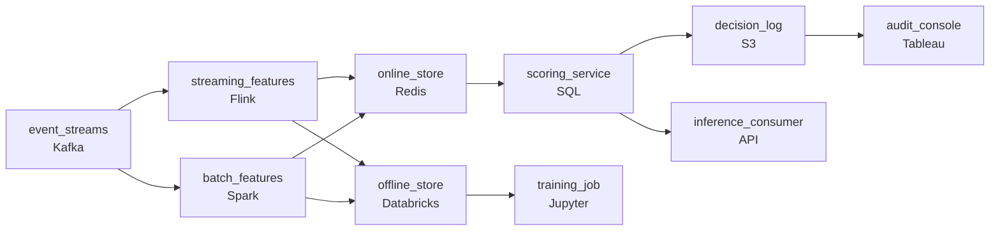

# The Models Going Stale
_The model is only as good as what you feed it._

- **Domain:** pipeline_architecture
- **Difficulty:** Hard
- **Est. time:** 30 min
- **URL:** https://datadriven.io/problems/the_models_going_stale

## Problem

Our risk models keep going stale in production: the features behind them aren't refreshed fast enough to score loan applications live, and the models don't all tolerate the same lag. Design a feature pipeline and store that serves fresh features at low latency for live scoring while keeping years of historical feature values, so the team can retrain on what was true at the moment of each past decision. Compliance also needs to trace exactly which feature values produced any given score.

**Concepts tested:** `paApiIngestion`, `paBackfill`, `paBatchProcessing`, `paBatchVsStreaming`, `paColumnarVsRow`, `paCompression`, `paDagOrchestration`, `paDataLake`, `paDataQuality`, `paDeduplication`, `paDependencyMgmt`, `paEltVsEtl`, `paEventDriven`, `paEventPlatforms`, `paFileIngestion`, `paFullVsIncremental`, `paIdempotency`, `paLambdaArch`, `paLateData`, `paMonitoring`, `paPartitioning`, `paRetryHandling`, `paSchemaEvolution`, `paSmallFiles`, `paStreamProcessing`, `paTableFormats`

## Requirements

- Credit risk scores at loan application and needs activity from minutes ago, while account closure runs nightly and daily is fine, so the same schedule can't serve both.
- Live scoring at application time needs feature lookups fast enough to sit inside the request, so there has to be a store built for low-latency reads.
- The team retrains on what was true at each past decision, so years of historical feature values have to be kept for training, separate from the online serving store.
- Compliance needs to see exactly which feature values produced each decision as a stored record, not a reconstruction after the fact.

## Must-have components

- The architecture has an offline store (batch-trained features) and an online store (low-latency inference); those need different freshness tiers. Show at least one streaming path and at least one batch path.
- The offline store holds historical features for training and audit; without a warehouse / lakehouse tier there's nowhere for it to live. Add Snowflake, BigQuery, Redshift, Databricks, or a lakehouse format.

**Expected stages:** `raw_event_sources` → `feature_computation` → `online_store` → `offline_store` → `model_scoring` → `decision_log`

## Solution walkthrough

### The trap

This looks like a freshness complaint. Underneath, it is a training-serving consistency problem. Everyone draws a fast store for live scoring. What separates candidates is seeing that one store on one schedule cannot carry four jobs: features from minutes ago, nightly features, years of point-in-time history, and a record of every decision. Collapse them and the model trains on today's values for old loans. It looks brilliant offline, it underperforms in production, and compliance gets a reconstruction instead of a record.

> **Freshness belongs to the feature, not the pipeline**
>
> Credit risk needs activity from minutes ago, and account closure is fine nightly. Give each feature the cadence its fastest consumer needs. A streaming path and a batch path both write through **one shared definition** into two stores, so a value means the same thing at training and at serving.

### Walk the requirements

**Step 1: Split the feature computation by cadence**

Recent account activity goes through a streaming path (`streaming_features` on Flink). The slow aggregates go through a batch path (`batch_features` on Spark). If everything is streamed you are over-engineering. If everything runs nightly you have the exact staleness the prompt complains about.

**Step 2: Give each consumer a store shaped for it**

`online_store` holds only the latest value per entity and serves key lookups inside the request. `offline_store` keeps every historical value with its effective timestamp. Both are written by both paths, so neither tier has its own private definition that can drift.

**Step 3: Train with as-of joins**

Retraining joins on (`entity_id`, `event_time`) and takes the value that was valid at the decision, never the current one. That is the only way the offline metric predicts the production metric.

**Step 4: Log the decision at scoring time**

`scoring_service` writes the feature values, the feature version and the model version to `decision_log` in the same moment it returns the score. An audit is then a query against that log, with no replay needed.

### The reference design

| node | type | tech | details |
|---|---|---|---|
| event_streams | source | Kafka |  |
| streaming_features | transform | Flink |  |
| batch_features | transform | Spark |  |
| online_store | storage | Redis |  |
| offline_store | storage | Databricks |  |
| scoring_service | transform | SQL |  |
| decision_log | storage | S3 |  |
| training_job | consumer | Jupyter |  |
| inference_consumer | consumer | API |  |
| audit_console | consumer | Tableau |  |

| One store, nightly | Two stores, two cadences |
|---|---|
| A nightly batch job overwrites a key-value store. Credit risk misses the last day of activity. Training joins current values onto old events, and the audit trail is rebuilt from application logs. | Streaming and batch paths share one definition. `online_store` serves the latest value, `offline_store` keeps the history for as-of joins, and `decision_log` stores what was actually scored. |

> **Training on current values leaks the future**
>
> Candidates point training at the warehouse's latest feature table. Every historical row then carries information the model could not have had at decision time. Offline AUC climbs, production falls, and nobody can find the bug, because each component works on its own.

> **The audit record is written, not derived**
>
> The senior tell is putting `decision_log` on the scoring path itself. If the plan is to recompute the features from the offline store later, you have promised compliance a reconstruction, and it will be wrong whenever a late event or a backfill has changed the history since the decision.

- **A new feature needs an aggregation too slow to stream. How does credit risk still use it?**
  - _Tests per-feature cadence: it lands through the batch path with a known staleness budget, while the model keeps its real-time features._
- **A bug corrupts values in `online_store`. What do you recover from?**
  - _Tests seeing `offline_store` as the source of truth: replay it into the online tier, and use `decision_log` to scope which decisions were affected._
