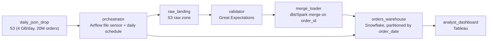

# The Morning File

- **Domain:** pipeline_architecture
- **Difficulty:** Medium
- **Est. time:** 25 min
- **URL:** https://datadriven.io/problems/the_morning_file

## Problem

A live-shopping marketplace drops a single JSON export of the previous day's orders into cloud storage every morning, roughly 4 GB and 20 million records, and analysts need it queryable in the warehouse before the daily standup. The file sometimes arrives late, occasionally gets re-delivered under the same name, and its schema shifts as product teams add fields, so a plain daily reload either double-counts orders or breaks on the new keys. Design the pipeline that lands this file in the warehouse reliably each day.

**Concepts tested:** `paBatchProcessing`, `paDagOrchestration`, `paDataLake`, `paDataQuality`, `paDeduplication`, `paEltVsEtl`, `paFileIngestion`, `paFullVsIncremental`, `paIdempotency`, `paLateData`, `paMedallion`, `paPartitioning`, `paSchemaEvolution`, `paTableFormats`

## Requirements

- Finance keeps flagging days where our order count is inflated. If the same file lands twice, our numbers cannot move.
- The dashboard has to be right by 9am, and when the file is late I want to know before the analysts do.
- Product teams keep adding fields to the export without telling us, and it keeps breaking the load.
- When a load goes wrong I do not want to beg the vendor to resend; I want to re-run it myself.

## Must-have components

- This is a once-a-day file load, so the pipeline needs a daily batch tier. Add a node that runs on a daily schedule rather than a streaming processor.
- A late file has to be caught before standup. Add an orchestration layer that senses the file's arrival, gates the run, and alerts when it is late or missing.
- Land the raw JSON in durable storage before you transform it, so a bad or partial load can be replayed without waiting for the vendor to re-send. Add a raw landing zone.
- The schema drifts as teams add fields. Add a validation or quality-check stage that inspects the file before it reaches the warehouse, so a malformed day fails loudly instead of corrupting the table.
- Analysts query the result, so the load has to terminate in a warehouse. Add a warehouse serving tier.

**Expected stages:** `Daily orchestration with file sensor` → `Raw JSON landing zone` → `Schema validation and quality gate` → `Incremental merge load` → `Warehouse serving for analysts`

## Solution walkthrough

### Why this problem exists in real interviews

This is an idempotency problem wearing a file-ingestion costume. The skill being probed: can you load the same day's file twice, or a late re-delivery under the same name, without moving a single number? Anyone can COPY a 4 GB JSON file into a warehouse table. The trap is the blind daily append: the morning the vendor re-sends the file after a fix, or the orchestrator retries a half-finished run, your order count silently doubles and finance's revenue number is wrong before standup.

The whiteboard answer is a daily job that reads the JSON and inserts it into an orders table. It works until the day the file is re-delivered, or the file lands two hours late and the job already ran against nothing, or a product team adds a field and the strict loader throws. Three separate failure modes, all invisible until an analyst notices the dashboard disagrees with reality.

> **Trick to Solving**
>
> The load must be idempotent, replayable, and tolerant of additive schema change.
>
> 1. Merge, do not append. Upsert the day's records on order id so loading the same file twice is a no-op.
> 2. Land the raw JSON first, then transform. A bad load is replayed from the landing zone, not begged back from the vendor.
> 3. Sense the file, gate the run, and alert on lateness, so an empty or stale table never reaches the 9am dashboard.

---

### Break down the requirements

**Step 1: Decide full vs incremental before anything else**

Each file is one day's orders, not a full snapshot, so the target table is built by accumulating daily slices. That single fact rules out a full reload (it would wipe history) and rules out a blind append (it double-counts on re-delivery). The answer is an incremental merge keyed on order id: today's slice is upserted into the accumulated table, and re-running the same day changes nothing.

**Step 2: Make lateness a signal, not a surprise**

The file usually lands at 6am but sometimes late. A daily-scheduled orchestrator with a file-arrival sensor waits for the file rather than running against an empty prefix, and a deadline alert fires if the file has not arrived in time to hit the 9am standup. Without the sensor, a late file produces a silently stale table that looks fine until someone checks.

**Step 3: Land raw, then transform, so you can replay**

Write the untouched JSON to a durable landing zone before any parsing. When a load is wrong (a schema break, a bad merge, a partial run) you re-run from the landing zone instead of asking the vendor to resend. This is also what makes an orchestrator retry safe: the raw bytes are already durable and the merge is idempotent.

**Step 4: Absorb additive schema drift at the gate**

Fields get added, never renamed or dropped. A validation gate checks the required fields and types and fails loudly on a real break, while the load tolerates new optional fields (store the raw record in a variant column, or enable schema evolution on the merge) so a harmless new field does not fail the whole day.

---

### The shape that fits

| node | type | tech | details |
|---|---|---|---|
| daily_json_drop | source | S3 (4 GB/day, 20M orders) |  |
| orchestrator | transform | Airflow file sensor + daily schedule |  |
| raw_landing | storage | S3 raw zone |  |
| validator | quality_gate | Great Expectations |  |
| merge_loader | transform | dbt/Spark merge on order_id |  |
| orders_warehouse | storage | Snowflake, partitioned by order_date |  |
| analyst_dashboard | consumer | Tableau |  |

> **Scale + Cost**
>
> 4 GB and 20M records a day is small for batch; a single daily run on modest compute lands it in minutes. The cost is not compute, it is the merge: upserting 20M rows into an accumulating table needs the target partitioned or clustered by `order_date` so the merge touches one day's partition, not the whole history. Get the layout right and both the load and the analyst queries stay cheap; get it wrong and the daily merge scans years of data every morning.

> **Interviewers Watch For**
>
> The tell of seniority is naming the failure modes unprompted: what happens when the file is re-delivered, when it arrives late, when a field is added. A strong candidate reaches for merge-on-key and a landing zone before being asked, and states the full-vs-incremental decision explicitly instead of assuming append.

> **Common Pitfall**
>
> Appending the file straight into the orders table with no business key and no landing zone. It demos perfectly and passes the first week. Then the vendor re-sends a fixed file, the counts double, finance opens a ticket, and there is no raw copy to reconcile against because the JSON was streamed straight into the table and discarded. The rebuild adds exactly the merge key and landing zone that should have been there on day one.

---

- **The file volume grows 20x after the company adds international orders, and a single daily merge starts missing the 9am deadline. What changes?**
  - _Tests whether the candidate scales the merge: partition pruning, splitting the load by region, or micro-batching within the day, rather than just a bigger warehouse._
- **The vendor starts occasionally sending a corrected file that changes the amount on orders you already loaded yesterday. How does the design handle a mutating record?**
  - _Tests whether the candidate sees that upsert-on-key already updates in place, and whether they consider tracking change history versus overwriting for finance's audit needs._
