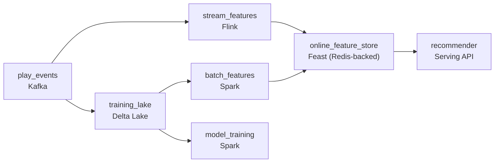

# The Next Track

- **Domain:** pipeline_architecture
- **Difficulty:** Medium
- **Est. time:** 30 min
- **URL:** https://datadriven.io/problems/the_next_track

## Problem

We run a music-streaming service where every play, skip, and save from 500 million listeners arrives as an event, and the recommender needs a listener's just-played tracks reflected in their suggestions within a minute or two. Those same events also feed the weekly model retraining that runs over months of history. Design the pipeline that serves fresh session features to the recommender in near real time while landing exactly-once training data for the batch jobs.

**Concepts tested:** `paBatchProcessing`, `paBatchVsStreaming`, `paDataLake`, `paDataQuality`, `paDeduplication`, `paEventDriven`, `paEventPlatforms`, `paIdempotency`, `paLambdaArch`, `paLateData`, `paMicroBatchVsTrue`, `paMonitoring`, `paPartitioning`, `paStreamProcessing`

## Requirements

- When a listener skips a track, the very next recommendation should already know about it.
- The weekly model has to train on every event once, with no dropped or double-counted plays skewing the labels.
- We do not want two separate event pipelines to keep in sync; the same events should power both fast serving and slow training.

## Must-have components

- Billions of play and skip events per day need a durable buffer to absorb spikes and let multiple consumers read the same stream. Add a message queue at ingestion.
- A skip has to change the next suggestion within a minute or two, which a nightly job cannot do. Add a streaming processor that computes session features as events land.
- The recommender needs low-latency reads of the freshest per-listener features at serving time. Add a low-latency online store (a feature store or key-value store) the streaming path writes into.
- The freshly computed session features must actually flow from the streaming processor into the online store, or serving still reads stale state. Connect the streaming node to the online store.
- Weekly retraining runs over months of history, which is a batch job, not a stream. Add a batch path for training data and model training.
- The design has two clocks: near-real-time serving features and slow batch training. Mark at least two distinct freshness tiers so the split is explicit rather than everything running at one speed.

**Expected stages:** `event ingestion` → `stream feature computation` → `online feature store` → `training data lake` → `batch model training` → `recommendation serving`

## Solution walkthrough

### Why this problem exists in real interviews

This is a lambda-style split wearing a recommendation-system costume. The real skill: can you route one event stream into a fast path that keeps a listener's session features fresh for serving and a slow path that lands exactly-once training data, and can you say WHICH features belong on which path. The trap is treating 'recommendations' as one system with one clock. Stream everything and you pay streaming prices to compute a 30-day genre affinity that changes once a week; batch everything and a listener skips a track while the recommender keeps suggesting more of it for hours.

The whiteboard answer is a single stream that writes to a table the recommender queries, retrained off the same table nightly. It looks clean until the online store is carrying features that only ever move at batch cadence, the training job double-counts every event a producer retried, and the offline metrics look great while the live model quietly disagrees with them because serving and training compute features differently.

> **Trick to Solving**
>
> Split by how fast a feature actually changes, and enforce exactly-once only where labels are graded.
>
> 1. Session features (last few plays, recent skips, current context) ride the streaming path into an online store the recommender reads in near real time.
> 2. Long-horizon features (genre affinity, embeddings) are computed in batch and refreshed slowly; the online store does not need to carry them at streaming cost.
> 3. Training data lands exactly-once keyed on `event_id`; serving features are allowed to be approximate under load.

---

### Walk the requirements

**Step 1: Buffer once, fan out to two speeds**

Billions of play and skip events land in a durable queue that both consumers read independently: the streaming feature job and the batch training job. One ingestion, two speeds. Building two separate ingest pipelines to keep in sync is the version that drifts within a month; the same buffer feeding both is what keeps the fast and slow paths reading identical events.

**Step 2: Compute session features in the stream, serve from an online store**

The streaming processor maintains per-listener session state (recent plays, skip rate, current context) and writes it to a low-latency online store (a feature store or key-value store). The recommender reads that store at request time, so a skip is reflected in the next suggestion within a minute or two. This path is allowed to be approximate: a duplicate skip nudges a counter, it does not corrupt a ledger.

**Step 3: Land training data exactly-once for the weekly retrain**

The batch path writes events into a lake, keyed on `event_id` with idempotent partition-overwrite, so a producer retry or a stream replay does not double-count plays. Weekly retraining reads months of this history. Exactly-once lives here and only here, because these are the labels the offline metrics are computed against; paying for it on the serving path would just make the hot path slower for no correctness gain.

---

### The shape that fits

| node | type | tech | details |
|---|---|---|---|
| play_events | source | Kafka | parallelism: high-cardinality by listener_id |
| stream_features | transform | Flink | slaFreshness: real-time |
| online_feature_store | storage | Feast (Redis-backed) | slaFreshness: < 1min |
| recommender | consumer | Serving API | slaFreshness: < 1min |
| training_lake | storage | Delta Lake | backfillStrategy: partition_overwrite; idempotencyStrategy: upsert |
| batch_features | transform | Spark | slaFreshness: < 24h |
| model_training | transform | Spark |  |

| Stream everything | Split by change rate |
|---|---|
| The streaming job computes 30-day genre affinity and embeddings that only move weekly, paying real-time compute for batch-cadence features and bloating the online store. Cost climbs with no freshness benefit. | Only session-scoped features run in the stream; long-horizon features are batch-computed and pushed into the online store slowly. The hot path stays small and cheap, freshness lands where it matters. |

> **Interviewers Watch For**
>
> A reviewer looks for these on the canvas:
> - Session features are computed in the stream and served from a low-latency online store the recommender reads.
> - Training data lands exactly-once keyed on `event_id`, separate from the approximate serving path.
> - Both paths read the same ingestion buffer instead of duplicating ingest.
> - The candidate names which features are real time versus batch rather than streaming all of them.

> **Common Pitfall**
>
> Ignoring training-serving skew. If the streaming job and the batch backfill compute the same feature with different logic, the model trains on one distribution and serves on another. Offline metrics look fine, the live recommender underperforms, and nobody can explain why. Share the feature definitions across both paths and join training features as-of event time, not load time.

---

- **A regional evening peak pushes event volume to 10x for two hours. What backs up, and what stays within the one-to-two minute serving freshness target?**
  - _Tests backpressure thinking: the buffer absorbs the spike, the streaming job may lag but the online store still serves last-known features; the batch path is unaffected because it is not on the clock._
- **The team wants to add a new session feature and use it in training too. How do you get it into both paths without them drifting apart?**
  - _Tests training-serving consistency: a shared feature definition plus a point-in-time backfill over the lake so the offline values match what the stream would have produced._
