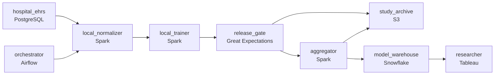

# The Patients We Cannot Move
_Patient data stays local. Insights have to be global._

- **Domain:** pipeline_architecture
- **Difficulty:** Hard
- **Est. time:** 10 min
- **URL:** https://datadriven.io/problems/the_patients_we_cannot_move

## Problem

We run federated machine learning across hospital networks for clinical trial research. Each hospital has patient data we're not allowed to move - privacy law and patient consent don't permit central aggregation. We need to train models and compute population statistics across data that is physically distributed across 40 hospitals in 8 countries, each with different EHR systems and data formats. Design a data pipeline that makes this possible.

**Concepts tested:** `paApiIngestion`, `paDagOrchestration`, `paDataQuality`, `paDeduplication`, `paIdempotency`, `paLateData`, `paMedallion`, `paMonitoring`, `paPartitioning`, `paRetryHandling`, `paSchemaEvolution`

## Requirements

- Privacy law and patient consent in eight countries forbid moving raw patient data out of each hospital; only computation results may leave.
- Each hospital uses a different EHR with different local codes for the same concept; cross-site research can't work with each one separately.

## Must-have components

- Training one model across 40 hospitals means sending each round of work into every site and collecting what comes back. Without an orchestration stage nothing coordinates those rounds. Add a scheduler such as Airflow, Dagster or Prefect.

**Expected stages:** `cohort_registry` → `harmonized_schema_map` → `federated_job_results` → `data_quality_reports`

## Solution walkthrough

### What this really is

This is a privacy boundary dressed up as an ML pipeline. Everyone says 'ship the compute to the data', and that part is table stakes. The trap is assuming the boundary is safe once raw rows stay home. **A count over five patients is a patient.** The privacy law that keeps records in place also covers what you send out. Ask about publication and you learn the result must reproduce for fifteen years from data you will never hold. If you check cohort sizes after results leave the site, re-identifiable numbers have already crossed the border. If you archive only the model, the regulator's reproduction request has no answer.

### Walk the requirements

**Step 1: Push rounds out, pull only results back**

The `orchestrator` sends each training round into every hospital, tracks which sites finished, and decides whether a round waits for a slow hospital or closes without it. Raw records never cross the boundary, because nothing outside the hospital is built to receive them.

**Step 2: Harmonize codes inside the hospital**

Forty EHRs encode the same diagnosis forty ways. `local_normalizer` maps local codes to one canonical clinical schema before training, so gradients mean the same thing at every site. Harmonizing centrally would require moving the data first.

**Step 3: Gate at the site, before the network**

`release_gate` runs inside each hospital, between `local_trainer` and the edge out. A cohort under the privacy threshold is withheld or coarsened, and a failed check means the result never leaves. Only gated output reaches the `aggregator`.

**Step 4: Archive the round, not just the model**

`study_archive` stores, per study and per hospital, the snapshot id, code version, and gradient hash for the full retention window. It is fed from the gate's output, so each site's contribution is recorded, along with the combined result from the `aggregator`.

| node | type | tech | details |
|---|---|---|---|
| hospital_ehrs | source | PostgreSQL |  |
| orchestrator | transform | Airflow | errorAction: alert; monitorAlert: Hospital missing from round past SLA |
| local_normalizer | transform | Spark | errorAction: alert |
| local_trainer | transform | Spark | idempotencyStrategy: staging_table |
| release_gate | quality_gate | Great Expectations | errorAction: alert; monitorAlert: Cohort under privacy threshold blocked |
| aggregator | transform | Spark | idempotencyStrategy: upsert |
| study_archive | storage | S3 | backfillStrategy: incremental |
| model_warehouse | storage | Snowflake | slaFreshness: < 24h |
| researcher | consumer | Tableau | slaFreshness: < 24h |

> **The boundary is a gate, not a wall**
>
> Keeping raw rows home covers half the privacy rule. The other half is checking every outbound number, which is why `release_gate` sits inside the hospital layer. A gate on shared infrastructure checks a small cohort after it has already crossed the network.

> **Git history is not reproducibility**
>
> Candidates archive the final model and point at the repo. Years later the regulator asks which snapshot each hospital trained on, and nobody recorded it. A code version means nothing without the snapshot id it ran against.

> **Say who handles a missing hospital**
>
> Strong candidates name the `orchestrator` as the place where a slow or dropped site is handled. They also point out that the `aggregator` upserts per round, so a retried site never gets double counted.

- **A hospital withdraws mid-study. What happens to the model and the record?**
  - _The orchestrator excludes it from later rounds, and the archive shows which rounds it contributed to._
- **A regulator asks for the raw data behind a result. Where does the design send them?**
  - _To the hospital. The center holds hashes and versions, never records._
- **Two gated aggregates can be subtracted to reveal a small cohort. How do you stop that?**
  - _Tests whether the gate tracks prior releases, not only each result in isolation._
