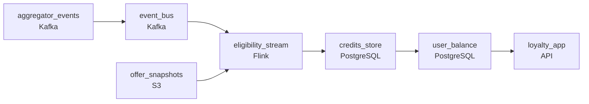

# The Points Arrive Two Days Late
_The bank data shows up late. The rewards were already sent._

- **Domain:** pipeline_architecture
- **Difficulty:** Medium
- **Est. time:** 10 min
- **URL:** https://datadriven.io/problems/the_points_arrive_two_days_late

## Problem

Our loyalty app links to users' bank accounts and credits reward points when they make purchases at partner brands. The problem is that bank data from our aggregators arrives 12 to 48 hours after the actual transaction, and by that time an offer may have expired or the user may have already redeemed that offer slot. We're also seeing duplicate transactions from aggregator bugs causing users to be double-credited. Design a pipeline that handles the late data problem and guarantees we never credit points twice for the same purchase.

**Concepts tested:** `paBatchProcessing`, `paDeduplication`, `paFullVsIncremental`, `paIdempotency`, `paLateData`, `paMonitoring`, `paPartitioning`, `paRetryHandling`, `paScdPipeline`, `paTableFormats`

## Requirements

- Bank aggregators retry on errors and the same purchase has been getting credited twice; users have been getting double rewards.
- Bank data arrives a day or two late, and a transaction landing today might come from a moment when a different offer was running; eligibility has to be checked against the offer that was active then.
- Once we know a transaction qualifies, the points have to land in the user's balance within minutes.

## Must-have components

- Bank aggregator events flow into an idempotent processing path keyed by user and transaction. Without a queue/log tier between aggregators and the points engine, there's no place to dedup or sequence per-user events. Add Kafka, Kinesis, SQS FIFO, or equivalent.
- A transaction landing today might come from when a different offer was running; eligibility has to be checked against the offer state then, which means historical offer snapshots persisted in a durable store. Add S3, GCS, ADLS, or equivalent.

**Expected stages:** `transaction_events` → `offer_matches` → `points_ledger` → `offer_catalog_snapshot`

## Solution walkthrough

### Why this problem exists in real interviews

Three properties that conflict if you do them naively: events arriving 12-48 hours late, the same purchase delivered multiple times by the aggregator, and the offer catalog that has changed since the transaction happened. The trap is checking eligibility against the current offer catalog and crediting on every event delivery; both shortcuts are how users have been double-credited or credited under the wrong offer.

The default move is to subscribe to aggregator events, look up the current offer catalog on each event, and credit points on a match. The aggregator delivers a purchase twice; the user gets credited twice. A purchase from two days ago lands today, but the offer that was running then expired yesterday; eligibility evaluated against today's catalog returns no match (or the wrong match) and the user is told their purchase didn't qualify. Both consumers (the user and the loyalty team) end up upset.

> **Trick to Solving**
>
> Idempotent crediting on (user, transaction id, offer id), eligibility evaluated against the offer catalog at the transaction's time, immediate credit once eligibility resolves.
>
> 1. Crediting is idempotent on a stable key: the same (user, transaction id, offer id) credits points once and only once, regardless of how many times the aggregator delivers it.
> 2. The offer catalog is captured in durable snapshots over time; eligibility is evaluated against the offer state as of the transaction's timestamp, not pipeline-run time.
> 3. Once eligibility resolves, points land in the user's balance within minutes; no batch delay between qualifying and crediting.

---

### Walk the requirements

**Step 1: Idempotent crediting on a stable key**

Each aggregator event carries (`user_id`, `transaction_id`) from the bank. The crediting path keys on (`user_id`, `transaction_id`, `offer_id`) and writes the credit idempotently: if the same key has already produced a credit, the second delivery is a no-op. The key includes `offer_id` because a single transaction can match multiple offers and each match credits once. Without this contract, an aggregator retry that resends the same purchase produces a second credit; without `offer_id` in the key, two distinct offers on the same purchase collapse into one.

**Step 2: Evaluate eligibility against the offer catalog at the transaction's time**

Bank events arrive 12 to 48 hours late, and the offer catalog has changed since. Capture the offer catalog in durable snapshots with effective dates (`offer_id`, `valid_from`, `valid_to`, conditions). When an aggregator event arrives, the eligibility check looks up the offer state as of the transaction's timestamp, not the current state. A purchase from two days ago is evaluated against the offers that were running then, and the user gets credit if it qualified then. Evaluating against the live catalog is the version that retroactively disqualifies users for offers they did qualify for.

**Step 3: Land points in the user's balance within minutes of qualification**

Once the eligibility check resolves and the idempotent credit is written, points land in the user's balance store within minutes. The crediting path doesn't batch overnight; the user sees the points soon after the pipeline qualifies the transaction. A 'wait until midnight to credit' design adds days on top of the already-delayed bank data and makes the loyalty experience worse than it has to be.

---

### The shape that fits

| node | type | tech | details |
|---|---|---|---|
| aggregator_events | source | Kafka |  |
| event_bus | queue | Kafka | parallelism: 8 partitions |
| eligibility_stream | transform | Flink | slaFreshness: real-time; idempotencyStrategy: upsert |
| offer_snapshots | storage | S3 | backfillStrategy: incremental |
| credits_store | storage | PostgreSQL | slaFreshness: < 1min; idempotencyStrategy: upsert |
| user_balance | storage | PostgreSQL | slaFreshness: < 1min |
| loyalty_app | consumer | API | slaFreshness: < 1min |

> **What this design gives up**
>
> Idempotent crediting needs an index on the credit key; offer snapshots have to be retained per change with effective dates. The eligibility lookup against historical snapshots is more expensive than a current-state lookup. Implementation cost is the price; the win is users don't get double-credited, late transactions credit under the right offer, and points show up soon after qualification.

> **What reviewers check**
>
> A reviewer looks at the canvas for these properties:
> - An event bus or queue sits between aggregators and the points-crediting path so events can be deduped and processed idempotently.
> - A durable historical-offer-snapshot store lets eligibility be evaluated against the offer state at the transaction's time.
> - Once eligibility is resolved, points land in the user's balance within minutes.

> **The mistake that ships**
>
> The shape that ships subscribes to aggregator events, looks up the current offer catalog, and credits on every event. The aggregator delivers a duplicate; the user is double-credited. A late transaction lands when its original offer is no longer active; the user is told their purchase didn't qualify. Customer support gets two waves of tickets in the same week. The team rebuilds with idempotent crediting on a stable key and historical offer snapshots, but the loyalty team has already had to issue manual adjustments and apologies in the meantime.

---

- **An aggregator reverses a transaction (refund or chargeback) days after it was credited. What in this design lets points be reversed cleanly?**
  - _Tests whether the candidate sees that the credit is keyed and that a reversal arrives as another idempotent event keyed on the same (user, transaction). The reversal writes a debit credit; the user balance reflects the net. Treating reversals as a manual adjustment is the version where the balance drifts from the source._
- **An offer's eligibility rule is corrected retroactively: a clause was misconfigured and some past transactions are now eligible that weren't credited. How does this design handle the recredit?**
  - _Tests whether the candidate sees the offer snapshot as immutable history, with the corrected rule emerging as a new snapshot version. Replaying the affected transactions through the eligibility stream against the corrected snapshot writes the missing credits idempotently; previously-credited transactions are no-ops._
