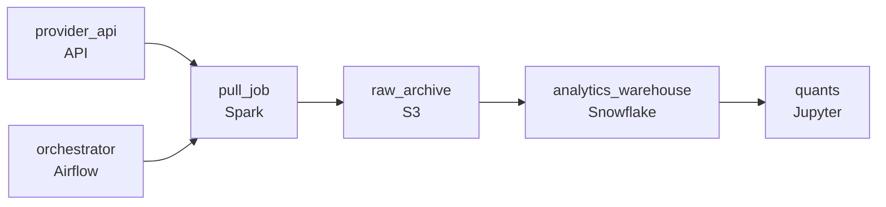

# The Provider That Sometimes Sleeps
_The models run at dawn. The data has to be there first._

- **Domain:** pipeline_architecture
- **Difficulty:** Medium
- **Est. time:** 25 min
- **URL:** https://datadriven.io/problems/the_provider_that_sometimes_sleeps

## Problem

Our quantitative research team runs pre-market models each morning on the prior day's price and volume data, pulled daily from a paid external provider whose manual pull process has already cost us missed trading sessions. The provider bills per request and goes dark for hours at a time, and our licensing terms require every raw file we receive to be kept unchanged for audit. Design an automated ingestion pipeline that lands the data on time, keeps every raw file for audit, rides out the provider's outages without draining the paid request budget, and gets a failed or late pull in front of the team before the quants hit it at model-run time.

**Concepts tested:** `paApiIngestion`, `paBatchProcessing`, `paBatchVsStreaming`, `paDagOrchestration`, `paDataQuality`, `paDeadLetterQueue`, `paEltVsEtl`, `paEventDriven`, `paFileIngestion`, `paIdempotency`, `paLateData`, `paMonitoring`, `paRetryHandling`

## Requirements

- Quants run pre-market models each morning and depend on the prior day's data being present before they start; a missed session has already broken a model run, so a failed or late pull has to reach the team automatically, not be discovered at model-run time.
- The provider charges per request and has multi-hour outages a few times a year; a naive script burns the daily budget on blind retries before the outage resolves, so the pull and its retry logic have to be driven by an orchestrator.
- Our licensing agreement requires raw files be retained for audit and never modified or deleted after ingestion, so the raw landing zone has to be durable storage written straight from the pull, distinct from the downstream transformed research database.

## Must-have components

- Licensing requires the raw provider files be retained unchanged for audit; without a durable archive tier there's nowhere to keep them. Add S3, GCS, or ADLS.
- The 7am deadline and retry-with-backoff during provider outages need something that owns the daily pull. Add Airflow, Dagster, or Prefect.

**Expected stages:** `External HTTP API` → `Ingestion Orchestrator` → `Raw Storage` → `Validation Layer` → `Research Database` → `Monitoring & Alerting`

## Solution walkthrough

### Why this problem exists in real interviews

A daily pull from a paid provider with 7am quant deadlines, multi-hour outages a few times a year, and a licensing requirement that raw files be retained unchanged. The trap is a naive retry loop that burns the daily budget during an outage or treating retention as 'we'll keep it somewhere.'

The default reach is a manual pull script that runs at midnight and a retry loop on failure. The first multi-hour outage burns the daily request budget before resolving; the next morning's models miss data. Raw files get overwritten when the team reruns the pull because retention wasn't an explicit boundary.

> **Trick to Solving**
>
> Orchestrated pull with bounded retries and exponential backoff, raw files stored immutably for audit, alerting before 7am if anything is at risk.
>
> 1. The orchestrator schedules the pull and applies bounded exponential-backoff retries; once the daily budget is exhausted the retry stops and pages on-call.
> 2. Each pulled raw file lands in immutable cold storage with the licensing-required retention; nothing overwrites it after ingestion.
> 3. Sensors fire ahead of the 7am deadline if the file isn't ready so on-call has hours, not minutes.

---

### Walk the requirements

**Step 1: Pull on schedule with bounded retries that respect the budget**

The orchestrator runs the daily pull on a schedule. Failures retry with exponential backoff up to a budget; once the budget is exhausted the orchestrator pages on-call rather than burning more requests on a provider that's down. A naive retry loop is the version where a multi-hour outage drains the daily budget on retries before resolving; the bounded retry is what keeps the next day's pull intact.

**Step 2: Raw files land immutably for audit**

Each pulled file writes to cold storage with the licensing-required retention; the storage policy denies modification or deletion. A rerun of the pull writes a new versioned file; the original stays. Without immutability the audit can't prove the file as received; the immutable archive is the contract.

**Step 3: Alert before 7am, not at 7am**

Sensors fire before 7am if the daily file hasn't arrived or hasn't loaded. On-call has hours to chase the provider, fire a manual pull, or escalate. A 'we'll find out at 7am when models break' approach is the version where the quant team is first to notice; sensors ahead of the deadline give the team a window to act.

---

### The shape that fits

| node | type | tech | details |
|---|---|---|---|
| provider_api | source | API |  |
| orchestrator | transform | Airflow | retryCount: 5; errorAction: retry; monitorAlert: Pull failure, retry budget exhausted, or stage at risk vs 7am SLA; retryBackoff: exponential |
| pull_job | transform | Spark | idempotencyStrategy: staging_table |
| raw_archive | storage | S3 | backfillStrategy: incremental |
| analytics_warehouse | storage | Snowflake | slaFreshness: < 24h |
| quants | consumer | Jupyter | slaFreshness: < 24h |

> **What this design gives up**
>
> Bounded retries mean a long outage gives up rather than burning the budget; immutable retention costs storage proportional to the licensing window; the orchestrator's sensors and alerts are infrastructure to operate. Implementation cost is the price; the win is models that run on the prior day's data, an audit answer that points at unchanged files, and on-call seeing trouble before quants do.

> **What reviewers check**
>
> A reviewer looks at the canvas for these properties:
> - An orchestration layer schedules the daily pull with bounded retries and backoff so a multi-hour outage doesn't burn the request budget.
> - Raw files land in immutable cold storage; nothing modifies or deletes them after ingestion.
> - Sensors fire before the 7am deadline if the file is at risk.

> **The mistake that ships**
>
> What gets shipped runs a manual pull with a naive retry loop. A multi-hour provider outage burns the daily budget on retries; the next morning's models miss data. Raw files get overwritten on rerun. Quants find out about the missing data at 7am. The eventual rebuild adds bounded retries, the immutable archive, and pre-deadline alerting.

---

- **The provider has a documented multi-hour maintenance window. How does this design handle a known outage without firing alerts every minute?**
  - _Tests whether the candidate sees that scheduled maintenance windows are a config the orchestrator reads; retries pause during the window and resume on a single alert if the post-window pull still fails. The orchestrator distinguishes scheduled outages from unexpected ones._
- **The audit team asks for the file received on a date six months ago. Where does this design point them?**
  - _Tests whether the candidate sees the raw archive's per-day immutability: a query by date returns the file as received. The warehouse's loaded data may have been transformed; the archive answers 'what did we get' separately from 'what did we load.'_
