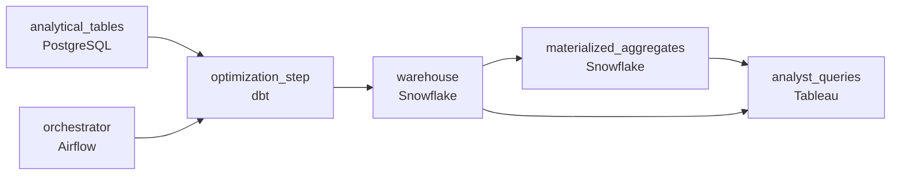

# The Query That Used to Be Fast
_Queries used to be fast. Something changed._

- **Domain:** pipeline_architecture
- **Difficulty:** Medium
- **Est. time:** 20 min
- **URL:** https://datadriven.io/problems/the_query_that_used_to_be_fast

## Problem

Analysts run interactive dashboards against a 2TB Snowflake fact table that used to answer in seconds; now the same date-filtered and merchant-filtered queries take minutes and blow past the 30-second interactive SLA. Design the remediation: give those dashboards a served surface fed from the warehouse, and stand up a scheduled job that tracks p95 query duration and pages the team when performance regresses, all within the CFO's cost ceiling.

**Concepts tested:** `paBatchProcessing`, `paBatchVsStreaming`, `paDagOrchestration`, `paFullVsIncremental`, `paMonitoring`, `paPartitioning`

## Requirements

- Analysts run interactive dashboards and expect results in tens of seconds; today they're waiting minutes.
- The same date-filtered dashboards run hundreds of times a day and re-scan the whole table each time.
- When p95 query duration regresses past the interactive SLA, the team needs to be paged, not hear about it from analysts.

## Must-have components

- Business analysts run interactive queries on a warehouse; the optimisation has to land there. Without a warehouse tier there's no surface to optimise. Add Snowflake, BigQuery, Redshift, or Databricks.
- Performance regression monitoring and alerting on p95 query duration require a scheduled pipeline; without orchestration there's nothing to track trends or alert when queries regress. Add Airflow, Dagster, Prefect, or Composer.

**Expected stages:** `source_fact_tables` → `orchestration_and_monitoring` → `clustering_layout_step` → `snowflake_warehouse` → `materialized_aggregates`

## Solution walkthrough

### Why this problem exists in real interviews

A performance question framed as 'optimize the warehouse,' but the requirements force discipline: diagnose before buying more compute, lay out the table for the actual query pattern, and put a cost number on every change. The trap is enabling expensive warehouse features (clustering, materialized views, larger warehouse sizes) without a profile or a cost projection.

The default reach is to scale the warehouse up and turn on every clustering or materialization feature available. Queries get slightly faster; the bill goes up; the CFO asks why. The actual bottleneck, a partition column that doesn't match what BI filters on, stays unfixed. Some queries that used the unindexed columns get worse because clustering on the wrong key forced shuffles.

> **Trick to Solving**
>
> Profile first, lay out the table to match the common query, project the cost of every change before turning it on.
>
> 1. The warehouse's query profile shows where time goes (full table scan, large shuffle, micro-partitions skipped vs not). The next change is the one the profile points at.
> 2. Cluster the table on the column most queries filter by (often date, sometimes a high-cardinality dimension). Pruning matters more than parallelism for date-filtered queries.
> 3. Materialized aggregates absorb repeated dashboard queries so the same scan doesn't run a hundred times a day.
> 4. Every proposed change comes with a cost estimate from the warehouse's planning tools; the team approves changes against the CFO's ceiling.

---

### Walk the requirements

**Step 1: Lay out the table for the common query, p95 inside the 30-second budget**

Most analyst queries filter by date and a small set of dimensions. Cluster the warehouse table on those columns so the warehouse prunes micro-partitions and scans a slice. p95 falls inside the 30-second budget when the layout matches the query. Without a warehouse tier the optimisation has nowhere to land; without orchestration the p95 monitoring has nowhere to live.

**Step 2: Profile first, then change**

Throwing more compute at slow queries hasn't helped, which means compute isn't the bottleneck. The warehouse's query profile tells the team where time goes: full scan, shuffle, partition pruning ratio, file count. Each observation points at a specific change (cluster on a different column, increase partition coarseness, add a materialized aggregate). The next change is the one the profile points at, not the one that sounded right in standup.

**Step 3: Cost projection on every change**

The CFO has a ceiling. Every proposed change comes with a cost projection: clustering adds maintenance compute, materialized aggregates add storage and refresh compute, a larger warehouse multiplies hourly cost. The team approves changes against the ceiling. Enabling a clustering on every wide table because 'it can't hurt' is the version that doubles the bill quietly; the projection is the discipline that keeps the bill at the approved level.

---

### The shape that fits

| node | type | tech | details |
|---|---|---|---|
| analytical_tables | source | PostgreSQL |  |
| orchestrator | transform | Airflow | errorAction: alert; monitorAlert: p95 query duration regressed past threshold |
| optimization_step | transform | dbt | idempotencyStrategy: staging_table |
| warehouse | storage | Snowflake | slaFreshness: < 1h |
| materialized_aggregates | storage | Snowflake | slaFreshness: < 1h |
| analyst_queries | consumer | Tableau | slaFreshness: < 1h |

> **What this design gives up**
>
> Profiling and layout work doesn't ship a feature; for a few weeks the team produces evidence, not improvements. Materialized aggregates add storage and refresh compute. Cluster keys lock the table to a query pattern; queries that don't fit the cluster see worse pruning. Implementation cost is the price; the win is interactive queries that meet the SLA, evidence-driven changes the CFO will approve, and a bill that stays inside the ceiling.

> **What reviewers check**
>
> A reviewer looks at the canvas for these properties:
> - Common date-filtered queries scan a small slice through partition / cluster choices that match the query pattern.
> - The remediation references query-profile evidence to identify the bottleneck before changes are proposed.
> - Each proposed change carries a cost estimate against the approved ceiling.
> - An orchestration layer monitors p95 query duration and alerts on regressions.

> **The mistake that ships**
>
> What gets shipped scales the warehouse up and enables clustering on every wide table 'just in case.' Some queries get slightly faster, the bill grows steadily, the CFO asks pointed questions. The actual bottleneck, a partition / cluster mismatch with the common filter, stays unfixed. The team rolls back some clustering changes that made queries with different filters worse. The eventual approach is the profile-first, project-cost, then-change discipline, reachable up front if 'throw more compute' had been recognized as the answer that already didn't work.

---

- **Two query patterns (interactive analyst dashboards and ad-hoc data-science queries) want different cluster keys. What does this design do, and what's the cost?**
  - _Tests whether the candidate sees materialized aggregates as a way to serve the interactive pattern from a clustered surface while the ad-hoc queries scan the underlying table on its primary cluster key. Two cluster keys on one table aren't possible; the materialized aggregate is the second surface. The cost is the aggregate's storage and refresh._
- **After clustering, p95 is good but p99 is much worse. What does the design do, and where does the team look?**
  - _Tests whether the candidate sees that p99 catches outlier queries (queries that don't fit the cluster, full scans from data scientists, expensive joins). The fix is profiling the slow tail to identify whether it's a different query class that needs its own surface or a query rewrite is appropriate. The team doesn't blanket-fix p99 by upsizing the warehouse without diagnosis._
