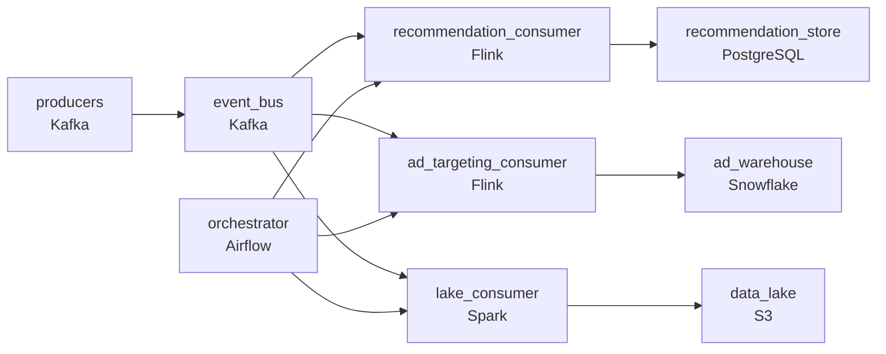

# The Queue That Wouldn't Stop Growing
_500,000 messages behind and the number keeps climbing._

- **Domain:** pipeline_architecture
- **Difficulty:** Medium
- **Est. time:** 25 min
- **URL:** https://datadriven.io/problems/the_queue_that_wouldn_t_stop_growing

## Problem

Your streaming video event pipeline shows consumer lag spiking from near-zero to over 500,000 messages within two hours. You need to diagnose whether the cause is a producer burst or a consumer slowdown, then design a monitoring and auto-remediation system that can detect, alert on, and automatically recover from future lag events.

**Concepts tested:** `paEventDriven`, `paEventPlatforms`, `paIdempotency`, `paMonitoring`, `paPartitioning`, `paStreamProcessing`

## Requirements

- Lag climbed past 500,000 messages before anyone noticed; future lag events have to be detected and raise an alert.
- When lag builds up again, the pipeline has to recover on its own instead of waiting for an engineer to intervene.

## Must-have components

- The whole problem is consumer lag on a Kafka cluster; without a message-queue tier there's nothing to monitor or remediate. Add Kafka, Kinesis, Pub/Sub, or equivalent as the event backbone.
- Auto-remediation needs a control plane that drives recovery of the consuming stages; a monitor that only pages recovers nothing. Add an orchestrator such as Airflow, Dagster or Prefect wired to the consumer stages.

**Expected stages:** `Source Layer` → `Ingestion Layer` → `Processing Layer` → `Storage Layer` → `Serving Layer`

## Solution walkthrough

### Why this problem exists in real interviews

Per-consumer lag tolerance, auto-scaling that creates rebalance pauses, and rebalance-induced lag spikes that look like real problems. The trap is one global lag threshold and uncapped auto-scaling; both produce false alerts that train on-call to ignore real ones.

The default reach is one global lag threshold and a scaler that adds replicas whenever lag crosses it. Recommendations' tight tolerance forces the threshold low; the data lake's tolerance is wider so it's wasted. Each rebalance pauses consumption and produces a brief lag spike that fires the alert; auto-scaling reacts and adds another replica that triggers another rebalance. Alerts fire constantly for problems that don't exist.

> **Trick to Solving**
>
> Per-consumer thresholds, capped scaling with cooldown, alerts that ignore rebalance-only spikes.
>
> 1. Each consumer has its own lag threshold tied to its tolerance; the alert per consumer is what's actionable for that consumer's SLA.
> 2. Auto-scaling is bounded with a cooldown between scaling actions; a chain of rebalances can't trigger more scaling.
> 3. Rebalance events are visible to the alerting layer; a brief lag spike inside a rebalance window is filtered, real lag past the rebalance fires the alert.

---

### Walk the requirements

**Step 1: Per-consumer thresholds replace one global one**

Each consumer's lag threshold matches its tolerance: recommendations alert on near-zero, ad targeting on minutes, the lake on hours. The alert per consumer is the right one for that consumer's SLA. A single global threshold is the version that over-pages or under-pages depending on which consumer it's tuned for; per-consumer thresholds are the contract.

**Step 2: Cap auto-scaling and add cooldown to break the chain**

Adding consumer replicas pauses consumption briefly while the cluster rebalances. Uncapped scaling chains rebalances together: each rebalance produces a lag spike, the scaler reacts, another rebalance fires. Bound the scaling action and add a cooldown window so consecutive scale-ups can't cascade. Without the cap, scaling makes lag worse during bursts.

**Step 3: Filter rebalance-only lag spikes from alerting**

Rebalance produces a brief lag spike that auto-resolves once consumption resumes. The monitoring layer sees the rebalance event and ignores lag spikes that fall inside the rebalance window. Real lag that persists past the window fires the alert. Alerting on every rebalance spike is what trains on-call to ignore the alert; filtering rebalance windows is what keeps the alert meaningful.

---

### The shape that fits

| node | type | tech | details |
|---|---|---|---|
| producers | source | Kafka |  |
| event_bus | queue | Kafka | parallelism: 16 partitions |
| orchestrator | transform | Airflow | errorAction: alert; monitorAlert: Sustained lag past per-consumer threshold (rebalance-window-aware) |
| recommendation_consumer | transform | Flink | slaFreshness: real-time |
| ad_targeting_consumer | transform | Flink | slaFreshness: < 15min |
| lake_consumer | transform | Spark | slaFreshness: < 24h |
| recommendation_store | storage | PostgreSQL | slaFreshness: real-time |
| ad_warehouse | storage | Snowflake | slaFreshness: < 15min |
| data_lake | storage | S3 | slaFreshness: < 24h |

> **What this design gives up**
>
> Per-consumer thresholds are configuration that has to be tuned per consumer; bounded auto-scaling means a real burst takes longer to absorb; rebalance-aware alerting requires the monitoring layer to consume rebalance events. Implementation cost is the price; the win is alerts that fire on real problems, scaling that doesn't make lag worse, and on-call that doesn't tune out the alerts.

> **What reviewers check**
>
> A reviewer looks at the canvas for these properties:
> - An event bus fans events out to consumers with per-consumer lag thresholds.
> - An orchestration / monitoring layer applies per-consumer thresholds and bounded auto-scaling with cooldown.
> - Alerts distinguish rebalance-induced lag spikes from sustained real lag.

> **The mistake that ships**
>
> What gets shipped uses one global threshold and uncapped scaling. The threshold over-pages on the data lake's spikes; uncapped scaling cascades rebalances during bursts and makes lag worse. Alerts fire constantly on rebalance spikes and on-call tunes them out. The eventual rebuild adds per-consumer thresholds, bounded scaling with cooldown, and rebalance-aware alerting.

---

- **A real producer burst hits during a planned scaling event. What does this design do?**
  - _Tests whether the candidate sees the cooldown allowing the in-flight scaling to settle, then a follow-up scale if lag remains past the rebalance window. The alert fires on real sustained lag, not the rebalance spike, so on-call investigates the burst rather than the scaling._
- **Recommendations' tolerance changes (the team accepts more lag during low-traffic hours). How does this design absorb the change?**
  - _Tests whether the candidate sees per-consumer thresholds as config the orchestrator reads on schedule; a time-of-day-aware threshold relaxes during low-traffic hours and tightens during peak. The change is config, not code._
