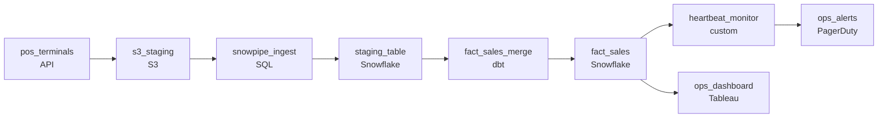

# The Register Never Sleeps
_Every swipe lands in the warehouse. The table has to stay current without breaking._

- **Domain:** pipeline_architecture
- **Difficulty:** Medium
- **Est. time:** 20 min
- **URL:** https://datadriven.io/problems/the_register_never_sleeps

## Problem

We run a 600-store retail chain feeding a Snowflake warehouse, but the POS terminals only bulk-upload each day's sales to S3 after close, so operations is blind to intraday numbers and learns that a store went dark mid-afternoon only when the nightly totals come in low. Build a pipeline that lands each sale in the warehouse within minutes and raises an alert when a store stops sending during business hours. Voids and same-day price corrections arrive as new events that reference the original transaction, and each has to update that original in place instead of adding a second row.

**Concepts tested:** `paBatchVsStreaming`, `paDagOrchestration`, `paEventDriven`, `paFileIngestion`, `paFullVsIncremental`, `paIdempotency`, `paMedallion`, `paMonitoring`, `paStreamProcessing`

## Requirements

- The operations dashboard tracks intraday sales across stores; today the end-of-day batch leaves ops blind during the day.
- Some transactions are voided or price-corrected the same day, and the corrections reference the original; the warehouse has to apply each correction without producing two records.
- If a store has stopped sending transactions during business hours, ops needs to know quickly; today it's discovered when end-of-day numbers come in low.

## Must-have components

- Sales land in the warehouse and ops queries it from there. Without a warehouse tier there's no destination. Add Snowflake, BigQuery, Redshift, or Databricks.
- Operations needs intraday visibility within minutes; an end-of-day batch can't satisfy that. Add a continuous or streaming ingestion path or set SLA Freshness to real-time / < 1min on the ingest stage.

**Expected stages:** `pos_event_stream` → `s3_staging` → `snowpipe_ingest` → `staging_table` → `fact_sales_merge`

## Solution walkthrough

### What this really is

This is a change-data problem wearing a retail costume: a void isn't a new sale, it's a restatement of an old one, and a silent register isn't missing data, it's the signal. Swapping the end-of-day batch for continuous ingestion is the easy half everyone reaches for. The trap is treating the void as just another row and trusting someone to notice a dark store. Get the first wrong and `fact_sales` carries both 'completed' and 'voided' for one transaction id, so totals diverge from the register tape. Get the second wrong and ops learns a store died at noon only when nightly numbers come in low.

> **One key does both jobs**
>
> The transaction id is the whole design. Snowpipe delivers at-least-once, so the staging table dedups on that id before anything reaches the fact table; then a `MERGE` keyed on the same id inserts new sales and updates the original row for voids and corrections. One key gives you both idempotent ingestion and in-place restatement, so consumers always see one row per transaction at its current state.

---

### Walk the requirements

**Step 1: Land each sale within minutes**

An S3 event notification triggers `snowpipe_ingest` to load each POS file into `staging_table` on arrival, and `ops_dashboard` reads the warehouse. No end-of-day wait. When a store reconnects after an outage and dumps a backlog, Snowpipe absorbs it one file at a time.

**Step 2: Resolve voids against the original by id**

`staging_table` dedups on transaction id first (Snowpipe is at-least-once). Then `fact_sales_merge` runs a `MERGE`: a new sale inserts; a void or price correction, which arrives as a new event referencing the original id, updates that row's status and net amount instead of appending. Appending the void is the version where duplicates pile up and totals drift.

**Step 3: Alert on silence during business hours**

`heartbeat_monitor` tracks per-store arrival and fires to `ops_alerts` when a store goes quiet past its expected tolerance, with store id and last-seen time. Catching the gap at end of day is the failure this replaces.

---

### The shape that fits

| node | type | tech | details |
|---|---|---|---|
| pos_terminals | source | API | slaFreshness: real-time |
| s3_staging | storage | S3 |  |
| snowpipe_ingest | transform | SQL | slaFreshness: < 1min; idempotencyStrategy: dedup |
| staging_table | storage | Snowflake | idempotencyStrategy: dedup |
| fact_sales_merge | transform | dbt | slaFreshness: < 1min; idempotencyStrategy: upsert |
| fact_sales | storage | Snowflake | slaFreshness: < 1min |
| heartbeat_monitor | quality_gate | custom | errorAction: alert; monitorAlert: Store silent past expected business-hours tolerance |
| ops_dashboard | consumer | Tableau | slaFreshness: < 15min |
| ops_alerts | consumer | PagerDuty | slaFreshness: < 1min |

> **Continuous is not the same as correct**
>
> The version that ships stops at continuous append: ops sees intraday sales, so it looks done. But a re-fired S3 notification lands a file twice and voids stack as new rows, so `fact_sales` shows duplicate transaction ids and totals drift from the register tape. And a store dies at noon with nobody watching. Staging dedup, `MERGE` by id, and per-store monitoring are the three pieces that turn 'faster' into 'trustworthy'.

> **You pay in compute for freshness**
>
> Snowpipe bills serverless per file, so many tiny POS files cost more than fewer right-sized ones; keep `fact_sales` clustered on transaction id so the `MERGE` stays a targeted update. That cost buys ops the day as it happens, voids resolving in place, and outages surfacing in hours instead of at close.

- **A void arrives for a transaction that hasn't been ingested yet. What does the `MERGE` do, and how does `fact_sales` converge?**
  - _Tests whether out-of-order events are handled: insert a placeholder the original later reconciles, or buffer until it arrives. Either way the table settles to one row per id._
- **A slow store trips `heartbeat_monitor` with false positives. How do you avoid alerting fatigue without missing real outages?**
  - _Tests per-store baselines over a global threshold, so a naturally quiet afternoon has a wider silence window than a high-volume store._
