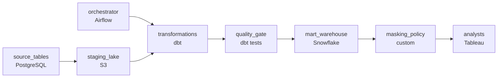

# The Revenue That Was Wrong for Two Weeks
_Nobody caught it until the CFO asked a question. Design the system that catches it first._

- **Domain:** pipeline_architecture
- **Difficulty:** Medium
- **Est. time:** 25 min
- **URL:** https://datadriven.io/problems/the_revenue_that_was_wrong_for_two_weeks

## Problem

Our transformation layer has grown to over 200 models, and we're seeing silent data quality failures slip into production reports. The data team wants a pipeline design that enforces quality gates, prevents bad models from promoting downstream, and gives analysts confidence in the output. Design the pipeline.

**Concepts tested:** `paDagOrchestration`, `paDataQuality`, `paDependencyMgmt`, `paFullVsIncremental`, `paIdempotency`, `paMedallion`, `paMonitoring`

## Requirements

- Revenue was double-counted for two weeks before anyone noticed; bad data has been quietly reaching production reports.
- Business consumes the mart at 7am every morning; the nightly run has to finish in time.
- Order data carries customer email and shipping address; analysts can't see those fields in the mart.

## Must-have components

- The mart that the business consumes at 7am lives in the warehouse; without a warehouse tier there's no destination for the validated mart. Add Snowflake, BigQuery, Redshift, or Databricks.
- A model with failing tests can't reach the mart; that's the named control. Without a quality-check tier (Great Expectations, dbt tests, Soda, Monte Carlo) there's nowhere to enforce promotion gates. Add a quality-gate node before the mart load.

**Expected stages:** `Raw Source` → `dbt Staging Layer` → `dbt Intermediate Layer` → `dbt Mart Layer` → `BI Serving Layer`

## Solution walkthrough

### Why this problem exists in real interviews

200+ models, silent quality failures slipping into reports for weeks, a 7am deadline, and PII that can't reach analysts. The trap is treating quality as a downstream cleanup; bad data spreads through derived models for weeks before the team notices.

The default reach is to run the transformation layer and let consumers notice problems in dashboards. Revenue is double-counted for two weeks before the head of finance asks why; analysts lose trust. The 7am deadline gets hit but the data behind it is wrong. PII is filtered in BI views; one direct query bypasses it.

> **Trick to Solving**
>
> Quality gates between each model and its consumer, mart-level masking on PII before analysts read, the orchestrator owns the 7am deadline.
>
> 1. Each transformation has a quality gate (row counts, null checks, referential integrity, business-rule checks) before it promotes to the next layer; bad models don't promote.
> 2. PII columns mask at the mart layer with column-level policies enforced at the warehouse, not in BI views.
> 3. The orchestrator schedules the transformations and gates with sensors firing before 7am if anything is at risk.

---

### Walk the requirements

**Step 1: Quality gate before each promotion catches silent failures**

Each transformation in the layer has its quality gate: row count tolerance, null-rate checks, referential integrity, business-rule sanity checks. The gate fails closed: a model that fails its gate doesn't promote to the downstream model that depends on it. Revenue double-counting wouldn't have spread for two weeks because the row-count or aggregate check would have caught it. A 'we'll notice in dashboards' approach is the version where bad data spreads for weeks; gates between layers stop the spread.

**Step 2: PII masks at the mart layer, not in BI views**

Customer email and shipping address are PII. Column-level policies on the mart return null or hashed values for analyst roles; the underlying tables also enforce the policy so a direct query doesn't bypass it. A 'hide it in BI' approach is the version where one direct query exposes raw email; the warehouse-enforced mask is the contract.

**Step 3: Land the mart by 7am with alerting before**

The orchestrator runs the nightly DAG with sensors firing before 7am if any stage is at risk. On-call has hours to fix, not minutes. Without the orchestration the deadline isn't owned by anybody and the 7am freshness sometimes slips silently.

---

### The shape that fits

| node | type | tech | details |
|---|---|---|---|
| source_tables | source | PostgreSQL |  |
| orchestrator | transform | Airflow | errorAction: alert; monitorAlert: Stage at risk vs 7am SLA or quality gate failed |
| staging_lake | storage | S3 | backfillStrategy: partition_overwrite |
| transformations | transform | dbt | idempotencyStrategy: staging_table |
| quality_gate | quality_gate | dbt tests | errorAction: alert |
| mart_warehouse | storage | Snowflake | slaFreshness: < 24h |
| masking_policy | quality_gate | custom | errorAction: alert |
| analysts | consumer | Tableau | slaFreshness: < 24h |

> **What this design gives up**
>
> Quality gates add validation work between every transformation and gate-failure means more 'failed' runs the team has to triage; column-level masking adds query-rewrite cost on every read; the orchestrator's per-stage SLA is configuration to maintain. Implementation cost is the price; the win is bad data caught between models, PII that doesn't leak through BI workbooks, and a 7am deadline owned by the orchestrator.

> **What reviewers check**
>
> A reviewer looks at the canvas for these properties:
> - A quality-gate tier validates each model before promotion to the next layer.
> - PII fields mask at the warehouse layer; analysts can't read raw email and address.
> - An orchestration layer owns the nightly run with alerting before the 7am deadline.

> **The mistake that ships**
>
> What gets shipped runs the transformations and lets consumers notice failures. Revenue double-counts silently for two weeks; the head of finance asks why. PII is filtered in BI views and one direct query exposes it. The 7am deadline slips occasionally because nobody's watching it. The eventual rebuild adds quality gates between layers, warehouse-level PII masking, and orchestrated deadline alerting.

---

- **A quality gate fails on a downstream model that 200 reports depend on. What does this design do, and what do analysts see at 7am?**
  - _Tests whether the candidate sees the gate-fail-closed contract: the downstream doesn't promote, analysts read yesterday's mart, and the alert tells them which model failed and why. The 7am report shows yesterday's data with a freshness flag rather than wrong data with no flag._
- **An analyst legitimately needs a customer's email for a debugging exercise. What in this design lets that happen, and what doesn't?**
  - _Tests whether the candidate sees the masked view as the default; legitimate access goes through a separate audited path against the unmasked source with explicit grants and a logged query. Analysts don't get unmasked access to the mart by being analysts; the mask is the contract._
