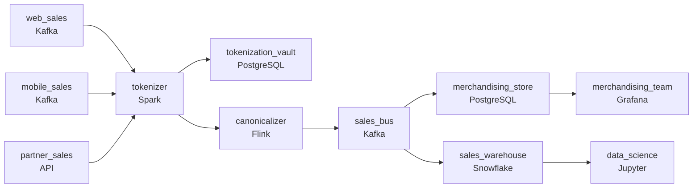

# The Sale That Needs to Land Now
_Three channels feeding one view. Not all of them speak the same language._

- **Domain:** pipeline_architecture
- **Difficulty:** Medium
- **Est. time:** 25 min
- **URL:** https://datadriven.io/problems/the_sale_that_needs_to_land_now

## Problem

We run a global luxury e-commerce marketplace where sales arrive from three channels in three shapes: the web storefront pushes JSON events, the mobile apps send batched JSON, and partner retail integrations are polled as XML, and every order has to be reconciled into one canonical record before anything downstream reads it. Merchandising runs live flash sales and needs sales from all three channels landing in their dashboard within minutes to tune discounts, so no channel can sit behind a daily-batch-only path, while the data science team only needs a clean daily archive for modeling. Many buyers are in the EU, so customer email and shipping address are GDPR-regulated and can never sit in a queryable table in the clear.

**Concepts tested:** `paApiIngestion`, `paBackfill`, `paBatchProcessing`, `paBatchVsStreaming`, `paDagOrchestration`, `paDataLake`, `paDataQuality`, `paDeadLetterQueue`, `paDeduplication`, `paEltVsEtl`, `paEventDriven`, `paEventPlatforms`, `paFileIngestion`, `paFullVsIncremental`, `paIdempotency`, `paLambdaArch`, `paLateData`, `paMedallion`, `paMonitoring`, `paPartitioning`, `paRetryHandling`, `paSchemaEvolution`, `paStreamProcessing`, `paTableFormats`

## Requirements

- Merchandising adjusts campaigns and discounts on live performance; sales from every channel have to land in their dashboard within minutes, including during a flash sale, so no channel can sit behind a daily batch.
- Web, mobile, and partner sources each send orders in different formats; downstream consumers can't branch on the channel for every order.
- EU customer email and address are PII under GDPR; raw values can't sit in any queryable table.

## Must-have components

- Merchandising acts in minutes on live performance, including during a flash sale; without a streaming / sub-minute path the dashboard is too slow. Add a streaming layer on the order paths or set SLA Freshness to real-time / < 1min.
- Orders land in the warehouse for downstream analytics. Without a warehouse tier there's no destination. Add Snowflake, BigQuery, Redshift, or Databricks.

**Expected stages:** `Source Systems` → `Ingestion Layer` → `Raw Landing Zone` → `Transformation Layer` → `Serving Layer`

## Solution walkthrough

### Why this problem exists in real interviews

Multi-channel sales with three properties to fit: minutes-fresh merchandising even during a flash sale, a canonical shape across web, mobile, and partner formats, and GDPR PII isolation. The trap is one ingester per channel that branches downstream and treating PII as a downstream filter.

The default reach is per-channel ingesters and downstream consumers branching on channel. The first flash sale doubles event rates and the merchandising path can't keep up because the channels run on shared compute. PII lands in the warehouse and is masked in BI views; one direct query exposes raw email. Each channel format change ripples through every consumer.

> **Trick to Solving**
>
> Canonical sale shape on the bus, streaming for merchandising in minutes, PII tokenized at ingest before any queryable table sees it.
>
> 1. All three channels normalize to a canonical sale shape on the bus; consumers read one schema regardless of source.
> 2. A streaming consumer feeds merchandising within minutes; the path is sized to absorb a flash-sale spike via a queue.
> 3. PII tokenizes at ingest; the warehouse and downstream stores hold tokens, not raw email and address.

---

### Walk the requirements

**Step 1: Merchandising sees minutes-fresh sales, even in a flash sale**

Sales events flow through tokenization and a streaming consumer that updates the merchandising store within minutes. The partner channel is polled but its output joins the same streaming path, so partner sales land in the dashboard within minutes of being polled, not a day later. A queue between sources and the consumer buffers flash-sale spikes; the consumer catches up with backpressure visible in queue depth rather than dropped events. Without a streaming tier the merchandising freshness is unattainable; without a buffer the spike crashes the consumer.

**Step 2: Canonical shape across web, mobile, and partner**

Each channel normalizes to a canonical sale shape (channel, `customer_token`, products, amounts, currency, timestamp) at ingest. Downstream consumers read one schema; a new partner integration adds a normalizer mapping rather than a consumer change. A 'branch on channel everywhere' design is the version where every channel change touches every consumer; canonical-up-front is what keeps consumers stable.

**Step 3: Tokenize PII at ingest; raw values never land queryable**

EU customer email and address are GDPR PII. Tokenization runs at the boundary; the warehouse and merchandising store hold tokens. The mapping vault sits in a restricted environment with audited access. A 'mask in BI' approach is the version where a direct query reveals the raw values; tokenizing at ingest keeps PII out of queryable tables.

---

### The shape that fits

| node | type | tech | details |
|---|---|---|---|
| web_sales | source | Kafka |  |
| mobile_sales | source | Kafka |  |
| partner_sales | source | API |  |
| tokenizer | transform | Spark |  |
| tokenization_vault | storage | PostgreSQL |  |
| canonicalizer | transform | Flink |  |
| sales_bus | queue | Kafka |  |
| merchandising_store | storage | PostgreSQL |  |
| sales_warehouse | storage | Snowflake |  |
| merchandising_team | consumer | Grafana |  |
| data_science | consumer | Jupyter |  |

> **What this design gives up**
>
> The canonical shape requires every channel to map at ingest; tokenization adds a hop and a vault; the queue between sources and the consumer is more infrastructure than a direct write. Implementation cost is the price; the win is merchandising that sees flash sales as they happen, channels that change without rippling through consumers, and PII that doesn't leak through any queryable path.

> **What reviewers check**
>
> A reviewer looks at the canvas for these properties:
> - An event bus carries canonical sale events from all three channels; consumers read one shape.
> - A streaming path serves merchandising within minutes; the queue absorbs flash-sale spikes.
> - PII tokenizes at ingest; raw email and address never sit in queryable tables.
> - A warehouse anchors the canonical sales fact for analytics and data science.

> **The mistake that ships**
>
> What gets shipped runs per-channel ingesters and lets consumers branch on channel, or drops the polled partner channel into a daily batch that misses the dashboard. A flash sale doubles event rates and the merchandising path can't keep up. PII lands in the warehouse and is masked in BI; one direct query exposes raw email. Each channel format change ripples through every consumer. The eventual rebuild adds tokenization at ingest, canonical-on-the-bus, and the buffered streaming path.

---

- **A new partner integration sends a format the canonical shape doesn't anticipate. What in this design extends, and what doesn't?**
  - _Tests whether the candidate sees the canonicalizer's mapping as the extension point: a new normalizer for the partner, the canonical shape unchanged, and downstream consumers unaffected. Adding fields to the canonical shape (additive evolution) is a separate decision tied to consumer needs._
- **A GDPR deletion request lands. What in this design lets the deletion physically remove the customer from every store?**
  - _Tests whether the candidate sees the tokenization vault as the boundary: deletion removes the customer's token mapping; the warehouse and merchandising store hold tokens that are now orphaned. The data is effectively forgotten because the link to the person is gone, with the orphaned tokens compacted on a schedule._
