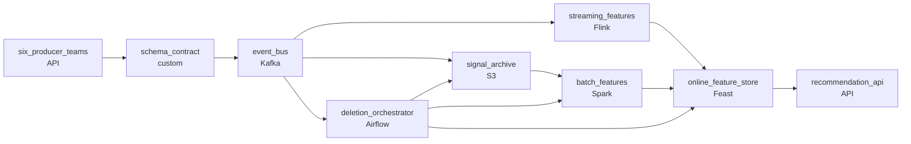

# The Signals That Power Recommendations
_Fresh signals, many teams, one pipeline._

- **Domain:** pipeline_architecture
- **Difficulty:** Medium
- **Est. time:** 25 min
- **URL:** https://datadriven.io/problems/the_signals_that_power_recommendations

## Problem

Our personalization platform powers product recommendations for millions of users. It needs a continuous feed of user interaction signals - clicks, purchases, saves, and ratings - from multiple product surfaces and a feature computation layer that keeps user profiles current. Different teams own different signal sources and have different latency requirements. Design the ingestion and feature pipeline.

**Concepts tested:** `paApiIngestion`, `paBatchVsStreaming`, `paDataLake`, `paDataQuality`, `paDeadLetterQueue`, `paDeduplication`, `paEventDriven`, `paEventPlatforms`, `paFullVsIncremental`, `paIdempotency`, `paLambdaArch`, `paLateData`, `paMonitoring`, `paPartitioning`, `paRetryHandling`, `paSchemaEvolution`, `paStreamProcessing`, `paTableFormats`

## Requirements

- The recommendation API uses 'recently viewed' features; if those are stale, recommendations get noticeably worse.
- Six product teams emit signals in their own formats with no shared schema today; consumers can't keep adding format-specific code each time a producer ships a change.
- Under GDPR, a deletion request has to remove the user from the feature store, the historical archive, and any derived features.

## Must-have components

- Multiple producers publish canonical signals to a centralized event bus and consumers subscribe independently. Without a message queue / event bus tier there's no shared backbone. Add Kafka, Kinesis, or Pub/Sub.
- GDPR deletion has to reach the historical signal archive and any derived features; without a durable archive tier the deletion has nothing to act on. Add S3, GCS, ADLS, or equivalent.

**Expected stages:** `Signal Sources` → `Event Bus` → `Feature Computation` → `Feature Store` → `Recommendation Serving`

## Solution walkthrough

### What this really is

This is a **contract problem dressed up as an ingestion problem**. Six teams, six formats, one recommendation API that goes stale in minutes, and a GDPR clock. Anyone can draw Kafka feeding a feature store. What separates candidates is whether the shape is fixed at publish or repaired downstream, and whether deletion is part of the design or a later project. Harmonize downstream and every consumer carries six parsers, so one producer change breaks all of them. Bolt deletion on later and the user survives in derived stores nobody listed.

> **Validate the shape before the bus, not after it**
>
> Put the schema check between the producers and the bus. Everything behind the bus then reads one canonical shape (`event_type`, `user_id`, `item_id`, surface, timestamp, payload), and a new signal is a new `event_type` value, not a new parser.

### Walk the requirements

**Step 1: Gate every publish on the canonical shape**

`schema_contract` sits in front of `event_bus` and rejects nonconforming events, alerting the producing team. The team that broke the shape learns at publish time. Without the gate, consumers find out in production.

**Step 2: Split fresh features from heavy ones**

'Recently viewed' goes through `streaming_features` (Flink, upsert keyed on `user_id`) into the online feature store within seconds. Long-window aggregates stay in `batch_features`, reading the archive every hour. Streaming every feature costs a lot and buys nothing. Batching every feature means stale recommendations.

**Step 3: Make deletion an event with receipts**

A deletion request rides the same bus. `deletion_orchestrator` removes the online row, tombstones the user's events in `signal_archive`, and triggers a recompute of the affected batch partitions. It collects a confirmation from each store. You answer the regulator with those receipts, not with a promise.

### The reference design

| node | type | tech | details |
|---|---|---|---|
| six_producer_teams | source | API |  |
| schema_contract | quality_gate | custom | errorAction: alert; monitorAlert: Producer rejected on canonical shape |
| event_bus | queue | Kafka | parallelism: 16 partitions |
| signal_archive | storage | S3 | backfillStrategy: partition_overwrite |
| streaming_features | transform | Flink | slaFreshness: real-time; idempotencyStrategy: upsert |
| batch_features | transform | Spark | slaFreshness: < 1h |
| online_feature_store | storage | Feast | slaFreshness: < 1min |
| deletion_orchestrator | transform | Airflow | errorAction: alert; monitorAlert: Per-store deletion confirmation missing within window |
| recommendation_api | consumer | API | slaFreshness: real-time |

> **A downstream harmonizer is six parsers in disguise**
>
> The design candidates usually ship lets producers publish raw and adds a 'normalize' transform after the bus. It looks central, but each producer change still lands on whoever owns that transform, and the archive keeps six formats forever. That makes replay and deletion harder, not easier.

> **Deletion drawn as edges, not a footnote**
>
> The reviewer checks for a path from the deletion request to every store that holds the user, derived features included. A design that says 'handle GDPR separately' has already failed the requirement.

> **Stream only what goes stale**
>
> Streaming is priced per feature, all day. Only the signals where recommendation quality decays in minutes should be on it. The hourly batch path over S3 costs little and is replayable, and it is also where deletion recomputes partitions cleanly.

- **A producer adds an `event_type` value that no consumer reads yet. What does `schema_contract` enforce, and what does it let through?**
  - _Checks that you know the difference between a new value inside the shape and an additive, optional change to the shape itself._
- **One store's deletion confirmation is overdue. What does `deletion_orchestrator` do, and what goes in the audit response?**
  - _Checks for retries and an alert, and a per-store status that shows confirmed and outstanding stores rather than a single pass or fail._
