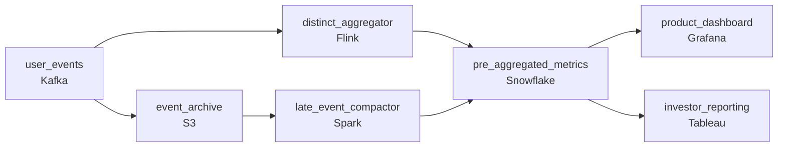

# The Speed Layer
_Dashboards can't wait for raw logs. Something has to happen upstream._

- **Domain:** pipeline_architecture
- **Difficulty:** Medium
- **Est. time:** 20 min
- **URL:** https://datadriven.io/problems/the_speed_layer

## Problem

Our product team tracks user engagement through active user counts. They need hourly active users, daily active users, and weekly active users all refreshed every hour. Right now we compute these at query time and it is too slow. Design a pipeline that pre-computes and serves these metrics.

**Concepts tested:** `paBatchProcessing`, `paDagOrchestration`, `paDataQuality`, `paDeduplication`, `paDependencyMgmt`, `paFullVsIncremental`, `paIdempotency`, `paLateData`, `paMonitoring`, `paPartitioning`

## Requirements

- Product wants HAU within minutes of the hour closing and DAU shortly after midnight; today they wait until 2am for yesterday's number.
- DAU goes into investor reporting; the count has to be exact, not approximate.
- Mobile clients buffer events for hours; a late event from yesterday has to update yesterday's numbers, not be silently dropped.

## Must-have components

- HAU, DAU, and WAU are pre-aggregated tables that dashboards read; without a warehouse tier there's nowhere for the rollups to live. Add Snowflake, BigQuery, Redshift, or Databricks.
- HAU has to land within minutes of each hour close while late events update prior days; one shared cadence either misses the hourly window or never corrects history. Show at least one streaming path and at least one batch path.

**Expected stages:** `raw_activity_events` → `deduped_sessions` → `hourly_rollup` → `daily_rollup` → `weekly_rollup`

## Solution walkthrough

### Why this problem exists in real interviews

DAU into investor reporting wants exact distinct counts, HAU wants minutes-fresh, and mobile late events have to correct yesterday's number rather than disappear into today. The trap is approximating the count with HyperLogLog to hit the speed budget , that breaks the investor-exact constraint , or running everything as a single nightly recompute, which misses the hourly window.

The default reach is one streaming aggregator that uses HLL to keep approximate counts and a nightly recompute to fix DAU. Investor reporting can't use HLL because the number has to be exact; the nightly run produces a different number than HLL by enough to matter. Late mobile events arrive after the daily aggregation has run; either they're dropped or they get attributed to the wrong day. HAU is fresh; DAU is exact only at midnight, and history is never corrected.

> **Trick to Solving**
>
> Streaming for the freshness, distinct-set state for the exactness, late-event reprocessing for the history.
>
> 1. Per-period distinct user sets (last hour, last day, last week) live in the streaming state and emit exact counts on each window-close. The aggregator holds the set, not an approximate sketch.
> 2. Late events update the affected period's set and the metric for that period rebuilds; downstream tables version the metric so the corrected number replaces the original.
> 3. Investor-grade DAU comes from the streaming aggregator's day-close set, not from an approximate stream sketch.
> 4. Pre-aggregated tables in the warehouse hold (`period_type`, `period_id`, `distinct_count`) so dashboards read at query time without recomputing.

---

### Walk the requirements

**Step 1: HAU within minutes, DAU within minutes of midnight, exact counts**

A streaming aggregator maintains exact distinct user sets per (`period_type`, `period_id`) , hour-of-the-day, day, week. When an hour closes, the aggregator emits the exact distinct count to the warehouse table; same for the day at midnight UTC. Dashboards read pre-aggregated rows; no recompute at query time. A 'compute distincts at query time on the raw events' design is what's been making them wait until 2am; pre-aggregated tables read in milliseconds.

**Step 2: Exact counts even under freshness pressure**

Investor DAU goes on the front of regulatory filings; approximate counts can't substitute. The aggregator holds the actual user-id set (or a structure that allows exact distinct, not a probabilistic sketch) for each open period. Memory cost is proportional to active users in the open windows, which is bounded. HLL is the version that hits the speed budget but produces a number that doesn't match the audited count; exact distinct sets are the contract that matches the regulatory bar.

**Step 3: Late events correct the day they belong to**

Mobile clients buffer events; a late event from yesterday has to update yesterday's DAU, not today's. Each event carries event-time; the aggregator keeps recently-closed periods open for the lateness allowance and reopens older periods when a late event arrives outside the allowance. The warehouse pre-aggregated row for the affected day is overwritten with the corrected count. A 'drop events past the lateness window' design is the version where history goes silently wrong; reopening older periods is what keeps the historical figure honest.

---

### The shape that fits

| node | type | tech | details |
|---|---|---|---|
| user_events | source | Kafka | parallelism: 16 partitions |
| event_archive | storage | S3 | backfillStrategy: partition_overwrite |
| distinct_aggregator | transform | Flink | slaFreshness: real-time; idempotencyStrategy: upsert |
| late_event_compactor | transform | Spark | slaFreshness: < 1h; backfillStrategy: partition_overwrite; idempotencyStrategy: staging_table |
| pre_aggregated_metrics | storage | Snowflake | slaFreshness: < 1min; backfillStrategy: partition_overwrite |
| product_dashboard | consumer | Grafana | slaFreshness: < 1min |
| investor_reporting | consumer | Tableau | slaFreshness: < 24h |

> **What this design gives up**
>
> Holding exact distinct sets in the aggregator memory is more expensive than HLL; reopening older periods for late events means the warehouse rows for past days can change; the pre-aggregated tables roughly double the storage of the raw event log on the metric columns. Implementation cost is the price; the win is investor-grade exactness, hourly freshness without query-time recompute, and history that corrects when late events arrive.

> **What reviewers check**
>
> A reviewer looks at the canvas for these properties:
> - A streaming aggregator maintains exact distinct user sets per period (hour, day, week) and emits the count at each window close.
> - Pre-aggregated tables in the warehouse serve dashboards at read time.
> - Late events update the affected period's set and the warehouse metric is restated for that period.

> **The mistake that ships**
>
> What gets shipped runs HLL in a streaming aggregator and a nightly recompute for exactness. Investor reporting can't use the HLL number because it differs from the audited DAU by more than tolerance; the team manually reconciles every quarter. Late mobile events arrive after the daily aggregation; the team drops them. History never gets corrected and somebody asks why DAU on a Friday looks lower than its weekend neighbors. The eventual rebuild moves to exact distinct sets and a late-event compactor; each was reachable up front if 'investor uses these numbers' had been treated as a correctness budget rather than a freshness budget.

---

- **Active users for a single hour spike past the aggregator's memory budget for an exact set. What does this design do, and what's the failure mode if not?**
  - _Tests whether the candidate sees the memory bound: the aggregator either spills the set to disk (slower but still exact), partitions across more workers, or , only if the business accepts approximation for that grain , uses an approximate sketch. The candidate should name the trade and not silently swap exactness for HLL._
- **DAU for a day a month ago is corrected upward after a late buffer drain. Investor reporting has already filed on the original number. What does this design do?**
  - _Tests whether the candidate sees the warehouse keeping the original-as-filed value alongside the restated value (or in an immutable filing archive separate from the live warehouse) so the regulatory record is preserved. The pre-aggregated table reflects the restated number; the filing's record reflects what was filed._
