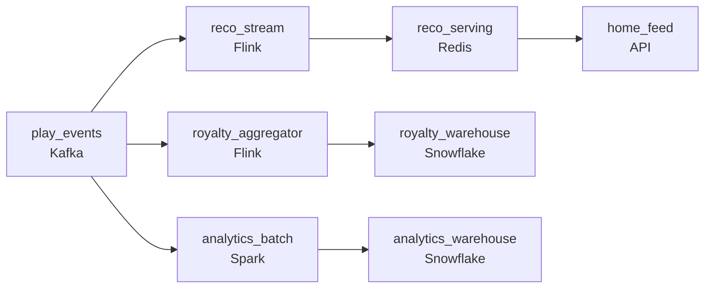

# The Thirty-Second Rule

- **Domain:** pipeline_architecture
- **Difficulty:** Medium
- **Est. time:** 35 min
- **URL:** https://datadriven.io/problems/the_thirty_second_rule

## Problem

A music-streaming platform emits a play event every time someone starts, pauses, or skips a track, and three teams read that same feed: recommendations wants what a listener is playing reflected in their home feed within a minute, royalty accounting must count each qualifying play (30 seconds or more of listening) exactly once because payouts to rights-holders can't be clawed back, and product analytics reports daily engagement the next morning. Design the platform that ingests the play stream once and serves all three from it at their own freshness and correctness needs.

**Concepts tested:** `paBatchProcessing`, `paBatchVsStreaming`, `paDataLake`, `paDataQuality`, `paDeduplication`, `paEventDriven`, `paEventPlatforms`, `paIdempotency`, `paLambdaArch`, `paLateData`, `paMonitoring`, `paPartitioning`, `paRetryHandling`, `paStreamProcessing`, `paTableFormats`

## Requirements

- When a listener plays a few tracks, their home feed should react within about a minute.
- Every qualifying play (30 seconds or more) must be counted once for royalties; we cannot pay a rights-holder twice.
- Product analytics needs daily engagement numbers ready the next morning.

## Must-have components

- A single high-throughput ingestion queue (e.g. Kafka) has to absorb the raw play stream before any consumer reads it. Add a message-queue node as the shared source so all three teams read the same events.
- Recommendations needs a listener's activity reflected within a minute, which batch cannot deliver. Add a streaming processor on the path to the recommendation serving tier.
- The three consumers do not share one latency budget: recommendations is sub-minute, analytics is next-morning. Model at least two distinct freshness tiers so you are not streaming everything or batching everything.
- Royalty accounting and analytics both need a queryable store of settled counts. Add a warehouse (or lakehouse) as the durable, auditable home for exactly-once royalty aggregates and daily reports.
- The recommendation feed reads from a low-latency serving store, not from the raw stream. Wire the streaming processor directly into a serving store so the home feed updates within the minute.
- Serving three consumers from one feed at different tiers needs at least the ingest queue, a streaming path with its serving store, an exactly-once royalty path with its warehouse, and a batch analytics tier. Build out the full fan-out.

**Expected stages:** `play_event_ingest` → `streaming_processor` → `recommendation_serving` → `royalty_dedup_aggregation` → `royalty_warehouse` → `analytics_batch` → `analytics_warehouse`

## Solution walkthrough

### Why this problem exists in real interviews

This is a multi-consumer fan-out problem wearing a music-app costume. One play-event feed has to satisfy three teams with three different correctness budgets: recommendations wants freshness and shrugs at a slightly wrong count, royalty accounting needs each qualifying play counted exactly once because a payout to a rights-holder cannot be clawed back, and analytics just wants yesterday's numbers by morning. The trap is a single pipeline that averages all three: it is too slow to feel live, too approximate to bill on, and too expensive because it streams work that could have waited until 2am.

The default whiteboard answer is one Kafka topic into one stream job that writes a 'plays' table everyone queries. Recommendations lag because the job is doing heavy royalty logic inline. Royalties double-count the first time a producer retries a batch of offline uploads, because nothing dedups on a stable id. Analytics runs full scans over a table that was never partitioned for it. Three consumers, three quiet failures, one shared pipeline to blame.

> **Trick to Solving**
>
> Ingest once, fan out into paths sized for each consumer's correctness budget.
>
> 1. Recommendations ride a streaming path to a low-latency serving store; approximate-but-live is the budget.
> 2. Royalties ride an exactly-once path: dedup on a stable play id, apply the 30-second qualifying check, upsert idempotently into a warehouse. Correctness is the budget, latency is not.
> 3. Analytics is a nightly batch into its own warehouse layout; streaming it buys nothing.

---

### Walk the requirements

**Step 1: Ingest the play stream once, into a shared queue**

Every start, pause, skip, and progress event lands in one high-throughput queue partitioned so a hot artist or a peak-hour region does not create a single hot partition. All three consumers read from here as independent consumer groups, so one team's backpressure never stalls another's. Three separate ingest layers would triple cost and let the three views of a play drift apart.

**Step 2: Stream recommendations to a serving store; approximate is fine**

A streaming processor keeps per-listener recent activity and pushes it to a low-latency serving store the home feed reads within a minute. If a viewer's count is briefly off by one during a skip, nobody notices. The mistake here is doing the royalty dedup inline on this path: it is the heavy work that makes the feed lag.

**Step 3: Count royalties exactly once on a stable play id**

A qualifying play is a start event whose progress signal shows 30+ seconds, correlated on the play id the client stamped. The royalty path dedups on that id and upserts counts into a warehouse idempotently, so a producer retry or a stream restart replays without inflating what a rights-holder gets paid. Latency is not the budget; a duplicated cent is, once it scales to millions of plays.

**Step 4: Batch analytics on its own cadence and layout**

Daily engagement lands the next morning from a batch job that reads the same events but writes a warehouse table partitioned by date and the dimensions analysts filter on. Streaming this path adds cost and operational surface for a consumer that only ever looks at yesterday.

---

### The shape that fits

| node | type | tech | details |
|---|---|---|---|
| play_events | source | Kafka |  |
| reco_stream | transform | Flink |  |
| reco_serving | storage | Redis |  |
| home_feed | consumer | API |  |
| royalty_aggregator | transform | Flink |  |
| royalty_warehouse | storage | Snowflake |  |
| analytics_batch | transform | Spark |  |
| analytics_warehouse | storage | Snowflake |  |

> **Scale + Cost**
>
> At ~5B events/day the cost concentrates in whatever you choose to stream. Recommendations is the only consumer that justifies always-on streaming compute; royalties can run as an exactly-once micro-batch and analytics as one nightly Spark job. Streaming all three would roughly triple the streaming bill for two consumers that gain nothing from sub-minute latency.

> **Interviewers Watch For**
>
> A candidate who justifies streaming-vs-batch per consumer instead of defaulting to stream-everything; who names the play id as the dedup key and the 30-second progress signal as the qualifying join; and who reasons about producer retries and late offline uploads landing in the right accounting period by event time, not arrival time.

> **Common Pitfall**
>
> Folding royalty logic into the recommendation stream, so the feed lags and the counts still aren't exactly-once. The two have opposite budgets: separate them. The second pitfall is anchoring royalty windows on arrival time, which silently drops offline plays that upload a day late and undercounts a rights-holder's payout.

---

- **A device was offline for two days and uploads 400 plays at once, some already counted before the disconnect. How does the royalty path avoid double-paying and still credit the genuinely new plays?**
  - _Tests dedup on stable play id plus event-time windowing and reconciliation for late data._
- **A new tournament-style release causes a 20x spike on one artist for an hour. Where does this design bend, and what do you scale?**
  - _Tests partition-key choice, consumer-group isolation, and streaming autoscaling under a hot key._
