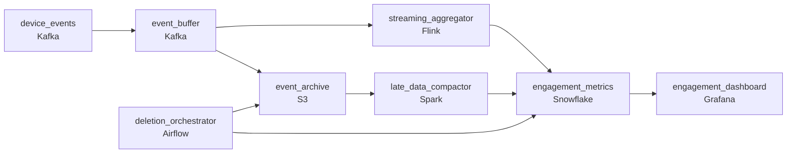

# The User Who Asked to Be Forgotten
_Users want their data erased. Completely._

- **Domain:** pipeline_architecture
- **Difficulty:** Hard
- **Est. time:** 30 min
- **URL:** https://datadriven.io/problems/the_user_who_asked_to_be_forgotten

## Problem

Our platform has listeners on mobile, web, and smart speakers - all generating user interaction events. We need to aggregate these into dashboards showing hourly and daily engagement metrics. The challenge is that events arrive late, users can listen across multiple devices in one session, and GDPR requires us to completely delete a user's event history within 30 days of a deletion request. Design the end-to-end pipeline.

**Concepts tested:** `paApiIngestion`, `paBatchProcessing`, `paDataLake`, `paDataQuality`, `paDeduplication`, `paEventDriven`, `paEventPlatforms`, `paFullVsIncremental`, `paIdempotency`, `paLateData`, `paMicroBatchVsTrue`, `paPartitioning`, `paRetryHandling`, `paStreamProcessing`

## Requirements

- GDPR requires that a user's data be deleted within 30 days of their request, across every system that holds it.
- Mobile clients buffer events for tens of minutes when connectivity is bad; engagement metrics have to count those events for the time the user listened, not when the platform received them.
- Client retries deliver the same event twice; engagement and royalty numbers can't be inflated by those retries.
- Major live events drive sudden 15x volume spikes that have caused the pipeline to fall behind in the past.

## Must-have components

- Hourly and daily engagement dashboards driven by windowed aggregation over a continuous stream is the named architecture. Add a streaming layer on the event path or set SLA Freshness to real-time / < 1min on the processor.
- GDPR deletion has to reach the raw archive and any aggregation that included the user; without a durable archive tier there's nothing to delete from and no way to demonstrate completion within 30 days. Add S3, GCS, or ADLS.

**Expected stages:** `event_ingestion` → `stream_processor` → `gcs_raw_archive` → `bigquery_aggregates` → `gdpr_deletion_service`

## Solution walkthrough

### What this really is

This is a deletion control plane dressed up as an engagement dashboard. Almost every candidate can draw events into a stream processor into a warehouse, so that half is table stakes. The real test is whether you designed erasure as a path with receipts or left it for later. An hourly aggregate carries no user id, so you cannot erase one listener from a count. You have to scrub the raw archive and recompute every bucket that counted them. Skip that and day 31 arrives with a clean archive, contaminated aggregates, and nothing to show the regulator.

> **Deletion is a replay, not a DELETE**
>
> Land every raw event in `event_archive` on S3, partitioned by event hour. Erasing a user then becomes three steps: drop their rows, rerun only the touched partitions through `late_data_compactor`, and `partition_overwrite` those hours in `engagement_metrics`. The same replay path also absorbs events that miss the lateness window, so one mechanism covers two requirements.

### Walk the requirements

**Step 1: Put a queue in front of the aggregator**

A 15x live-event spike belongs in `event_buffer` as consumer lag, not in `streaming_aggregator` as dropped events. Size Kafka retention for the burst and size Flink for sustained load. Flink catches up within minutes and nothing is lost.

**Step 2: Window on event time with an allowed lateness**

Phones buffer events for tens of minutes. Bucket on the client timestamp and hold windows open for the lateness allowance. An event later than that goes through the archive and the compactor into its true hour. It must never be counted in the hour it happened to arrive.

**Step 3: Dedup on the client `event_id` before counting**

Retries resend the same `event_id`. Flink keyed state drops the second copy before any counter moves, and an `upsert` write keeps a restart from counting twice. Royalties are computed from these numbers, so a few percent of inflation is real money.

**Step 4: Give each store its own deletion receipt**

`deletion_orchestrator` fans each request out to the archive and to the aggregates. It records a confirmation per store and alerts when a confirmation is overdue. The 30-day proof is that set of receipts.

| node | type | tech | details |
|---|---|---|---|
| device_events | source | Kafka | parallelism: 16 partitions |
| event_buffer | queue | Kafka | parallelism: 16 partitions |
| event_archive | storage | S3 | backfillStrategy: partition_overwrite |
| streaming_aggregator | transform | Flink | slaFreshness: real-time; idempotencyStrategy: upsert |
| late_data_compactor | transform | Spark | slaFreshness: < 1h; idempotencyStrategy: staging_table |
| engagement_metrics | storage | Snowflake | slaFreshness: < 1min; backfillStrategy: partition_overwrite |
| deletion_orchestrator | transform | Airflow | errorAction: alert; monitorAlert: Per-store deletion confirmation missing within window |
| engagement_dashboard | consumer | Grafana | slaFreshness: < 1min |

| Arrival-time buckets | Event-time buckets |
|---|---|
| A phone reconnects at 9:40 and drains 30 minutes of listening. The 9:00 hour spikes, 8:00 comes up short, and the dashboard reports behavior that never happened. | The same drain lands in 8:00, where it belongs. Anything past the allowance takes the `event_archive` to `late_data_compactor` path and overwrites the 8:00 partition. |

> **Subtracting duplicates later never converges**
>
> Candidates count everything and plan a nightly job to remove retries. Every recompute disagrees with the live number, and royalty reports drift. Dedup belongs at the boundary, before the counter moves.

> **Receipts per store, not a global done flag**
>
> Watch whether the candidate can name every place a user's events live and how each one confirms erasure. An answer of 'we delete from the warehouse' means the raw archive still holds the user on day 31.

- **One store is offline when a deletion request arrives. What does `deletion_orchestrator` report?**
  - _The request stays open with per-store status, retries run, and an alert fires before the 30-day deadline. The answer is never a silent pass._
- **How do you erase a user whose events sit in compacted Parquet files in `event_archive`?**
  - _Tests partitioning by event hour so the rewrite touches only affected files, followed by a targeted `partition_overwrite` of those hours._
