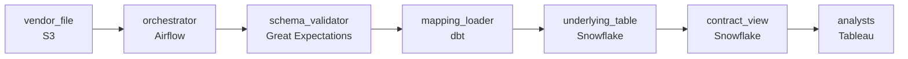

# The Vendor Who Never Warns You
_Every month, something is different. The dashboards have no idea._

- **Domain:** pipeline_architecture
- **Difficulty:** Medium
- **Est. time:** 25 min
- **URL:** https://datadriven.io/problems/the_vendor_who_never_warns_you

## Problem

We receive monthly data files from an external vendor. The problem is that the file structure changes unpredictably; new columns appear, column names get renamed, and occasionally columns are dropped. The data feeds a set of analyst dashboards that must not break when the file format changes. Design the ingestion pipeline.

**Concepts tested:** `paBatchProcessing`, `paDagOrchestration`, `paDataLake`, `paDataQuality`, `paEltVsEtl`, `paFileIngestion`, `paIdempotency`, `paMedallion`, `paMonitoring`, `paRetryHandling`, `paSchemaEvolution`

## Requirements

- The vendor file lands on the 1st of each month and analysts run monthly reports starting 9am on the 2nd; the warehouse has to be loaded by then.
- Analyst dashboards can't break each time the vendor renames a column; they need a stable contract.
- The vendor occasionally sends a truncated or malformed file; partial loads are worse than no load and the team has to know immediately.

## Must-have components

- Analysts read the monthly file from the warehouse for monthly reports; without a warehouse tier there's nowhere for the validated data. Add Snowflake, BigQuery, Redshift, or Databricks.
- The 9am day-2 SLA, schema-drift detection, malformed-file alerting, and quarantine workflow live in the orchestrator. Add Airflow, Dagster, Prefect, or Composer.

**Expected stages:** `Vendor SFTP` → `Landing Zone` → `Schema Detector` → `Normalization Layer` → `Target Warehouse`

## Solution walkthrough

### Why this problem exists in real interviews

A monthly vendor file with unpredictable structure changes, a 9am-on-the-2nd deadline, and a contract for stable analyst dashboards. Plus partial / malformed files that are worse than no load. The trap is inferring the schema and trusting validation downstream of the warehouse.

The default reach is to infer the file's structure each month and load what parses. A column rename silently maps to a new column nobody noticed; analyst dashboards return nulls. A truncated file partially loads; the team finds out at 9am the 2nd that the totals are low. Renames break dashboards because the underlying schema changed.

> **Trick to Solving**
>
> Stable contract view for analysts, schema-drift validator on arrival that halts on partial files, orchestrated for the 9am-on-the-2nd deadline.
>
> 1. Analyst dashboards read from a stable contract view; the underlying table can be remapped per file without dashboards changing.
> 2. Schema-drift validation at arrival compares structure to the registered schema; renames or partial files halt the load and alert.
> 3. The orchestrator runs the load with sensors firing before 9am on the 2nd if any stage is at risk.

---

### Walk the requirements

**Step 1: Load by 9am on the 2nd, with alerting before**

The orchestrator schedules the monthly load and the validation. Sensors fire before the 2nd at 9am if any stage is at risk; on-call has hours, not minutes. Without the orchestration the deadline isn't owned; without a warehouse the loaded data has nowhere to land.

**Step 2: Stable contract view shields dashboards from vendor renames**

Analyst dashboards read from a contract view that maps the underlying schema to a stable column set. When the vendor renames a column, the underlying mapping updates; the contract view stays the same; dashboards keep working. A 'dashboards read the underlying table' design is the version where every vendor rename breaks every dashboard; the view is the abstraction that decouples them.

**Step 3: Schema-drift validation halts on partial or malformed files**

Each file's structure validates against the registered schema on arrival; differences (missing columns, truncation, malformed rows) halt the load and alert. A 'load what parses' approach is what produced the named problem of partial loads; the validation gate is what makes 'no load' the safer default until on-call decides.

---

### The shape that fits

| node | type | tech | details |
|---|---|---|---|
| vendor_file | source | S3 |  |
| orchestrator | transform | Airflow | errorAction: alert; monitorAlert: File missing or stage at risk vs 9am-on-the-2nd SLA |
| schema_validator | quality_gate | Great Expectations | errorAction: alert; monitorAlert: Vendor structure drift or partial file detected |
| mapping_loader | transform | dbt | backfillStrategy: partition_overwrite; idempotencyStrategy: staging_table |
| underlying_table | storage | Snowflake |  |
| contract_view | storage | Snowflake | slaFreshness: < 24h |
| analysts | consumer | Tableau | slaFreshness: < 24h |

> **What this design gives up**
>
> The contract view requires the underlying mapping to be updated whenever the vendor renames; schema-drift validation halts on legitimate vendor changes too, until the team accepts them; the orchestrator is infrastructure to operate. Implementation cost is the price; the win is dashboards that survive vendor renames, partial files that halt rather than corrupt, and the 9am deadline owned by the orchestrator.

> **What reviewers check**
>
> A reviewer looks at the canvas for these properties:
> - An orchestration layer schedules the monthly load with sensors firing before 9am on the 2nd.
> - A stable contract view shields analyst dashboards from underlying schema changes.
> - Schema-drift validation halts on truncated, malformed, or unrecognized files.
> - The warehouse anchors the analyst-facing model.

> **The mistake that ships**
>
> What gets shipped infers the file's structure each month and loads whatever parses. A vendor rename silently maps to a new column nobody noticed; dashboards return nulls. A truncated file partially loads; analysts open at 9am the 2nd and the totals are low. The eventual rebuild adds the schema-drift validator, the contract view, and the orchestrated SLA.

---

- **The vendor adds a new column with data analysts want. What in this design lets them use it without breaking the contract?**
  - _Tests whether the candidate sees the contract view as additive: a new column added to the contract view exposes the data; existing dashboards don't change. The underlying mapping handles the new column too. Schema-drift validation accepts the add as a registered change._
- **The 1st falls on a weekend and the vendor delays the file by a day. What does this design do, and what do analysts see Monday morning?**
  - _Tests whether the candidate has thought about scheduled-vs-actual arrival: the orchestrator's sensor pages on missing files past the expected window; the team escalates with the vendor and the load runs once the file arrives. Analysts see the prior month's data with a freshness flag until the file lands._
