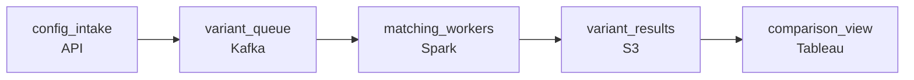

# The What-If Machine
_A million slots. A thousand campaigns. Every combination matters._

- **Domain:** pipeline_architecture
- **Difficulty:** Hard
- **Est. time:** 25 min
- **URL:** https://datadriven.io/problems/the_what_if_machine

## Problem

We run an ads platform and want to build a simulation system that matches ad inventory (slots) against ad campaigns to answer what-if questions about fill rates, reach, and frequency. Users should be able to configure a simulation, submit it, and explore the results later. A single configuration might run up to 1,000 simulations. Design the data pipeline behind this system.

**Concepts tested:** `paBatchProcessing`, `paDagOrchestration`, `paDataQuality`, `paDeadLetterQueue`, `paDependencyMgmt`, `paIdempotency`, `paMonitoring`, `paPartitioning`, `paRetryHandling`

## Requirements

- A configuration's variants have to be comparable in the same working session, not the next day.
- Losing a whole configuration's worth of work just because one variant blew up isn't acceptable.
- A submitted configuration runs in the background; the caller shouldn't have to keep a browser tab open while it runs.

## Must-have components

- A configuration of up to 1,000 variants is submitted and the results are read later. Without a queue or dispatch tier between submission and the matching engine, there's no path that lets variants fan out independently while the user's session is gone. Add a message queue or job-queue tier that decouples submission from compute.
- Variant results have to outlive the compute that produced them so users can fetch and compare them later, and a failed variant can't take the others down with it. Add a result store (S3, GCS, Azure Blob, or a warehouse) that the matching engine writes to and the user-facing path reads from.

**Expected stages:** `config_validator` → `input_flattener` → `simulation_scheduler` → `matching_engine` → `state_tracker` → `result_aggregator` → `result_store`

## Solution walkthrough

### Why this problem exists in real interviews

The hard part isn't the matching logic; it's the contract between a long-running compute job and a user who walks away. A configuration fans out into hundreds of independent simulations, each one takes minutes, and whoever submitted it comes back later expecting to compare them. The interesting design pressure is that compute, durability, and the user's session all live on different clocks.

First instinct is one big batch job: read the configuration, loop over the variants, write everything to a results table at the end. Looks clean. Then a single variant blows up, the whole job aborts, every successful variant before it disappears with the crash, and the wall-clock time scales with variant count instead of with whatever compute you can throw at it. The shape doesn't fit because the failure radius is wrong, not because the algorithm is.

> **Trick to Solving**
>
> If results have to outlive the run, store them per unit-of-work, not per job.
>
> 1. Each variant is its own unit of work. A failure should affect only its own row in the result store, not the rest of the configuration.
> 2. Submission and compute live on different timelines. The user gets a job handle and reads the result store later; nothing is held open in between.
> 3. Comparison is a read pattern, not a write pattern. Lay the result store out so the cross-variant view is one query, not one job.

---

### Walk the requirements

**Step 1: Run variants in parallel, not as one job**

The wall-clock budget is set by the user, not by variant count. Treat each variant as its own task, schedule them onto independent workers, and let throughput scale with the worker pool. A thousand serial 2-minute runs is over thirty hours; the same thousand variants on a worker pool that scales out is bounded by how much compute you're willing to pay for, not by the variants themselves.

**Step 2: Isolate per-variant results so one failure doesn't poison the rest**

If you write all variants to the same row of one table at the end of the job, any failure throws away every successful variant. Write each variant to its own row in object storage like S3 or GCS, or to its own partition of a results table, as it finishes. Failed variants land as 'failed' rather than as a crash that takes the rest with them, and a retry only re-runs the bad one.

**Step 3: Decouple submission from compute through a queue**

The user submits a configuration, gets a job id, and reads the result store later. That's the contract. A queue between submission and the worker pool, anything from Kafka or Kinesis to a managed job queue, absorbs bursty submissions, makes the system restartable when a worker dies, and lets the user's path stay independent of the worker path.

---

### The shape that fits

| node | type | tech | details |
|---|---|---|---|
| config_intake | source | API |  |
| variant_queue | queue | Kafka | parallelism: 8 consumers |
| matching_workers | transform | Spark | errorAction: retry; parallelism: auto |
| variant_results | storage | S3 | backfillStrategy: partition_overwrite |
| comparison_view | consumer | Tableau |  |

> **What this design gives up**
>
> Per-variant results cost you a small storage premium and a slightly more complex result query. The aggregate view is now a fan-in over many records instead of a single materialised table. That's the cheaper of two prices: a serial job is faster to build but slower to run and brittle to a single bad input.

> **What reviewers check**
>
> A reviewer looks at the canvas for these properties:
> - A configuration of up to 1,000 variants is submitted and the results are read later.
> - Variant results have to outlive the compute that produced them so users can fetch and compare them later, and a failed variant can't take the others down with it.

> **The mistake that ships**
>
> The version that ships looks like 'we'll loop over variants in one job to keep the code simple, and write the aggregate at the end.' The first failure during a thousand-variant run wipes out hours of compute, the user reloads the dashboard, and the team adds a `--skip-failed-variants` flag that nobody trusts. The actual fix isn't a flag; it's that the result store should never have been a single end-of-job write.

---

- **If one variant retries forever and never succeeds, how does the user see what's blocking their configuration?**
  - _Probes how the system surfaces partial completion: failed-variant routing, retry budget, and the read shape that lets the user act on a stuck variant without rerunning the rest._
- **What changes when one variant takes thirty seconds and another takes thirty minutes?**
  - _Probes worker scheduling and how the slow variant doesn't block the queue or starve fast variants of capacity._
