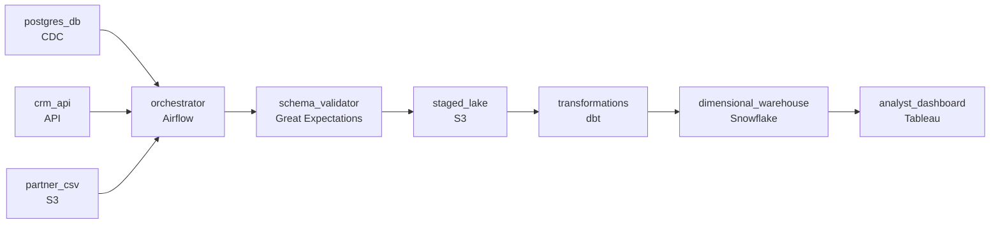

# The Whiteboard Exercise
_Marker in hand. Draw the whole thing._

- **Domain:** pipeline_architecture
- **Difficulty:** Medium
- **Est. time:** 20 min
- **URL:** https://datadriven.io/problems/the_whiteboard_exercise

## Problem

We run an e-commerce marketplace where transactions live in a Postgres database, customer records come from a rate-limited CRM API, and a partner ships the daily product catalog as CSV files over SFTP. About 50 business analysts open a dashboard at 8am each morning to slice yesterday's transactions by customer, product, channel, and date, so all three sources have to land in the warehouse during the overnight window: the customer detail from the CRM, the product detail from the partner catalog, the transactions from Postgres. Keep the load resilient to the partner's occasional CSV column changes and the CRM API's rate limits, and design the pipeline end to end.

**Concepts tested:** `paApiIngestion`, `paBackfill`, `paBatchProcessing`, `paBatchVsStreaming`, `paDagOrchestration`, `paDataLake`, `paDataQuality`, `paDeduplication`, `paDependencyMgmt`, `paEltVsEtl`, `paEnvironmentMgmt`, `paFileIngestion`, `paFullVsIncremental`, `paIdempotency`, `paMedallion`, `paMonitoring`, `paPartitioning`, `paRetryHandling`, `paScdPipeline`, `paSchemaEvolution`

## Requirements

- Roughly 50 business analysts open the daily dashboard at 8am and need yesterday's data by then, with all three sources loaded.
- Analysts slice transactions by customer, product, channel, and date in interactive queries; querying raw transaction rows for every report doesn't scale.
- The partner sometimes ships product-catalog CSV files with extra columns or changed headers; the nightly load can't fail when a layout shift appears.

## Must-have components

- The dashboard at 8am reads from the warehouse; without a warehouse tier there's no destination for the modeled facts. Add Snowflake, BigQuery, Redshift, or Databricks.
- The midnight-to-8am window with three sources, dependency ordering, and CSV layout drift all live in the orchestrator. Add Airflow, Dagster, Prefect, or Composer.

**Expected stages:** `data_sources` → `extraction_services` → `staging_storage` → `transform_engine` → `warehouse_model`

## Solution walkthrough

### What this really is

This is a deadline-bound multi-source merge dressed up as a generic ETL whiteboard. Three sources need three extraction shapes: an incremental pull from Postgres, a rate-limited paginated CRM API, and a partner CSV dropped over SFTP. All three have to converge into one dimensional model before 50 analysts open the dashboard at 8am. Anyone can draw boxes from source to warehouse. What separates candidates is **who owns the clock and where a bad file stops**. Load raw transactions into a flat table and every slice scans full history. Let the partner's renamed header reach the loader unguarded and the whole night fails, so 8am arrives with no data at all.

> **Three extraction shapes, one owner of the deadline**
>
> Name each source's extraction shape out loud, put one orchestrator in charge of ordering and lateness, and stop drifted partner files at a gate before staging instead of letting them crash the load.

### Walk the requirements

**Step 1: Extract each source on its own terms**

Postgres pulls incrementally on a watermark or through CDC. The CRM API needs pagination with exponential backoff, because the rate limit will throttle you mid-run and a naive retry loop only hammers it harder. The catalog is a file pickup. One uniform pull box hides three different failure modes, and the interviewer will ask about each one.

**Step 2: Give the 8am deadline an owner**

Airflow schedules the nightly DAG, orders dependencies so dimensions load before facts, and alerts when a stage runs late enough to threaten 8am. Without it, nobody notices the CRM pull crawling at 3am until the analysts do.

**Step 3: Gate the partner file before staging**

The quality gate accepts additive columns as nullable and quarantines renames or missing columns with an alert. The night continues on yesterday's catalog while the team fixes the mapping and replays. Failing on any difference turns every partner change into a missed morning.

**Step 4: Model the slices, not the rows**

dbt builds a star: a transaction fact keyed to `dim_customer` from the CRM, `dim_product` from the catalog, plus channel and date, partitioned by date in Snowflake. Analyst slices prune to partitions instead of scanning raw history, and partition overwrite keeps reruns idempotent.

### The reference design

| node | type | tech | details |
|---|---|---|---|
| postgres_db | source | CDC |  |
| crm_api | source | API |  |
| partner_csv | source | S3 |  |
| orchestrator | transform | Airflow | errorAction: alert; monitorAlert: Stage at risk vs 8am SLA or schema drift detected |
| schema_validator | quality_gate | Great Expectations | errorAction: alert |
| staged_lake | storage | S3 | backfillStrategy: partition_overwrite |
| transformations | transform | dbt | backfillStrategy: partition_overwrite; idempotencyStrategy: staging_table |
| dimensional_warehouse | storage | Snowflake | slaFreshness: < 24h; backfillStrategy: partition_overwrite |
| analyst_dashboard | consumer | Tableau | slaFreshness: < 24h |

| One nightly flat load | Orchestrated star schema |
|---|---|
| Raw transactions land in one wide table. Every report scans full history, a partner header change crashes the loader, and nothing alerts before 8am. | Facts keyed to `dim_customer` and `dim_product`, partitioned by date. Drifted files are quarantined at the gate, and Airflow alerts while there is still time to recover. |

> **Dropping the catalog because it is just a file**
>
> Candidates draw Postgres and the CRM carefully, then forget the SFTP catalog. `dim_product` is left with no source, and the product slice on the dashboard goes blank. Every named source needs an arrow into the flow.

> **Narrate the bad night, not the happy one**
>
> Strong candidates walk through the failure path unprompted. The API throttles and the retry backs off. The orchestrator alerts before 8am. The bad CSV sits in quarantine while yesterday's catalog serves. A design that only works on a clean night is a junior design.

- **A customer + region + week slice becomes routine. What keeps it from scanning the full table?**
  - _A new rollup or cluster key in the dbt model, with existing models untouched._
- **The partner adds a column the team actually wants. How does it reach the dashboard?**
  - _Additive drift passes the gate as nullable, lands in staging, and enters the model on the next deploy._
- **The CRM moves to nested JSON, cursor pagination, and a lower rate limit. What changes?**
  - _Only the CRM extraction and its landing mapping change. Staging, transform, and warehouse stay put._
