# Thirty Cities, One Forecast
_Five cities. Five data formats. One prediction._

- **Domain:** pipeline_architecture
- **Difficulty:** Hard
- **Est. time:** 25 min
- **URL:** https://datadriven.io/problems/thirty_cities_one_forecast

## Problem

Our operations team runs a bike-share network across dozens of cities. We want to predict hourly demand at each station so we can pre-position bikes before rush hour. The data comes from multiple city systems and external sources in different formats. Design a pipeline that takes in this raw data and produces reliable, model-ready features.

**Concepts tested:** `paBackfill`, `paBatchProcessing`, `paDagOrchestration`, `paDataLake`, `paDataQuality`, `paDependencyMgmt`, `paEltVsEtl`, `paFileIngestion`, `paFullVsIncremental`, `paIdempotency`, `paMonitoring`, `paPartitioning`, `paRetryHandling`, `paSchemaEvolution`

## Requirements

- Operations runs predictions every 30 minutes and pre-positions bikes ahead of the next half-hour; the feature pipeline has to be ready in time.
- When one city's data hasn't arrived, the other cities still need their predictions on time.
- Onboarding a new city requires three years of historical features; that backfill can't slow down predictions for the live cities.

## Must-have components

- The DAG has ordered dependencies and per-city isolation; without an orchestrator there's nothing to express dependency order, sense missing files, or run new-city backfills on a separate pool. Add Airflow, Dagster, Prefect, or Composer.
- Demand predictions read features from a stored layer at runtime and training reads 90 days of features per zone. Without a warehouse / feature-store tier there's nowhere for features to materialize. Add BigQuery, Snowflake, or an equivalent feature store.

**Expected stages:** `raw_source_ingestion` → `cleaning_normalization` → `feature_engineering` → `feature_store` → `model_input_export`

## Solution walkthrough

### Why this problem exists in real interviews

Predictions run every 30 minutes, cities arrive on different clocks, and onboarding a new city is a backfill of years of history alongside the live runs. The trap is making the DAG fan in across cities and share compute with backfills; both shortcuts are how the next 30-minute window slips for cities that should have been ready.

The natural shape is one DAG that waits on every city's data, then transforms, then writes the online lookup tier. The next prediction window slips whenever one operator's data is late, and the rebalancing team gets stale predictions for cities that were ready in time. A new city's three-year backfill saturates the cluster the live pipeline depends on; predictions stutter for everyone for the duration of the onboarding.

> **Trick to Solving**
>
> Per-city ingest tasks under one orchestrator, prediction-window cadence on whichever cities finished, backfill on its own worker pool.
>
> 1. Each city is its own ingest task; the orchestrator runs them independently, alerts on missing data per city, and starts feature computation as soon as a city is ready.
> 2. Feature computation runs whichever cities finished by the prediction-window cutoff; cities that didn't get predicted from the previous window's features with an alert.
> 3. Backfill tasks route to a separate worker pool; the live pipeline keeps its compute regardless of how big the backfill is.

---

### Walk the requirements

**Step 1: Move each city's data through to the online lookup tier before the next prediction window**

Predictions run every 30 minutes; the pipeline has to land features for each city in time for the next run. The orchestrator runs the per-city ingest, the per-city feature computation, and the feature-store write within the window. Sensors fire before the window's deadline if any city is at risk; on-call sees a late city by name, not a generic 'pipeline late.' Without orchestration there's nothing watching the window or coordinating the order; without a feature-store tier the prediction service has nowhere to read from.

**Step 2: Per-city ingest so a missing source for one city doesn't block the others**

Each city has its own ingest task and its own sensor; none of the city tasks know about each other. Feature computation runs against whichever cities finished this window; cities that didn't predict from the previous window's features, with an alert. The other cities get fresh predictions on time. A single fan-in gate at the top is the version where one operator's feed delay stalls every city's next window.

**Step 3: Backfill on a separate worker pool**

Onboarding a new city is years of historical features computed once. The orchestrator routes backfill tasks to a separate worker pool from the live pipeline; the live runs get their compute every 30 minutes regardless of how big the backfill is. Sharing a pool means the first new-city onboarding stutters every live prediction for the duration of the backfill. The pool boundary is what makes live SLA independent of the backfill's cost.

---

### The shape that fits

```mermaid
flowchart LR
    city_data_sources["city_data_sources<br/>S3"]
    orchestrator["orchestrator<br/>Airflow"]
    per_city_ingest["per_city_ingest<br/>Spark"]
    staged_lake["staged_lake<br/>S3"]
    feature_compute["feature_compute<br/>Spark"]
    feature_store["feature_store<br/>BigQuery"]
    demand_model["demand_model<br/>Jupyter"]
    rebalancing_team["rebalancing_team<br/>Tableau"]
    city_data_sources --> orchestrator
    orchestrator --> per_city_ingest
    per_city_ingest --> staged_lake
    staged_lake --> feature_compute
    feature_compute --> feature_store
    feature_store --> demand_model
    demand_model --> rebalancing_team
```

| node | type | tech | details |
|---|---|---|---|
| city_data_sources | source | S3 |  |
| orchestrator | transform | Airflow | errorAction: alert; monitorAlert: City data late vs next 30-minute window |
| per_city_ingest | transform | Spark | parallelism: 8 partitions; idempotencyStrategy: staging_table |
| staged_lake | storage | S3 | backfillStrategy: partition_overwrite |
| feature_compute | transform | Spark | parallelism: 16 partitions; idempotencyStrategy: upsert |
| feature_store | storage | BigQuery | slaFreshness: < 1h |
| demand_model | consumer | Jupyter | slaFreshness: < 1h |
| rebalancing_team | consumer | Tableau | slaFreshness: < 1h |

> **What this design gives up**
>
> Per-city tasks make the DAG wider and the orchestration config heavier than one shared job. A separate backfill pool costs more idle capacity than one shared cluster. Pipeline simplicity is the cost; the win is predictions that arrive every 30 minutes for the cities that are ready, on-call alerted by city when something is late, and onboarding new cities without taking the live pipeline down with them.

> **What reviewers check**
>
> A reviewer looks at the canvas for these properties:
> - An orchestration layer schedules per-city ingest with alerts before each prediction window if any city is at risk.
> - Feature computation runs the cities that finished and skips the ones that didn't, with the missing city named in the alert.
> - Historical backfill runs on a separate worker pool from the live pipeline.
> - Features land in an online lookup tier / warehouse the model reads at prediction time.

> **The mistake that ships**
>
> What gets shipped uses one DAG that waits on every city, runs everything on a single cluster, and tells data science to schedule the model after the DAG completes. The first time one operator's feed is late, the DAG hangs and every city's next prediction window slips. The first new-city backfill consumes the cluster; live predictions stutter for hours. The rebalancing team starts repositioning bikes off intuition; complaints about empty stations follow. The eventual fix is per-city orchestration and a backfill pool, neither of which were on the original whiteboard.

---

- **Two cities in the same DAG slot fail their ingest at the same time. What does the orchestrator do, and what does the rebalancing team see?**
  - _Tests whether the candidate sees per-city alerts as independent: both cities raise their own alerts, the rebalancing dashboard surfaces stale predictions for those two cities specifically, and on-call gets enough signal to triage both without the rest of the network being affected._
- **Data science wants to retrain on years of features per city. Where does that data come from, and how does the retrain stay off the live pool?**
  - _Tests whether the candidate sees the online lookup tier as the long-history surface (it carries history) and the retrain as another consumer routed to its own worker pool, like backfills, so it doesn't compete with the next 30-minute prediction._
