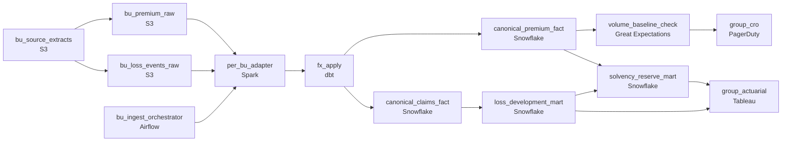

# Thirty Countries, One Solvency Number
_Premiums collected globally. Losses happen locally._

- **Domain:** pipeline_architecture
- **Difficulty:** Hard
- **Est. time:** 10 min
- **URL:** https://datadriven.io/problems/thirty_countries_one_solvency_number

## Problem

We are a global insurer with business units across 30 countries, each running their own policy and claims systems. The group actuarial team needs a consolidated view of global premium writings and loss events to calculate solvency capital requirements and set reserve targets. Design a data ingestion platform that collects this data from all business units and makes it available for actuarial analysis within hours of being written.

**Concepts tested:** `paBackfill`, `paBatchProcessing`, `paDagOrchestration`, `paDataLake`, `paDataQuality`, `paDeduplication`, `paEltVsEtl`, `paFileIngestion`, `paFullVsIncremental`, `paIdempotency`, `paLateData`, `paMedallion`, `paMonitoring`, `paPartitioning`, `paRetryHandling`, `paScdPipeline`, `paSchemaEvolution`

## Requirements

- Group actuarial closes the quarter on data from 30 business units; if any one of them is late, the close gets delayed.
- Each BU runs a different policy and claims system; group actuarial can't reason about 30 different shapes of data.
- A historical premium has to be valued at the FX rate in effect on its original transaction date, not today's.
- When a BU's premium volume drops sharply, the group CRO has to know within hours, not at quarter close.

## Must-have components

- Group actuarial analysis runs on a consolidated warehouse with the canonical premium fact, loss-development triangle, and solvency mart. Without a warehouse tier there's nowhere for that to live. Add Snowflake, BigQuery, Redshift, or Databricks.
- Thirty business units land on different schedules and group actuarial closes the quarter on the slowest. Without an orchestration layer there's nothing to monitor per-BU SLAs, sense partition readiness, or alert when a BU is missing. Add Airflow, Dagster, Prefect, or Composer.

**Expected stages:** `bu_premium_raw` → `bu_loss_events_raw` → `canonical_premium_fact` → `loss_development_mart` → `solvency_reserve_mart`

## Solution walkthrough

### What this really is

This is a conformance problem dressed up as ingestion. Moving bytes from 30 countries is the easy part. The real skill is deciding where thirty source shapes become one, and what gets frozen on the row when they do. The trap is the single nightly extract that dumps raw tables into the warehouse and leaves actuaries to harmonize in notebooks. Build that and three things break. The close waits on a BU nobody can name. Last year's premiums drift every time the dollar moves. A BU whose writings collapse on a Tuesday surfaces six weeks later at quarter close.

> **Conform before the warehouse, freeze FX on the row**
>
> Every BU gets its own adapter that maps its policy and claims extract to one canonical schema. The converted amount is computed once at load, using the rate for the transaction date. Everything downstream, from the loss triangle to the solvency mart, reads one shape and never re-derives currency.

### Walk the requirements

**Step 1: Give each BU its own task and its own deadline**

Airflow runs one ingest task per BU, with a sensor on that BU's landing partition. The close still waits on the slowest unit, but now the dashboard names it, and the sensor fires before the window closes rather than after. Raw files land untouched in `bu_premium_raw` and `bu_loss_events_raw`, so any BU can be replayed by overwriting its partition.

**Step 2: Map to the canonical schema in a per-BU adapter**

The adapter is the only place that knows a BU's field names. It dedupes resent files on the source transaction key and writes through a staging table, so a retried load replaces the data rather than doubling it. Actuarial reads `canonical_premium_fact`, never a source shape.

**Step 3: Store local amount, rate and converted amount together**

`fx_apply` joins each transaction to the rate for its transaction date and writes all three columns. No query converts on the fly, so a historical premium keeps the value it was booked at. A restated rate becomes an explicit backfill, not a silent drift.

**Step 4: Baseline daily volume per BU**

A quality gate compares each BU's daily premium count and sum against its trailing baseline and pages the CRO when one falls off a cliff. The per-BU split is the point. 'Volume is down somewhere' is not actionable. 'Brazil wrote 60% less yesterday' is.

### The reference design

| node | type | tech | details |
|---|---|---|---|
| bu_source_extracts | source | S3 |  |
| bu_premium_raw | storage | S3 | backfillStrategy: partition_overwrite |
| bu_loss_events_raw | storage | S3 | backfillStrategy: partition_overwrite |
| bu_ingest_orchestrator | transform | Airflow | errorAction: alert; monitorAlert: BU landing late vs close window |
| per_bu_adapter | transform | Spark | retryCount: 3; errorAction: retry; idempotencyStrategy: staging_table |
| fx_apply | transform | dbt | idempotencyStrategy: upsert |
| canonical_premium_fact | storage | Snowflake | slaFreshness: < 24h; backfillStrategy: partition_overwrite |
| canonical_claims_fact | storage | Snowflake | slaFreshness: < 24h; backfillStrategy: partition_overwrite |
| volume_baseline_check | quality_gate | Great Expectations | errorAction: alert; monitorAlert: BU daily volume vs baseline |
| group_cro | consumer | PagerDuty | slaFreshness: < 1h |
| loss_development_mart | storage | Snowflake | slaFreshness: < 24h |
| solvency_reserve_mart | storage | Snowflake | slaFreshness: < 24h |
| group_actuarial | consumer | Tableau | slaFreshness: < 24h |

| Convert at query time | Freeze the rate on the row |
|---|---|
| `amount_local * current_rate` in a view. Every rebuild revalues history, so last year's Q3 solvency number changes when the euro moves, even though nobody touched the data. | `amount_local`, `fx_rate` and `amount_group_ccy` are stored at load. History stays stable, and quarter-end revaluation is still possible because the local amount survives. |

> **One job for thirty units fails as one unit**
>
> Candidates draw a single extract task feeding the warehouse. When one BU's file is late or malformed, the whole run fails. Worse, it can succeed with 29 units and leave a silent hole in the solvency number. Per-BU tasks turn one opaque failure into one named, retryable partition.

> **Where the mapping lives signals seniority**
>
> A senior candidate says out loud that harmonization happens once, upstream, in code owned per BU. They also say the canonical schema is a contract every new BU must meet. Pushing that work into actuarial notebooks reads as someone who has never run a quarter close.

- **A newly acquired BU runs a policy system we have never seen. What changes to onboard it?**
  - _Tests whether the adapter is the extension point: you add a new adapter and a new sensor, while the canonical fact, the marts and the consumers stay untouched._
- **Actuarial wants the close at end-of-quarter FX instead of transaction-date FX. What changes?**
  - _Tests whether keeping `amount_local` makes quarter-end revaluation a separate calculation over the same table rather than a rebuild._
- **A BU restates three months of claims. How do you reload it without double counting?**
  - _Tests partition overwrite on the raw and canonical tiers, plus idempotent writes in the adapter._
