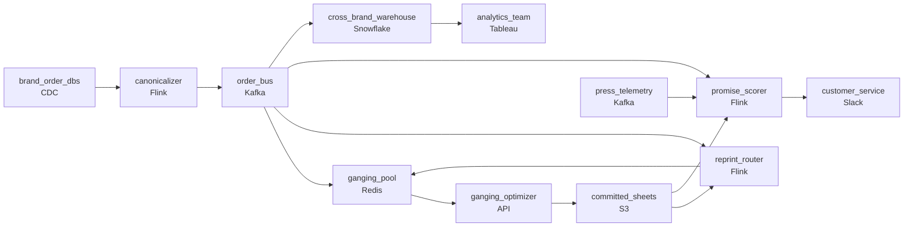

# Thirty Million Unique Jobs a Year
_One press run, many orders. Group them right._

- **Domain:** pipeline_architecture
- **Difficulty:** Hard
- **Est. time:** 10 min
- **URL:** https://datadriven.io/problems/thirty_million_unique_jobs_a_year

## Problem

We produce 30 million custom print products a year for small businesses - business cards, flyers, and banners - each one unique. Our profitability depends on ganging: combining multiple customer orders onto a single press sheet to maximize utilization. The ganging algorithm needs a real-time view of pending orders, and our operations team needs to know before a job starts whether it will meet its delivery promise. Our analytics are also fragmented across 10 acquired companies running different ERP systems. Design a pipeline that supports all three needs.

**Concepts tested:** `paApiIngestion`, `paBackfill`, `paBatchProcessing`, `paBatchVsStreaming`, `paCdc`, `paDagOrchestration`, `paDataLake`, `paDataQuality`, `paDeadLetterQueue`, `paDeduplication`, `paEltVsEtl`, `paEventDriven`, `paEventPlatforms`, `paFileIngestion`, `paFullVsIncremental`, `paIdempotency`, `paLambdaArch`, `paMedallion`, `paMonitoring`, `paPartitioning`, `paRetryHandling`, `paScdPipeline`, `paSchemaEvolution`, `paSmallFiles`, `paStreamProcessing`, `paTableFormats`

## Requirements

- The ganging algorithm needs a real-time view of pending orders.
- Our analytics are fragmented across 10 acquired companies running different ERP systems.
- Our operations team needs to know before a job starts whether it will meet its delivery promise.

## Must-have components

- The ganging algorithm needs a real-time view of orders waiting to be ganged, but nothing in the design runs at streaming freshness. Put a streaming stage on the order path, or set SLA Freshness to real-time / < 1min on the store the algorithm reads.
- Analytics across ten acquired brands needs one place for the unified order data to live; without a warehouse tier the reporting stays fragmented. Add a warehouse such as Snowflake, BigQuery, Redshift or Databricks.

**Expected stages:** `pending_orders` → `gang_sheets` → `press_telemetry` → `delivery_predictions`

## Solution walkthrough

### What this really is

This is a fan-out from one canonical order stream, dressed up as print-shop logistics. Ganging, promise scoring and cross-brand analytics all read the same orders, so the real skill is making the canonical shape a contract upstream of every consumer. Most candidates draw a warehouse. The trap is letting the ganging optimizer query ten brand databases every few minutes and leaving canonicalization to a nightly ETL. If you do that, a confirmed order misses its print cycle, operations throttles your reads, and a post-commit cancellation rewrites a sheet that is already on the press.

> **Canonicalize once, fan out from the bus**
>
> CDC each brand into one streaming canonicalizer that writes to a single `order_bus`. Every consumer reads from there, and none of them reads from an order database.

### Walk the requirements

**Step 1: Feed the pool, not the optimizer's queries**

CDC turns a confirmed order into an event within seconds. Flink maps that event and lands it in `ganging_pool`, a Redis serving store. The optimizer reads the pool each cycle, so print-cycle latency no longer depends on how loaded the operational systems are.

**Step 2: Map ten schemas before anyone reads**

The canonicalizer outputs one shape (`order_id`, brand, product, dimensions, quantity, deadline, status). If you harmonize at query time instead, every consumer has to reimplement ten mappings and they drift apart. Upserting on `order_id` keeps CDC replays idempotent.

**Step 3: Score promises from the press, not yesterday**

`promise_scorer` joins live press telemetry with in-flight orders and their committed sheets. It keeps state per order and alerts customer service in Slack when the probability drops below the threshold. That way customer service hears about a slip before the customer does.

**Step 4: Make committed sheets append-only**

`committed_sheets` is written once and never updated. When a cancellation arrives for an order that is already committed, `reprint_router` emits a replacement order back into the pool. The original sheet stays exactly as it was printed.

| node | type | tech | details |
|---|---|---|---|
| brand_order_dbs | source | CDC |  |
| canonicalizer | transform | Flink | slaFreshness: real-time; idempotencyStrategy: upsert |
| order_bus | queue | Kafka |  |
| ganging_pool | storage | Redis | slaFreshness: < 1min |
| ganging_optimizer | consumer | API | slaFreshness: < 1min |
| committed_sheets | storage | S3 |  |
| reprint_router | transform | Flink | slaFreshness: real-time |
| press_telemetry | source | Kafka |  |
| promise_scorer | transform | Flink | errorAction: alert; monitorAlert: In-flight order delivery probability below threshold; slaFreshness: real-time |
| customer_service | consumer | Slack | slaFreshness: real-time |
| cross_brand_warehouse | storage | Snowflake | slaFreshness: < 24h |
| analytics_team | consumer | Tableau | slaFreshness: < 24h |

| Optimizer queries the brands | Optimizer reads the pool |
|---|---|
| Ten schemas are joined inside the optimizer, and read load lands on production databases. An order confirmed after the last poll misses the cycle. | `ganging_pool` already holds canonical orders a few seconds after they are confirmed. The brand databases see only the CDC log reader. |

> **Cancel by update, lose the press's truth**
>
> Candidates often model a cancellation as an `UPDATE` to the sheet row. Once the plate is made, the system's view and the press's output disagree, and nobody can reconstruct what was actually printed.

> **Name the contract, not the tools**
>
> The senior tell is saying that the canonical order shape is the interface and the bus is where it is enforced. After that, the fact that adding a consumer requires no new brand mapping explains itself.

- **An eleventh brand arrives with its own schema. What changes?**
  - _Only a new CDC connector and a new mapping in the canonicalizer. Every downstream consumer stays untouched._
- **A slip is predicted for an order on an already committed sheet. What happens?**
  - _The sheet stays immutable. The alert and any recovery are recorded against the order, and a reprint goes through `reprint_router` if one is needed._
