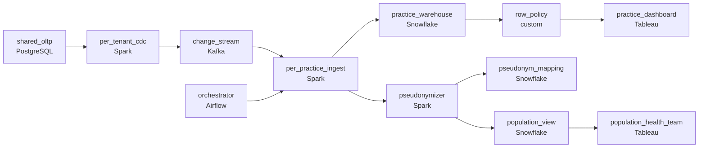

# Thousands of Practices, One Dataset
_Patient records in, operational insights out._

- **Domain:** pipeline_architecture
- **Difficulty:** Hard
- **Est. time:** 10 min
- **URL:** https://datadriven.io/problems/thousands_of_practices_one_dataset

## Problem

We operate a cloud-based EHR platform used by thousands of medical practices, and each practice's patient and clinical data is stored in a shared database with tenant isolation enforced at the application layer. Our analytics team needs to run cross-tenant population health analytics and individual practice performance reporting without exposing one practice's data to another. Design the pipeline architecture that supports both use cases with proper tenant isolation.

**Concepts tested:** `paBackfill`, `paBatchProcessing`, `paBatchVsStreaming`, `paCdc`, `paColumnarVsRow`, `paCompression`, `paDagOrchestration`, `paDataQuality`, `paDeadLetterQueue`, `paDeduplication`, `paEltVsEtl`, `paFullVsIncremental`, `paIdempotency`, `paLateData`, `paMedallion`, `paMonitoring`, `paPartitioning`, `paRetryHandling`, `paSchemaEvolution`, `paSmallFiles`, `paTableFormats`

## Requirements

- One practice's data being visible to another is a HIPAA breach; the boundary has to hold once data leaves the application.
- The epidemiology team runs cross-practice research; they have to do it without seeing real patient identifiers.
- A handful of huge practices generate most of the volume; a smaller practice can't be left waiting because a big one is backed up.
- Every practice manager opens dashboards each morning for the prior day; T+1 freshness has to hold across all of them, not just the largest.

## Must-have components

- Per-tenant CDC lets one large tenant lag without blocking everyone else and feeds the alert path. Add a streaming CDC layer (e.g. Debezium + Kafka) or set SLA Freshness to real-time / < 1min on the capture stage.
- Per-practice and population-health views both query a warehouse with row-level security and column-level masking; without a warehouse tier there's nowhere to enforce tenant isolation. Add Snowflake, BigQuery, Databricks, or equivalent.

**Expected stages:** `tenant_event_raw` → `patient_records_silver` → `clinical_events_silver` → `practice_performance_gold` → `population_health_gold`

## Solution walkthrough

### The real problem

This is multi-tenant isolation wearing a healthcare costume. The real skill: can you keep one practice's PHI invisible to another once the data leaves the app layer, while a shared warehouse serves both per-practice dashboards and cross-practice research? A `WHERE practice_id =` filter in the BI tool fails because it sits one forgotten clause away from a HIPAA breach. The trap is that isolation, per-tenant SLA, and PHI-free research each look solvable alone, but a single nightly job into one table breaks all three at once.

The default move: one nightly load pulls everyone into one table, filtered in the dashboard. Big practices run long, so small practices' data misses the morning window; epidemiology gets 'temporary' access to the raw table and now holds PHI; one query without the filter returns another practice's patients. Get it wrong and it's a breach by lunch.

> **Isolation must outlive the app layer**
>
> Four moves crack it: per-practice CDC so a big tenant's backlog parks behind itself, not in front of a small one; row-level security in the warehouse so the boundary holds no matter how a query is written; a pseudonymized view for research fed from a restricted mapping store; and a per-practice T+1 SLA the orchestrator enforces for every tenant, not just the largest.

---

### Walk the requirements

**Step 1: Enforce the boundary with row-level security**

Once data leaves the OLTP, the warehouse owns isolation. Row-level security scopes every practice-scoped table so a practice sees only its own rows regardless of how the query is written. Filtering in the BI tool is one dropped clause from a breach; without a warehouse tier there is nowhere to enforce the policy at all.

**Step 2: Pseudonymize before research sees anything**

Epidemiology gets a separate view where MRN, name, and DOB are replaced by deterministic tokens. The real-to-pseudo mapping lives in a restricted store the research team cannot read, so cohorts stay anonymous and re-identification happens only through an audited path.

**Step 3: Give each practice its own ingest path**

A few large practices drive most of the volume. Per-practice CDC (or per-partition consumers scaled independently) means a big practice's backlog parks behind itself, not in front of a small one. A single shared queue is the version where small practices wait while a big one catches up.

**Step 4: Hold T+1 for every practice**

The orchestrator runs a per-practice DAG overnight with sensors that fire before the morning window if any tenant is at risk, and alerts that page on-call by practice name. 'We'll get to it after the big practices finish' is how small-practice managers open empty dashboards.

### The shape that fits

| node | type | tech | details |
|---|---|---|---|
| shared_oltp | source | PostgreSQL |  |
| per_tenant_cdc | transform | Spark | errorAction: alert; monitorAlert: Per-practice CDC lag rising |
| change_stream | queue | Kafka | parallelism: 16 partitions |
| per_practice_ingest | transform | Spark | parallelism: 16 partitions; idempotencyStrategy: staging_table |
| pseudonymizer | transform | Spark | errorAction: alert |
| pseudonym_mapping | storage | Snowflake |  |
| practice_warehouse | storage | Snowflake | slaFreshness: < 24h |
| population_view | storage | Snowflake | slaFreshness: < 24h |
| row_policy | quality_gate | custom | errorAction: alert |
| orchestrator | transform | Airflow | errorAction: alert; monitorAlert: Per-practice T+1 SLA at risk |
| practice_dashboard | consumer | Tableau | slaFreshness: < 24h |
| population_health_team | consumer | Tableau | slaFreshness: < 24h |

> **What the isolation costs**
>
> Per-practice CDC and per-practice DAGs are more orchestration than one nightly job; pseudonymization adds a restricted mapping store and a transform on every research refresh; row-level security adds query-rewrite cost on every read. You trade operational simplicity for a boundary that survives HIPAA and an SLA the smallest practice can trust.

> **The version that ships and breaks**
>
> The first cut loads everyone into one table, filters in BI, and hands epidemiology 'temporary' access. One missing filter exports another practice's patients; a big practice's load leaves small dashboards empty till midmorning; research runs on real PHI. The rebuild touches ingest, warehouse, and access policy together, after the finding.

---

- **Prove a population-health researcher can't reconstruct a patient's identity from the view they hold. What in this design backs that up?**
  - _Tests whether they see the mapping store as the only path back to identity, and that the view carries no quasi-identifiers strong enough to re-identify on their own._
- **A small practice is stuck for hours behind a large practice's onboarding backfill. What prevents this, and what would you change if it happened anyway?**
  - _Tests whether they reach for a backfill-only worker pool so steady-state per-practice ingest stays untouched._
