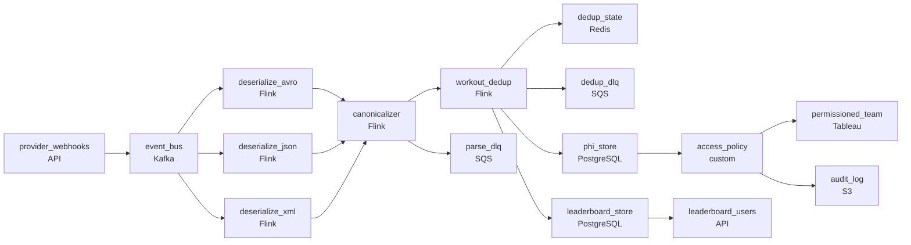

# Three Providers, One Workout
_The same ride, reported three times._

- **Domain:** pipeline_architecture
- **Difficulty:** Hard
- **Est. time:** 30 min
- **URL:** https://datadriven.io/problems/three_providers_one_workout

## Problem

We run a connected-fitness platform that ingests workout events from three external providers, each with its own data format and delivery mechanism, and the same session often arrives from more than one provider at once. Finishing a workout is the user-facing reward, so a completed session has to reach the leaderboard within about a minute and count once no matter how many providers reported it. Heart rate and GPS are protected health data: they cannot sit on the leaderboard's own store, only permissioned consumers may read them, and every read of the raw fields has to be audit-logged.

**Concepts tested:** `paApiIngestion`, `paDagOrchestration`, `paDataQuality`, `paDeadLetterQueue`, `paDeduplication`, `paEltVsEtl`, `paEventDriven`, `paIdempotency`, `paLateData`, `paRetryHandling`, `paSchemaEvolution`, `paStreamProcessing`

## Requirements

- Finishing a workout is the user-facing reward; the leaderboard has to reflect a completed workout within roughly a minute.
- When a user records the same workout on a hardware device and a wearable, the leaderboard can't show two entries for one workout.
- Heart rate and GPS are PHI; they can't sit on the leaderboard's own store, only permissioned consumers may read them, and every read of those fields has to land in an audit log.

## Must-have components

- Three providers send webhooks in different formats and we have to decouple webhook receipt from format-specific processing and downstream consumers. Without a queue/log tier there's no buffer or fan-out point. Add Kafka, Kinesis, Pub/Sub, or SQS.
- The leaderboard reflects completed workouts within roughly a minute. Without a streaming / sub-minute path the leaderboard is too slow. Add a streaming layer on the workout path or set SLA Freshness to real-time / < 1min.

**Expected stages:** `Source Layer` → `Ingestion Layer` → `Processing Layer` → `Storage Layer` → `Serving Layer`

## Solution walkthrough

### Why this problem exists in real interviews

The same workout from multiple providers, leaderboard latency under a minute, and PHI like heart rate and GPS that has to stay restricted with audit logging on raw reads. The trap is one stream that updates the leaderboard from every event without dedup, or putting PHI on the same path everyone reads.

The default reach is one streaming consumer that updates the leaderboard from every provider event. The same user records the same workout on a hardware device and a wearable; both events arrive and the leaderboard shows two entries. Heart rate and GPS sit on the same table the leaderboard reads; one direct query exposes PHI. Audit asks who read raw event data and the answer is nothing.

> **Trick to Solving**
>
> Canonical workout shape, dedup by user-and-workout, PHI restricted with audit logging.
>
> 1. All three providers normalize to a canonical workout shape on the bus; downstream consumers read one schema.
> 2. The streaming consumer dedups on (user, workout window) so two providers reporting the same workout collapse to one leaderboard entry.
> 3. PHI fields (heart rate, GPS) live in a restricted table with column-level access and audit logging on every raw read.

---

### Walk the requirements

**Step 1: Leaderboard reflects a workout within a minute**

Workout events flow from three providers' webhooks onto an event bus and into a streaming consumer that updates the leaderboard within a minute. Without a streaming tier the user-facing reward feels delayed; without a bus the three webhooks have no fan-in point.

**Step 2: Dedup by user-and-workout so duplicate-source events collapse**

When a user records the same workout on a hardware device and a wearable, two provider events arrive. The streaming consumer dedups on (`user_id`, workout time window, type) so the leaderboard records one entry. The duplicate's data merges with the canonical entry (or a precedence rule chooses the higher-fidelity source). A 'count every event' design is the version where the leaderboard double-counts; the dedup is the contract.

**Step 3: PHI restricted with audit on raw reads**

Heart rate and GPS are PHI. They live in a restricted table with column-level access tied to permissioned consumers (e.g., the user's own coach with permission). Raw reads write to an audit log so the audit can answer who saw what. The leaderboard reads aggregated, non-PHI columns. Putting PHI on the leaderboard's table is the version where one direct query exposes it; restricted column with audit is the contract.

---

### The shape that fits

| node | type | tech | details |
|---|---|---|---|
| provider_webhooks | source | API |  |
| event_bus | queue | Kafka | parallelism: 8 partitions |
| deserialize_avro | transform | Flink | slaFreshness: real-time |
| deserialize_json | transform | Flink | slaFreshness: real-time |
| deserialize_xml | transform | Flink | slaFreshness: real-time |
| canonicalizer | transform | Flink | slaFreshness: real-time; idempotencyStrategy: upsert |
| workout_dedup | transform | Flink | slaFreshness: real-time; idempotencyStrategy: upsert |
| dedup_state | storage | Redis | slaFreshness: real-time |
| parse_dlq | queue | SQS |  |
| dedup_dlq | queue | SQS |  |
| leaderboard_store | storage | PostgreSQL | slaFreshness: < 1min |
| phi_store | storage | PostgreSQL |  |
| access_policy | quality_gate | custom | errorAction: alert |
| audit_log | storage | S3 |  |
| leaderboard_users | consumer | API | slaFreshness: < 1min |
| permissioned_team | consumer | Tableau | slaFreshness: < 1h |

> **What this design gives up**
>
> Canonical mapping requires every provider format to deserialize and map at ingest; user-and-workout dedup adds a state store keyed per active user; PHI restriction requires permissioned access and audit logging on raw reads. Implementation cost is the price; the win is leaderboard within a minute, no double-count from multi-source workouts, and PHI that doesn't leak through the leaderboard's path.

> **What reviewers check**
>
> A reviewer looks at the canvas for these properties:
> - An event bus carries events from all three providers' webhooks, with per-format deserializers (Avro, JSON, XML) converging to one canonical schema.
> - A streaming path delivers leaderboard updates within a minute, deduped per user-and-workout against a fast state store (Redis or equivalent).
> - Separate dead-letter queues catch parse failures and dedup conflicts for review.
> - PHI fields live in a store separate from the leaderboard, gated so only permissioned consumers reach them; raw reads write to an audit log.

> **The mistake that ships**
>
> What gets shipped runs one streaming consumer that updates the leaderboard from every event. The same workout from two providers shows up as two entries. PHI sits on the same table the leaderboard reads and a direct query exposes it. The eventual rebuild adds per-format deserialization, user-and-workout dedup with a state store, dead-letter paths for the failures, and the restricted PHI path with audit.

---

- **A provider sends the same workout twice from a single device. What in this design protects the leaderboard?**
  - _Tests whether the candidate sees the dedup window catching exact-duplicate events from one provider too: the dedup key is (user, `workout_id`) where the provider's id is included; the second arrival is idempotent. The cross-provider dedup uses the user-and-window key._
- **A coach asks for raw GPS for a user who consented. What does this design do, and what does the audit show?**
  - _Tests whether the candidate sees the access policy as the gate: the coach's role permits the read, the consent is verified, the read writes an audit-log entry with the coach, the user, and the time. The audit can answer 'who saw what' for any later question._
