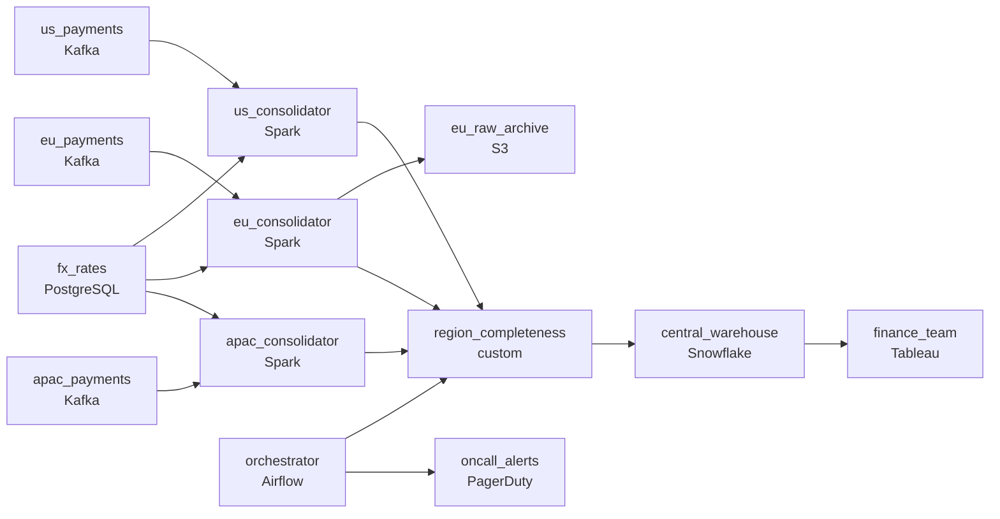

# Three Regions, One Finance Team
_Payments from everywhere. One consistent report._

- **Domain:** pipeline_architecture
- **Difficulty:** Hard
- **Est. time:** 30 min
- **URL:** https://datadriven.io/problems/three_regions_one_finance_team

## Problem

We process payments across the US, EU, and APAC and each region runs its own infrastructure. The finance team needs a single consolidated view of global payment volume for reporting, but right now every region is a silo. Design a data platform that ingests payment events from all regions and makes them available for consistent global reporting.

**Concepts tested:** `paBackfill`, `paBatchProcessing`, `paBatchVsStreaming`, `paCdc`, `paDagOrchestration`, `paDataLake`, `paDataQuality`, `paDeadLetterQueue`, `paDeduplication`, `paDependencyMgmt`, `paEventDriven`, `paEventPlatforms`, `paFullVsIncremental`, `paIdempotency`, `paLateData`, `paMedallion`, `paMonitoring`, `paPartitioning`, `paRetryHandling`, `paSchemaEvolution`, `paStreamProcessing`, `paTableFormats`

## Requirements

- Finance reads consolidated daily totals at 6am UTC every morning; missing it holds up reporting for the whole day.
- EU payment data is regulated; raw personal information and card data can't cross borders, only aggregated values can.
- Historical transactions have to be valued at the FX rate that was in effect on their original date, not today's rate.
- Finance has to see which regional totals are still incomplete before signing off; today late or missing data shows up as one final number.

## Must-have components

- Finance reads consolidated daily totals from a central warehouse; without a warehouse tier there's no consolidation surface. Add Snowflake, BigQuery, Redshift, or Databricks.
- Each region needs to keep ingesting even when the central pipeline is down or the network is partitioned, and EU PII can't leave EU infrastructure. Without a regional ingestion layer (Kafka or equivalent) per region, the design can't isolate residency or absorb regional outages.

**Expected stages:** `regional_kafka_clusters` → `cross_region_replication` → `reconciliation_layer` → `centralized_warehouse` → `reporting_layer`

## Solution walkthrough

### What this really is

This is a residency boundary problem wearing a reporting costume. Drawing three regional feeds into one warehouse is the easy part. The trap is centralizing first and enforcing residency at query time. Once you do that, raw EU card data is already sitting in a US warehouse before any filter runs. That is an audit failure on day one. It also leaves finance looking at one consolidated number that hides which region never arrived.

> **Decide what crosses the border before you draw the warehouse**
>
> Dedup, FX conversion and aggregation all run **inside each region**. Only totals leave. Draw that boundary first, and FX locking and completeness status both have an obvious place to live.

### Walk the requirements

**Step 1: Ingest and consolidate in-region**

Each region keeps its own Kafka log. That log is the residency boundary, and it absorbs outages: if the central path partitions, regions keep ingesting and replay later. `eu_consolidator` dedups and aggregates on EU compute. Raw rows land in `eu_raw_archive` and stay there.

**Step 2: Lock FX at the transaction's hour**

The consolidator joins each event to the hourly rate from `fx_rates` and stores the original amount, the rate and the converted amount on the row. If you apply today's rate at consolidation, every rebuild silently rewrites last quarter.

**Step 3: Gate on completeness per region**

`region_completeness` compares expected counts with received counts for each region and tags each one 'complete', 'late' or 'missing'. That tag lands next to the totals in the warehouse, so finance signs off knowing what is in the number.

**Step 4: Watch the 6am deadline, not the job**

Airflow sensors per region page on-call before 6am UTC if a region is at risk. The alert names the region, which is what lets someone act at 4am.

### The reference design

| node | type | tech | details |
|---|---|---|---|
| us_payments | source | Kafka |  |
| eu_payments | source | Kafka |  |
| apac_payments | source | Kafka |  |
| fx_rates | source | PostgreSQL |  |
| us_consolidator | transform | Spark | idempotencyStrategy: staging_table |
| eu_consolidator | transform | Spark | idempotencyStrategy: staging_table |
| apac_consolidator | transform | Spark | idempotencyStrategy: staging_table |
| eu_raw_archive | storage | S3 |  |
| region_completeness | quality_gate | custom |  |
| orchestrator | transform | Airflow | errorAction: alert; monitorAlert: Region not complete vs 6am UTC SLA |
| central_warehouse | storage | Snowflake | slaFreshness: < 24h; backfillStrategy: partition_overwrite |
| finance_team | consumer | Tableau | slaFreshness: < 24h |
| oncall_alerts | consumer | PagerDuty |  |

| Centralize, then filter | Aggregate in-region, then ship |
|---|---|
| Raw EU rows already sit in the central warehouse, and a filter on read does not change where they are stored. FX is joined at consolidation, so totals drift with every rebuild. A late region disappears into one number. | Only aggregates cross the border. FX is fixed on the row. A late region shows up as 'late' next to its total instead of being hidden inside it. |

> **A residency filter on read is not residency**
>
> Candidates draw one Spark job pulling all three regions, then add a 'mask EU PII' step downstream. The bytes have already crossed. Regulators care where data is stored, not what the dashboard shows.

> **Name the boundary node**
>
> The senior tell is pointing at `eu_consolidator` and saying that it is the residency boundary. Every compliance change lands there, and the central pipeline never changes.

- **EU now forbids even some aggregated breakdowns from leaving the region. What changes, and where?**
  - _Only the aggregation logic in `eu_consolidator` changes. Downstream of the border, nothing does._
- **Last quarter's USD total moved slightly between two runs a month apart. How does finance find out why?**
  - _The rate stored on each row, combined with the history in `fx_rates`, shows exactly which hourly rate was corrected._
