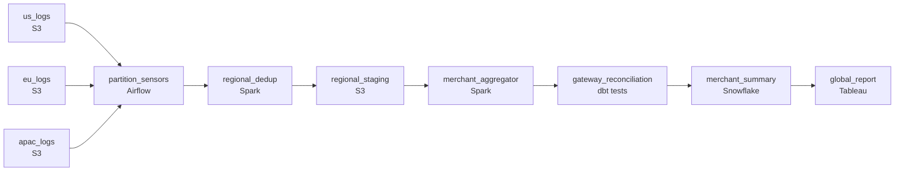

# Three Regions, One Report
_Three regions, billions of payments, one merchant summary by 6 AM._

- **Domain:** pipeline_architecture
- **Difficulty:** Hard
- **Est. time:** 25 min
- **URL:** https://datadriven.io/problems/three_regions_one_report

## Problem

What daily batch pipeline gets the previous day's payment logs, which US, EU and APAC each land in their own object storage bucket on their own clock, into a merchant-level summary for global reporting by 6 AM UTC, with each region moving as soon as its own files are in rather than waiting on the slowest? The on-call engineer needs every retried or straggling payment counted exactly once toward its original day, totals checked against the payment gateway's daily figures before the report sees them, and a rerun of a failed day that reproduces the same numbers.

**Concepts tested:** `paBatchProcessing`, `paDagOrchestration`, `paDataLake`, `paDataQuality`, `paDeduplication`, `paEltVsEtl`, `paFileIngestion`, `paFullVsIncremental`, `paIdempotency`, `paLateData`, `paMedallion`, `paMonitoring`, `paPartitioning`, `paRetryHandling`, `paSchemaEvolution`, `paSmallFiles`, `paTableFormats`

## Requirements

- Global reporting needs the consolidated merchant summary every morning by 6am UTC; missing it has been happening too often.
- Finance reconciles against the payment gateway and today the numbers never match because we drop or duplicate events.
- When one region's data lands late, the other regions still need to make progress; today everything waits for the slowest.
- When something fails partway through, operators rerun the day, and the rerun has to produce the same numbers, not different ones.

## Must-have components

- The 6am UTC SLA, three regions finalizing at different times, partition-readiness sensors, and rerun-safety can't be expressed without an orchestration layer. Add Airflow, Dagster, or Prefect as the DAG owner.
- Each region's raw payment logs land in object storage and the unified fact has to anchor on a durable layer that can be reread for reconciliation against the gateway. Without a cold storage tier, late-arriving data and reruns have nowhere to live.

**Expected stages:** `partition_sensor` → `regional_ingestion` → `schema_normalizer` → `deduplication_stage` → `merchant_aggregator` → `quality_gate` → `summary_publisher`

## Solution walkthrough

### Why this problem exists in real interviews

Three regions land logs on three different clocks. Finance reconciles the consolidated number against the gateway, so one missed event or one double-counted event lands on a CFO's desk. The 6 AM UTC deadline is non-negotiable because it feeds the global report the executives read with their coffee. The trap is treating this like one batch pipeline, when it's really three regional pipelines that converge.

The natural shape on the whiteboard is one DAG that waits for all three regions, then runs ingest, then dedup, then aggregation in a single chain. APAC's S3 bucket is occasionally late, so the whole pipeline misses 6 AM whenever APAC is. The fix the on-call engineer applies is 'make the SLA 7 AM,' which works once and then breaks again the next time EU is late. The shape is wrong: one slow region shouldn't be able to hold up the other two.

> **Trick to Solving**
>
> Three regions on three clocks means three pipelines that converge at the warehouse, not one pipeline that waits for the slowest.
>
> 1. Each region's ingest starts when its own partition is ready, not when all three are. A partition-readiness sensor per region, not one big AND gate.
> 2. Exactly-once is two properties together: dedup on a stable event key inside the day, and idempotent writes so reruns produce the same warehouse state.
> 3. Reconciliation against the gateway is a quality gate, not a comment in a runbook. The pipeline either matches the gateway total or it pages someone.

---

### Walk the requirements

**Step 1: Land the report by 6 AM, with alerting before, not after**

The deadline is 6 AM UTC and missing it has been routine. An orchestrator owns the DAG and runs partition-readiness sensors per region; each region finalises on its own clock, with one consistently latest. Each sensor has its own alert that fires before 6 AM, not at 6 AM, so on-call sees a late region with hours to fix rather than minutes. Without an orchestration layer there's nowhere for the SLA, the sensors, or the rerun semantics to live.

**Step 2: Make the count match the gateway, exactly once**

Payment events have a stable event id from the gateway. Dedup on (`event_id`, `event_date`) inside the day's partition, then aggregate by merchant. The aggregation writes to the merchant summary using partition overwrite on the report date, so a rerun replaces the day rather than double-writing it. Late-arriving events for yesterday land in yesterday's partition and trigger a rebuild of just that day, not the whole table. After the aggregate is built, a reconciliation step compares the merchant total against the gateway's reported total, and if they differ by more than a tight threshold, the run fails loudly instead of publishing a wrong number.

**Step 3: Decouple regional ingest from the global join**

Each region has its own partition sensor and its own ingest task that writes to a regional staging area in cold storage. None of those tasks know about each other. The downstream merchant aggregation is the only step that needs all three; everything before it runs in parallel as soon as its own data lands. When the slowest region runs hours late, the warehouse already has fresh per-region aggregates from the others, the operator can see exactly which region is delayed, and only the global rollup is waiting on it.

**Step 4: Make reruns boring**

Operators rerun a day when something fails midway through. The rerun has to land on the same numbers, not slightly different ones, or finance loses trust in the warehouse. Two properties get you there: dedup is deterministic on event id, and the merchant summary is written via partition overwrite keyed on report date. Whatever stage failed, restarting the DAG for that date produces the same end state. No surprise diff from the original run when the operator reruns.

---

### The shape that fits

| node | type | tech | details |
|---|---|---|---|
| us_logs | source | S3 |  |
| eu_logs | source | S3 |  |
| apac_logs | source | S3 |  |
| partition_sensors | transform | Airflow | errorAction: alert; monitorAlert: Region partition not ready before the morning deadline window |
| regional_dedup | transform | Spark | parallelism: 16 partitions; idempotencyStrategy: staging_table |
| regional_staging | storage | S3 | backfillStrategy: partition_overwrite |
| merchant_aggregator | transform | Spark | retryCount: 3; retryBackoff: exponential; idempotencyStrategy: upsert |
| gateway_reconciliation | quality_gate | dbt tests | errorAction: alert; monitorAlert: Merchant total disagrees with gateway total |
| merchant_summary | storage | Snowflake | slaFreshness: < 24h; backfillStrategy: partition_overwrite |
| global_report | consumer | Tableau | slaFreshness: < 24h |

> **What this design gives up**
>
> Three regional pipelines instead of one means three sets of partition sensors, three sets of dedup runs, and a fan-in step that has to handle one region being late. The orchestration config is heavier and the DAG graph is wider. DAG simplicity is what gets sacrificed; in return, the report ships when one region is slow, which is the whole point of decoupling them.

> **What reviewers check**
>
> A reviewer looks at the canvas for these properties:
> - An orchestration layer owns the daily schedule, per-region partition-readiness sensors, and SLA alerting before 6 AM.
> - Regional staging anchors on a durable layer that can be reread for reconciliation against the gateway and replayed for late events.

> **The mistake that ships**
>
> What gets built first uses a single 'wait for all regions' sensor at the top of the DAG, dedups inside Spark by sorting and dropping consecutive duplicates, and writes the merchant summary by appending. The first time APAC is late, the report misses 6 AM and a director notices. The on-call rerun produces a slightly different total than the original run because the append left some rows from the half-finished first attempt. Finance escalates to the head of data, who spends a week explaining why the warehouse total and the gateway total disagree.

---

- **A fourth region opens next quarter that finalizes its logs at 05:45 UTC. What changes in the design?**
  - _Tests whether the candidate added a region by changing config (sensor, ingest task, staging path) rather than rewriting the DAG. The whole point of the per-region shape was to make adding regions cheap._
- **Finance asks for the number to be available at 6 AM in their local time, not 6 AM UTC. Three finance teams, three timezones. What do you change?**
  - _Tests whether the candidate sees that the SLA is now three SLAs against the same warehouse table, which means freshness alerting becomes per-consumer rather than per-pipeline. The pipeline doesn't change; the alerting does._
