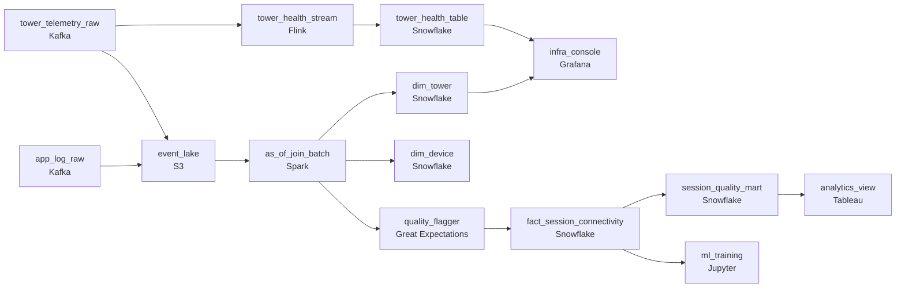

# Towers and Phones, Same Story
_Tower signals meet app events. Somewhere in between is the truth._

- **Domain:** pipeline_architecture
- **Difficulty:** Hard
- **Est. time:** 10 min
- **URL:** https://datadriven.io/problems/towers_and_phones_same_story

## Problem

Our connectivity team collects telemetry from cellular towers globally - signal strength, handoff events, and coverage measurements - and we need to combine this with mobile app performance logs to understand how network conditions affect user experience. Design the data warehouse pipeline including the ingestion architecture and the dimension/fact schema.

**Concepts tested:** `paBatchProcessing`, `paCdc`, `paDataQuality`, `paDeduplication`, `paEltVsEtl`, `paFileIngestion`, `paFullVsIncremental`, `paIdempotency`, `paLateData`, `paMedallion`, `paMonitoring`, `paPartitioning`, `paScdPipeline`, `paSchemaEvolution`, `paSmallFiles`, `paTableFormats`

## Requirements

- Infrastructure needs tower health for outage response, product analytics works in hours, and ML retrains weekly.
- Analysts need to know which tower a device was connected to when an app event happened; today they only have one or the other.
- Combining tower and app data can pinpoint where a person physically is; only the infrastructure team can see exact locations.
- Some regions have no tower coverage; analysts need to know an event happened there, not see it disappear.

## Must-have components

- This is a warehouse pipeline ,  the target is dim_tower / dim_device / fact_session_connectivity, and the rubric is weighted on the dimensional model. Add a warehouse tier (Snowflake, BigQuery, Redshift, or a lakehouse) as the modeled serving layer.
- Infrastructure needs tower health within minutes, while product analytics and ML run on hourly or weekly cadence. One serving path can't satisfy both economically. Show at least one streaming path and at least one batch path.

**Expected stages:** `tower_telemetry_raw` → `app_log_raw` → `fact_session_connectivity` → `dim_tower` → `dim_device` → `session_quality_mart`

## Solution walkthrough

### The trap

This is a point-in-time join dressed up as a telemetry warehouse. Anyone can land two Kafka feeds and draw a fact table. What separates candidates is the join key: which tower the device was on **at the moment of the event**, not the tower it is on now. Join on the latest tower and every handoff silently reattributes old sessions. Dashboards render, numbers look fine, and ML retrains on a different truth every week. The second trap: the joined record is more sensitive than either input, because it can place a person.

> **The tower is a moment, not an attribute**
>
> Model towers as a slowly changing dimension and join on `event_time BETWEEN valid_from AND valid_to`. Once you see the join as as-of, the rest follows: a batch path to build it, a streaming path for health, and a schema-level privacy split.

### Walk the requirements

**Step 1: Split by freshness budget**

Infrastructure needs tower health in minutes; analytics lives on hourly; ML retrains weekly. A `Flink` path lands tower health for outage response, a `Spark` batch path builds `fact_session_connectivity` hourly. One shared streaming tier is too costly for ML and still not tuned for outages.

**Step 2: Join as-of, never on current tower**

Key `dim_tower` on (`tower_id`, `valid_from`, `valid_to`). Each app event picks the version valid at its own `event_time`, so handoffs resolve themselves. An equi-join on the latest `tower_id` passes every test you would think to write.

**Step 3: Put the privacy boundary in the schema**

Precise coordinates live only in `dim_tower`, readable by infrastructure. The fact and `session_quality_mart` carry a bucketed cell. If the only guard is 'please don't query that column', the privacy review fails it.

**Step 4: Flag gaps, never drop them**

An event with no coverage lands with `tower_id` null and a `coverage_status` flag; an implausible signal gets a `quality_flag`. Filter them at join time and the question 'where do we lose coverage' becomes unanswerable.

### The shape that fits

| node | type | tech | details |
|---|---|---|---|
| tower_telemetry_raw | source | Kafka | parallelism: 16 partitions |
| app_log_raw | source | Kafka | parallelism: 16 partitions |
| tower_health_stream | transform | Flink | errorAction: dlq; slaFreshness: real-time |
| tower_health_table | storage | Snowflake | slaFreshness: < 1min |
| event_lake | storage | S3 | backfillStrategy: partition_overwrite |
| as_of_join_batch | transform | Spark | parallelism: 200 shuffle; slaFreshness: < 1h; idempotencyStrategy: staging_table |
| quality_flagger | quality_gate | Great Expectations | errorAction: alert; monitorAlert: Implausible signal or unattributed event |
| dim_tower | storage | Snowflake | slaFreshness: < 1h |
| dim_device | storage | Snowflake | slaFreshness: < 1h |
| fact_session_connectivity | storage | Snowflake | slaFreshness: < 1h; backfillStrategy: partition_overwrite |
| session_quality_mart | storage | Snowflake | slaFreshness: < 1h |
| infra_console | consumer | Grafana | slaFreshness: real-time |
| analytics_view | consumer | Tableau | slaFreshness: < 1h |
| ml_training | consumer | Jupyter | slaFreshness: < 24h |

| Latest tower join | As-of tower join |
|---|---|
| `ON e.device_id = d.device_id AND t.tower_id = d.current_tower_id`. Cheap equi-join. Last month's sessions move whenever the device hands off. | `ON e.tower_id = t.tower_id AND e.event_time BETWEEN t.valid_from AND t.valid_to`. A range scan, costlier, and stable forever. |

> **Three teams, three answers**
>
> Ship the latest-tower join and analytics contradicts infrastructure. Each team builds its own 'fixed' table, the warehouse grows competing answers to 'which tower was this', and the fact gets rebuilt six months in.

> **Say 'as-of' before you draw a box**
>
> The tell is naming the join semantics and the privacy split before picking tools. Candidates who start at `Kafka` and `Snowflake` rarely get to either.

- **A device hands off mid-session. How does `fact_session_connectivity` represent it?**
  - _Grain. Per-event grain resolves it for free; per-session grain must split or pick a dominant tower._
- **An analyst wants event counts by coverage area. Which table, and what can't they read?**
  - _Whether the privacy boundary actually exists: bucketed cells in the mart, precise coordinates only in `dim_tower`._
