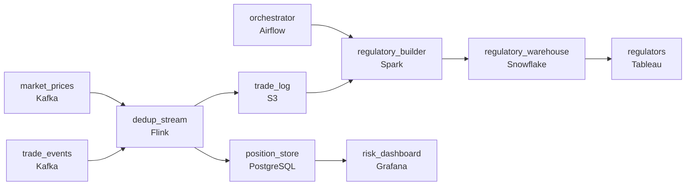

# Traders, Risk, and the Regulators
_Markets move in milliseconds. The pipeline has to keep up._

- **Domain:** pipeline_architecture
- **Difficulty:** Medium
- **Est. time:** 10 min
- **URL:** https://datadriven.io/problems/traders_risk_and_the_regulators

## Problem

We are an energy trading company that needs to consolidate market price feeds, trade execution data, and open position data from multiple trading desks into a unified analytics platform. The data must be reliable, auditable, and available to risk managers within minutes of execution. Design the end-to-end pipeline with a focus on scalability, data quality, and operational reliability.

**Concepts tested:** `paApiIngestion`, `paBackfill`, `paBatchProcessing`, `paBatchVsStreaming`, `paCdc`, `paCiCd`, `paColumnarVsRow`, `paCompression`, `paCostOptimization`, `paDagOrchestration`, `paDataQuality`, `paDataSkew`, `paDeadLetterQueue`, `paDeduplication`, `paDistributedPrimitives`, `paEltVsEtl`, `paEnvironmentMgmt`, `paEventDriven`, `paFullVsIncremental`, `paIdempotency`, `paLambdaArch`, `paLateData`, `paMedallion`, `paMemoryManagement`, `paMonitoring`, `paPartitioning`, `paRetryHandling`, `paSaltingStrategy`, `paScdPipeline`, `paSchemaEvolution`, `paSmallFiles`, `paSparkCaching`, `paStreamProcessing`, `paTableFormats`

## Requirements

- Risk managers operate on a sub-minute decision horizon during volatile markets; they can't be reading data from minutes ago.
- Regulators want trade reports submitted by morning the next business day; missing the deadline has direct regulatory consequences.
- Even one duplicate trade misstates the open position and creates a reportable risk error.

## Must-have components

- Risk managers operate on a sub-minute horizon; market and trade events have to land in seconds. Without a streaming path nothing reaches risk in time. Add a streaming layer (Kafka + Flink/Kafka Streams) or set SLA Freshness to real-time / < 1min.
- Regulators may regenerate any trade report for any past day; the trade history has to live in a durable, replayable store. Without a cold storage / durable layer there's nowhere to anchor regulatory replay.

**Expected stages:** `market_price_feed` → `trade_execution_events` → `position_snapshots` → `risk_exposure_mart` → `settlement_reconciliation`

## Solution walkthrough

### Why this problem exists in real interviews

Risk managers and regulators want the same trades from opposite ends of the latency spectrum. Risk needs the next minute; regulators need any past day reproducible. The trap is two pipelines that drift, where the risk view and the regulatory report disagree on what 'happened' for the same day. The right shape is one durable event log feeding both, with dedup at ingest so positions don't double-count.

The whiteboard answer is one Kafka stream into a real-time aggregator that updates a position store and writes to a database for regulators. The position store double-counts when a producer retries; risk reads inflated exposure for a moment. The regulator asks for last Tuesday's trade report and the team rebuilds it from the database, only to find a discrepancy with the position store everyone trusted. Two systems drifted because there was nothing both consumed from authoritatively.

> **Trick to Solving**
>
> Stream the trades, dedup on a stable id, anchor on a durable trade log; risk and regulators read derivatives of the same source.
>
> 1. A durable trade log in cold storage is the source of truth for both risk and regulatory. Both views are derivatives; neither is authoritative on its own.
> 2. Dedup on a stable trade id at ingest, before either view sees the event. Idempotent writes downstream so a retry produces the same state.
> 3. Risk reads from a streaming-fed position store updated in seconds. Regulators read from the warehouse, generated from the trade log on demand for any past date.

---

### Walk the requirements

**Step 1: Streaming path lands prices in seconds and trades in tens of seconds**

Market price feeds and trade execution events flow into a queue and a stream processor that updates the risk position store. The risk dashboard reads from the position store; end-to-end is sub-minute. Without a streaming path the requirement is unaddressed. Whatever stream tech (Flink, Kafka Streams, Spark Streaming), the property that matters is sub-minute end-to-end from event to risk view.

**Step 2: Regulatory reports regenerable for any past date from the trade log**

Trades land in a durable trade log in cold storage, partitioned by date and immutable once written. Regulatory reports are generated from the log on demand for any past date through a batch job; the same job for the same date produces the same report. The orchestrator schedules the next-business-day report so it lands before the regulatory deadline, with alerts before the deadline if anything is at risk. Without a durable trade history the regulatory replay has nowhere to anchor.

**Step 3: Dedup at ingest on a stable trade id**

Trades have a stable id from the execution system. Ingest dedups on that id before any consumer sees the event; the position store and the trade log both write idempotently keyed on it (upsert / partition-overwrite). A retry of the same trade produces the same state, not an inflated position. Two consumers each implementing their own dedup is two slightly different answers to 'how many trades was this' and a regulator asking why risk and the report disagree.

---

### The shape that fits

| node | type | tech | details |
|---|---|---|---|
| market_prices | source | Kafka | parallelism: 8 partitions |
| trade_events | source | Kafka | parallelism: 16 partitions |
| dedup_stream | transform | Flink | slaFreshness: real-time; idempotencyStrategy: upsert |
| position_store | storage | PostgreSQL | slaFreshness: real-time |
| trade_log | storage | S3 | backfillStrategy: partition_overwrite |
| orchestrator | transform | Airflow | errorAction: alert; monitorAlert: Regulatory report at risk vs next-business-day SLA |
| regulatory_builder | transform | Spark | slaFreshness: < 24h; backfillStrategy: partition_overwrite; idempotencyStrategy: staging_table |
| regulatory_warehouse | storage | Snowflake | slaFreshness: < 24h |
| risk_dashboard | consumer | Grafana | slaFreshness: real-time |
| regulators | consumer | Tableau | slaFreshness: < 24h |

> **What this design gives up**
>
> A durable trade log plus a streaming position store plus a regulatory batch job is more pieces than one big pipeline. Dedup at ingest costs more than appending blindly. Operational simplicity is the cost; what arrives is risk that reads in seconds, regulatory reports that reproduce, and positions that count each trade exactly once.

> **What reviewers check**
>
> A reviewer looks at the canvas for these properties:
> - A streaming path lands market and trade events at the risk view in seconds.
> - A durable trade log anchors regulatory replay for any past day; both views are derivatives of the same source.

> **The mistake that ships**
>
> What gets built first uses one stream into a position store and a separate database load for regulators, with append writes everywhere. A producer retry inflates position briefly; risk reads the inflated number and a manager makes a hedging call against it. The next morning, the regulator's report is generated from a database that drifted from the position store. Two views, two truths, neither reproducible. The team rebuilds with a durable trade log, dedup at ingest, and on-demand regulatory builds. By the time the rebuild lands, risk has been making decisions on inflated numbers for weeks and the regulator has its own questions about reproducibility.

---

- **A regulator asks for last Tuesday's trade report regenerated against the latest reporting rules. What changes, and what stays?**
  - _Tests whether the candidate sees the trade log as immutable history, with the regulatory builder being the place where reporting rules live. New rules mean a new builder run against the same log; the log doesn't change._
- **The streaming path has a brief outage during a volatile hour. What does the position store show, and what does it not show?**
  - _Tests whether the candidate sees that the position store falls behind during the outage, the trade log catches up when streaming resumes, and risk has either a stale indicator or a 'paused' mode for that window. Letting the position store quietly diverge from the log is the version that misleads risk during the outage._
