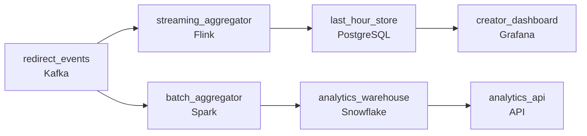

# Two Hundred Million Redirects
_Billions of clicks. One tiny code. Two very different clocks._

- **Domain:** pipeline_architecture
- **Difficulty:** Medium
- **Est. time:** 25 min
- **URL:** https://datadriven.io/problems/two_hundred_million_redirects

## Problem

Our link shortener does about 200 million redirects a day. Every redirect fires a click event and we need to serve two consumers from that stream: a real-time dashboard that shows per-link clicks within the last hour, and a nightly batch aggregate that powers the analytics API for date-range queries. Traffic is very spiky and some links go viral. Design the pipeline.

**Concepts tested:** `paBatchProcessing`, `paBatchVsStreaming`, `paDataLake`, `paDeduplication`, `paEventDriven`, `paEventPlatforms`, `paFullVsIncremental`, `paIdempotency`, `paLambdaArch`, `paLateData`, `paMonitoring`, `paPartitioning`, `paRetryHandling`, `paStreamProcessing`

## Requirements

- Link creators check their dashboard right after sharing and need clicks visible within roughly a minute; perceived lag is a top support complaint.
- The analytics API serves single-link lookups and date-range scans for an account; today the flat layout makes both slow.

## Must-have components

- Link creators check the dashboard right after sharing; clicks have to show up within roughly a minute. Add a streaming layer on the click path or set SLA Freshness to real-time / < 1min on the aggregator.

**Expected stages:** `event_ingestion` → `stream_processor` → `real_time_store` → `raw_event_lake` → `batch_aggregator` → `daily_aggregate_table` → `analytics_api`

## Solution walkthrough

### Why this problem exists in real interviews

Two consumers off one click stream with very different query shapes: a real-time dashboard for the last hour and an analytics API serving single-link lookups and date-range scans. The trap is one flat table; neither consumer is well-served.

The default reach is one streaming consumer that updates a flat clicks table. The dashboard's last-hour view is fast at low volume; at peak, an interactive dashboard query runs slow because nothing's indexed for per-link recent reads. The analytics API's date-range scans are slow because the layout doesn't match the access pattern.

> **Trick to Solving**
>
> Two stores tuned to two query shapes: a streaming-fed last-hour view, a partitioned aggregate for date-range scans.
>
> 1. Click events flow into a streaming consumer that maintains per-link last-hour counts in an online store; the dashboard reads from there.
> 2. A nightly batch aggregates clicks by day and link into a date-partitioned warehouse table the analytics API queries; date-range scans hit a slice.
> 3. Both consumers read derivatives of the same source events; nothing reads the raw clicks table at request time.

---

### Walk the requirements

**Step 1: Per-link last-hour counts within a minute for the creator dashboard**

Click events flow through a streaming consumer that maintains per-link last-hour counts in an online store. The dashboard reads from there; lag stays within the minute. Without a streaming tier the dashboard waits for batch and creators feel the lag they're complaining about.

**Step 2: Date-partitioned aggregates for the analytics API's two query shapes**

A nightly batch aggregates clicks by (`link_id`, date) into a warehouse table partitioned by date. Single-link lookups hit a partition pruned on date filter; date-range scans for an account read a small slice keyed on link plus date. A flat table with one row per click is the version where both query shapes scan everything; the aggregate is what makes the API fast for both.

---

### The shape that fits

| node | type | tech | details |
|---|---|---|---|
| redirect_events | source | Kafka |  |
| streaming_aggregator | transform | Flink | slaFreshness: real-time; idempotencyStrategy: upsert |
| last_hour_store | storage | PostgreSQL | slaFreshness: < 1min |
| batch_aggregator | transform | Spark | slaFreshness: < 24h; backfillStrategy: partition_overwrite |
| analytics_warehouse | storage | Snowflake | slaFreshness: < 24h; backfillStrategy: partition_overwrite |
| creator_dashboard | consumer | Grafana | slaFreshness: < 1min |
| analytics_api | consumer | API | slaFreshness: < 24h |

> **What this design gives up**
>
> Two stores instead of one; the nightly aggregate adds a job and a table. Implementation cost is the price; the win is creators seeing clicks within a minute and the analytics API serving both single-link lookups and date-range scans against a small slice.

> **What reviewers check**
>
> A reviewer looks at the canvas for these properties:
> - A streaming path serves the creator dashboard with per-link last-hour counts within a minute.
> - A batch path produces date-partitioned aggregates the analytics API queries for both single-link lookups and date-range scans.

> **The mistake that ships**
>
> What gets shipped runs one streaming consumer into a flat clicks table both the dashboard and the analytics API read. The dashboard runs slow at peak because nothing's indexed for per-link recent reads. The API's date-range scans are slow. The eventual rebuild adds the streaming last-hour store and the date-partitioned aggregate.

---

- **An analytics-API customer queries a single link over a year. What in this design serves it, and how fast?**
  - _Tests whether the candidate sees the date-partitioned aggregate as the surface: the query reads partitions for the year filtered on the link id, scanning a slice rather than the full table. The aggregate's row count is bounded by (link, date), which makes the year's worth of rows small for a single link._
- **A bot floods a single link with millions of clicks in an hour. What does this design do, and what does the creator see?**
  - _Tests whether the candidate sees the streaming aggregator absorbing the burst with per-link state; the creator's dashboard shows the inflated count (which is what was redirected). Bot-detection downstream of the aggregate is a separate consumer; the click count itself reflects what the redirector saw._
