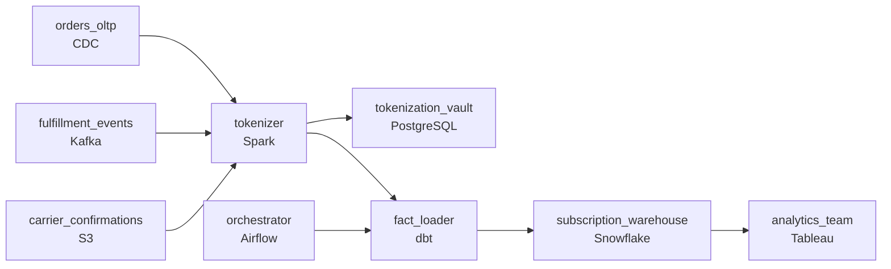

# Two Million Boxes by Monday Morning
_Shipped, maybe. Delivered, debatable._

- **Domain:** pipeline_architecture
- **Difficulty:** Hard
- **Est. time:** 35 min
- **URL:** https://datadriven.io/problems/two_million_boxes_by_monday_morning

## Problem

We ship weekly meal-kit boxes to subscribers across multiple countries. Orders are placed online, fulfilled through regional warehouses, and delivered via third-party carriers. The analytics team needs a warehouse that tracks subscription performance, delivery rates, ingredient waste, and weekly cohort behavior. Design the pipeline and warehouse model.

**Concepts tested:** `paApiIngestion`, `paBatchProcessing`, `paColumnarVsRow`, `paCompression`, `paDagOrchestration`, `paDataLake`, `paDataQuality`, `paDeduplication`, `paEltVsEtl`, `paEventDriven`, `paFileIngestion`, `paFullVsIncremental`, `paIdempotency`, `paLateData`, `paMedallion`, `paMonitoring`, `paPartitioning`, `paRetryHandling`, `paScdPipeline`, `paSchemaEvolution`

## Requirements

- The weekly business review runs Monday morning and analytics needs prior-week data ready by 7am; pipeline failures have to alert on-call by 5am Monday.
- Carriers confirm delivery a day or two after the box arrives; the warehouse has to update delivery status when late data lands without rebuilding the fact table.
- EU subscriber name and address are PII under GDPR; tokenization has to happen before any record reaches the analytics warehouse.

## Must-have components

- The weekly business review reads from the warehouse; without a warehouse tier there's no analytics destination. Add Snowflake, BigQuery, Redshift, or Databricks.
- The Monday 7am SLA, late-carrier handling without full-table reprocessing, and PII tokenisation all run on a coordinated schedule; without an orchestration layer there's nothing to coordinate that. Add Airflow, Dagster, Prefect, or Composer.

**Expected stages:** `Source Systems` → `Ingestion Layer` → `Transformation Layer` → `Data Warehouse` → `Serving Layer`

## Solution walkthrough

### Why this problem exists in real interviews

Weekly meal-kit subscription analytics with a Monday-morning deadline that has to alert on-call by 5am, late-arriving carrier delivery confirmations that update the warehouse without rebuilding the fact, and EU PII tokenized before any warehouse landing. The trap is treating the carrier confirmation as a separate batch or letting PII land before tokenization.

The default reach is one weekend run that loads orders, fulfillment, and what's available of carrier confirmations. Late carrier confirmations land Monday afternoon and the team rebuilds the entire fact table; the warehouse goes offline for hours. PII lands and is tokenized in a downstream view; one direct query exposes raw values.

> **Trick to Solving**
>
> Tokenize at ingest, partition-by-event-date so late confirmations update only the affected partition, orchestrator alerts on-call by 5am Monday.
>
> 1. PII tokenization runs before any warehouse landing; the warehouse holds tokens.
> 2. Late carrier delivery confirmations partition-overwrite the affected order's delivery row; the rest of the fact stays unchanged.
> 3. The orchestrator gates the Monday 7am SLA with a 5am on-call alert if anything is at risk.

---

### Walk the requirements

**Step 1: Land prior-week analytics by 7am Monday with on-call alert by 5am**

The orchestrator runs the weekly DAG with sensors firing by 5am Monday if any stage is at risk. On-call has hours, not minutes, to address pipeline failures before the 7am business review. Without orchestration the deadline isn't owned; without the warehouse the analytics layer has nowhere to live.

**Step 2: Late carrier confirmations partition-overwrite the affected row**

Carriers confirm delivery a day or two after the box arrives. Each confirmation arrives keyed on order id and partition-overwrites that order's delivery status row in the fact. The rest of the fact stays as is. A 'rebuild the fact every time a carrier confirmation lands' approach takes the warehouse offline for hours; targeted overwrite is the contract.

**Step 3: Tokenize EU PII at ingest; warehouse holds tokens**

EU subscriber name and address are GDPR PII. Tokenization runs at the boundary; the warehouse and downstream stores hold tokens. The mapping vault sits in a restricted environment with audited access. A 'mask in BI' approach is the version where one direct query exposes raw values; tokenize-at-ingest is the contract that keeps PII out of queryable tables.

---

### The shape that fits

| node | type | tech | details |
|---|---|---|---|
| orders_oltp | source | CDC |  |
| fulfillment_events | source | Kafka |  |
| carrier_confirmations | source | S3 |  |
| tokenizer | transform | Spark | errorAction: alert |
| tokenization_vault | storage | PostgreSQL |  |
| orchestrator | transform | Airflow | errorAction: alert; monitorAlert: Stage at risk vs 7am Monday SLA, alerting by 5am |
| fact_loader | transform | dbt | backfillStrategy: partition_overwrite; idempotencyStrategy: upsert |
| subscription_warehouse | storage | Snowflake | slaFreshness: < 24h; backfillStrategy: partition_overwrite |
| analytics_team | consumer | Tableau | slaFreshness: < 24h |

> **What this design gives up**
>
> Tokenization adds a hop and a vault; partition-overwrite for late confirmations needs the order id as the partition key; the orchestrator's 5am pre-alert is configuration to maintain. Implementation cost is the price; the win is Monday morning that doesn't slip, late confirmations that update without rebuilds, and PII that doesn't land in queryable tables.

> **What reviewers check**
>
> A reviewer looks at the canvas for these properties:
> - An orchestration layer schedules the weekly load with sensors firing by 5am Monday if any stage is at risk.
> - PII tokenizes at ingest before any record reaches the warehouse.
> - Late carrier confirmations partition-overwrite the affected order's delivery row without rebuilding the fact table.
> - A warehouse anchors the subscription analytics.

> **The mistake that ships**
>
> What gets shipped loads what's available at the weekend run, rebuilds the fact when late confirmations arrive, and tokenizes PII in a BI view. Late confirmations take the warehouse offline for hours. One direct query exposes raw PII. The eventual rebuild adds tokenization at ingest, partition-overwrite by order id, and on-call alerting by 5am Monday.

---

- **A carrier delivers two confirmations for the same order (a delivery and a later correction). What does this design do, and what does the warehouse show?**
  - _Tests whether the candidate sees the partition-overwrite by order id as the contract: the second confirmation overwrites the first; the warehouse reflects the corrected status. The fact's other rows are unaffected._
- **A GDPR deletion request arrives for an EU subscriber. What in this design lets the deletion happen without removing the order's existence?**
  - _Tests whether the candidate sees the tokenization vault as the boundary: deletion removes the subscriber's mapping; the order rows hold tokens that are now orphaned. The order facts stay intact; the link to the person is gone._
