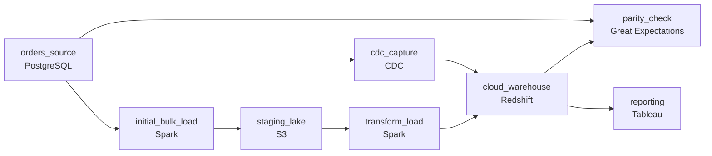

# Two Sources of Truth

- **Domain:** pipeline_architecture
- **Difficulty:** Medium
- **Est. time:** 25 min
- **URL:** https://datadriven.io/problems/two_sources_of_truth

## Problem

A retail company is moving its on-prem orders database to a cloud warehouse, and analytics teams cannot lose access to current data during the months-long cutover. Design a pipeline that does the one-time bulk load of the existing 2 TB, keeps the warehouse within minutes of the live source as new orders land, and proves the two systems agree before anyone flips reporting over.

**Concepts tested:** `paBackfill`, `paBatchProcessing`, `paBatchVsStreaming`, `paCdc`, `paDataLake`, `paDataQuality`, `paDeduplication`, `paEltVsEtl`, `paFileIngestion`, `paFullVsIncremental`, `paIdempotency`, `paLambdaArch`, `paMedallion`, `paMonitoring`, `paRetryHandling`, `paStreamProcessing`

## Requirements

- We have 2 TB of history sitting in the old database, and orders keep coming in while we migrate. We need both moved over.
- Analysts run dashboards all day. The warehouse can't be hours behind the live orders table during the migration.
- Before we point reporting at the new warehouse, we have to be sure it matches the old system. A silent gap would be a disaster.

## Must-have components

- The source keeps changing during the months-long load, so a one-shot dump goes stale immediately. Add a change-data-capture node that streams ongoing inserts and updates from the live source.
- The migration target is a cloud warehouse that analytics reads from. Add a warehouse node as the destination of the load.
- The existing 2 TB needs a one-time bulk load that the streaming path cannot do efficiently. Add a batch node for the initial backfill.
- Cutover has to be gated on the two systems agreeing. Add a quality-check node that reconciles row counts and key totals between source and warehouse before reporting flips over.

**Expected stages:** `initial_bulk_load` → `staging_lake` → `transform_load` → `cdc_capture` → `cloud_warehouse` → `parity_check`

## Solution walkthrough


### Why this problem exists in real interviews

Migration reads like 'copy the data once,' and that is the trap. The source is a moving target: 5 million rows change a day while a 2 TB dump runs for hours, so the snapshot is stale the moment it finishes. The real skill being probed is whether you split the load into a bulk backfill plus a change-capture stream, stitch them at a known log position, and refuse to cut over until the two systems are proven equal. Get the stitch wrong and you silently lose or double every order written during the load window, and nobody notices until finance reconciles the quarter.

The whiteboard answer is a nightly full reload of the orders table into the warehouse until the day you flip reporting. It works in the demo and falls apart at 2 TB: the reload takes longer than the night, dashboards trail by a full day, and on cutover day there is no evidence the warehouse actually matches the source. The fix is two paths sized for two jobs, reconciled before anyone trusts them.

> **Trick to Solving**
>
> Bulk-load once from a frozen snapshot, then let change capture carry everything after that exact point.
>
> 1. Take the initial snapshot at a recorded write-ahead-log position. That position is the seam.
> 2. Start change capture from that same position so no row is missed and none is replayed into a gap.
> 3. Apply changes as idempotent upserts keyed on the order id, so a redelivered event is harmless.
> 4. Reconcile against the source as-of a frozen position, because comparing against a live table never converges.

---

### Walk the requirements

**Step 1: Bulk-load the history once, off a recorded log position**

A batch job reads the 2 TB into a staging area in the lake, notes the write-ahead-log position the snapshot was consistent as-of, then a load step moves the staged history into the warehouse. Streaming 2 TB row by row through change capture would take days and hammer the source; the bulk path exists precisely because the backfill is a different job from the steady state. The recorded position is what makes the next step safe.

**Step 2: Stream every change after the seam, straight into the warehouse**

Change capture reads the source's write-ahead log starting from the snapshot position and applies inserts and updates directly to the warehouse as upserts on the order id. Because it starts exactly where the snapshot ended, nothing between 'dump finished' and 'stream started' falls through a hole, and a duplicated event just overwrites a row with identical data. This path is what keeps the warehouse within minutes of live without a nightly reload.

**Step 3: Prove parity before cutover**

A reconciliation job compares source and warehouse row counts and per-day order totals as-of a frozen log position. Comparing against the live source is a moving target that never reads zero, so you freeze a position, let the stream catch up to it, then diff. Cutover is gated on that diff being empty or fully explained. Skip this and you are betting the migration on faith.

---

### The shape that fits



| node | type | tech | details |
|---|---|---|---|
| orders_source | source | PostgreSQL |  |
| initial_bulk_load | transform | Spark |  |
| cdc_capture | source | CDC |  |
| staging_lake | storage | S3 |  |
| transform_load | transform | Spark |  |
| cloud_warehouse | storage | Redshift |  |
| parity_check | quality_gate | Great Expectations |  |
| reporting | consumer | Tableau |  |

**The seam, the stream, and the gate**

```python
$1c
```

| Nightly full reload | Bulk plus change capture |
|---|---|
| Re-extracts the whole table every night. Simple to write, but at 2 TB the job outruns the night, dashboards trail a full day, and cutover ships with no proof of correctness. | Backfills once, then streams deltas. More moving parts and a log-position seam to manage, but the warehouse stays minutes-fresh and reconciliation gives a hard go/no-go signal. |

> **Interviewers Watch For**
>
> The tell of a senior answer is the seam: naming that the snapshot and the change stream must share one log position, and that changes apply idempotently. Candidates who hand-wave the handoff are the ones who lose rows in production.

> **Common Pitfall**
>
> Comparing the warehouse to the live source and waiting for the diff to hit zero. It never will, because the source keeps moving while you measure. Freeze a log position, let the stream reach it, then diff as-of that point.

> **In production**
>
> Keep the legacy source authoritative and the change stream running well past cutover. Reporting points at the warehouse only after parity holds and a soak period passes, and pointing back to the legacy system is a one-line routing change, not a restore.

---

- **The source schema changes mid-migration: a column is added to orders. What does your change-capture path do, and where does it break?**
  - _Tests whether the candidate has a schema-evolution story for CDC and the downstream warehouse table rather than a static mapping._
- **Parity passes overall but one day's order total is off by a few cents in the warehouse. How do you decide whether to cut over?**
  - _Tests triage of a non-empty diff: classify it as rounding, a transform bug, or a real loss, and gate cutover on explanation rather than a raw zero._
