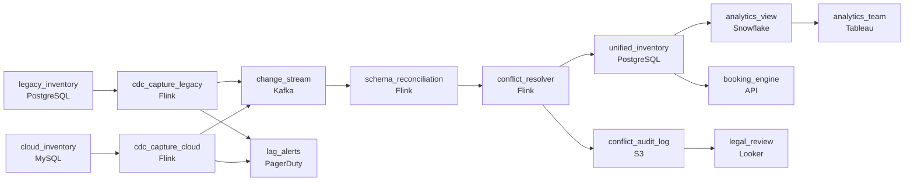

# Two Systems, One Room Count
_Two booking systems. Rooms do not duplicate themselves._

- **Domain:** pipeline_architecture
- **Difficulty:** Hard
- **Est. time:** 30 min
- **URL:** https://datadriven.io/problems/two_systems_one_room_count

## Problem

We operate a hotel booking marketplace with two independently evolving inventory databases: one from a legacy on-prem system and one from a newer cloud platform. Both are continuously updated by hotel partners, but they use different schemas for the same logical entities. Design a system to synchronize both sources into a unified, consistent inventory view that the booking platform and analytics team can query.

**Concepts tested:** `paCdc`, `paDeduplication`, `paEltVsEtl`, `paFullVsIncremental`, `paIdempotency`, `paSchemaEvolution`, `paStreamProcessing`

## Requirements

- Hotel partners update both inventory databases all day, and the unified view has to keep up with both of them.
- The two systems describe the same rooms with different schemas, and the unified view has to describe each room one way.
- The unified view must be consistent: the same room arriving from both systems is still one room.
- The booking platform and the analytics team both need to query the unified view, not the two source systems.

## Must-have components

- Both inventory databases are continuously updated by hotel partners, so a scheduled pull leaves the unified view behind the sources. Capture changes as they happen: use a streaming capture stage, or set SLA Freshness to real-time or < 1min on the capture path.
- The analytics team queries the unified inventory view, so the merged data needs a queryable analytical home. Add a storage node that is a warehouse or lakehouse (for example Snowflake, BigQuery, Redshift, Databricks or Delta Lake).

**Expected stages:** `cdc_capture_legacy` → `cdc_capture_cloud` → `schema_reconciliation` → `conflict_resolver` → `unified_inventory`

## Solution walkthrough

### What this really is

This is two-master replication in a hotel-booking costume. Two systems both claim to know the truth about the same room, and the booking engine has to act on one answer within seconds. Everyone draws CDC into a merged table. The real difference between candidates is the merge rule. Reach for **last-write-wins** and the winner depends on which event happened to arrive second. The same room then flips price between page loads, the losing value is overwritten with no record, and a lagging connector quietly sells rooms that are already gone.

> **Precedence is data, not arrival order**
>
> Resolve each field from the business's ownership table, keyed by property and field, and never by timestamp. Replay the same two events in either order and `conflict_resolver` must emit the same row. That determinism is also what makes a replay after a crash safe.

### Build it in order

**Step 1: Capture each source with its own CDC stream**

Run log-based CDC on both databases, one connector each, and tag every event with its source and log position. Separate connectors give you separate lag numbers, which is the only way ops learns which side is behind. Polling either side on a schedule brings back the stale window that causes overbookings.

**Step 2: Reconcile schemas before comparing anything**

The two systems describe the same room differently. `schema_reconciliation` maps both into one canonical event keyed by `room_id`, so the resolver compares like with like. If you skip this step, every apparent conflict is half schema mismatch and half real disagreement.

**Step 3: Resolve per field, upsert by key**

`conflict_resolver` holds state by `room_id` and applies the ownership rule field by field. For example, legacy owns price on its properties and cloud owns availability everywhere. It then upserts into `unified_inventory`. Because the write is keyed, a redelivered event is harmless.

**Step 4: Append every resolution to the audit log**

Whenever the two sources disagree, write the room, both values, the winner, the rule applied and the time to append-only object storage with retention. Legal reads this log. Nothing in the pipeline can update it.

**Step 5: Alert on lag per source**

Measure each connector's lag from its last committed log position, not from downstream symptoms. Page ops when either one crosses the threshold, before the booking engine sells against a frozen view.

| node | type | tech | details |
|---|---|---|---|
| legacy_inventory | source | PostgreSQL |  |
| cloud_inventory | source | MySQL |  |
| cdc_capture_legacy | transform | Flink | errorAction: alert; monitorAlert: Legacy CDC lag past threshold; slaFreshness: real-time |
| cdc_capture_cloud | transform | Flink | errorAction: alert; monitorAlert: Cloud CDC lag past threshold; slaFreshness: real-time |
| change_stream | queue | Kafka |  |
| schema_reconciliation | transform | Flink | slaFreshness: real-time |
| conflict_resolver | transform | Flink | slaFreshness: real-time; idempotencyStrategy: upsert |
| unified_inventory | storage | PostgreSQL | slaFreshness: real-time |
| conflict_audit_log | storage | S3 | backfillStrategy: incremental |
| analytics_view | storage | Snowflake | slaFreshness: < 1h |
| booking_engine | consumer | API | slaFreshness: real-time |
| analytics_team | consumer | Tableau | slaFreshness: < 1h |
| legal_review | consumer | Looker | slaFreshness: < 24h |
| lag_alerts | consumer | PagerDuty |  |

| Last-write-wins merge | Precedence merge |
|---|---|
| The winner is whichever event the stream delivered second. Delivery order changes on a retry or a partition rebalance, so the same conflict can resolve differently. The losing value is overwritten and gone. | The winner comes from the ownership rule for that field. Any order and any replay produce the same result. The losing value goes to `conflict_audit_log` before it is discarded. |

> **One combined ingest hides which side is late**
>
> Candidates often send both databases through a single ingest job and alert on end-to-end freshness. When the cloud side stalls, the legacy side keeps that combined number looking healthy. Half the rooms then go stale without tripping any alert.

> **The warehouse is not the booking path**
>
> The booking engine reads `unified_inventory`, a row store kept at real-time freshness. Snowflake gets an hourly copy for analytics. Pointing bookings at the warehouse tells the interviewer you have not thought about read latency or per-room writes.

- **The business moves ownership of price for one class of properties to the cloud system. What changes?**
  - _Only the rule that `conflict_resolver` reads changes, and the change itself is recorded. The connectors, storage and consumers stay as they are._
- **Both connectors stall during a partner outage. What does the booking engine do?**
  - _Tests for a stale-data policy: stop selling rooms whose last update is older than the threshold, rather than trusting a frozen view._
