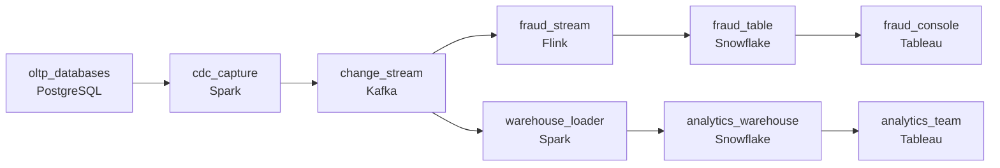

# Two Ways to Catch a Change
_Two ways to watch the database. Each has a cost._

- **Domain:** pipeline_architecture
- **Difficulty:** Medium
- **Est. time:** 20 min
- **URL:** https://datadriven.io/problems/two_ways_to_catch_a_change

## Problem

Our data team needs to replicate changes from several production databases into the warehouse in near-real time. We've been debating two approaches: reading directly from the database write-ahead log, or using database triggers to capture changes. Design a CDC replication system and make a concrete recommendation for which capture method to use across our source databases.

**Concepts tested:** `paBatchVsStreaming`, `paCdc`, `paDataQuality`, `paDeadLetterQueue`, `paDeduplication`, `paEventDriven`, `paEventPlatforms`, `paFullVsIncremental`, `paIdempotency`, `paKappaArch`, `paMonitoring`, `paRetryHandling`, `paSchemaEvolution`, `paStreamProcessing`

## Requirements

- Fraud needs database changes visible in the warehouse within minutes, while analytics teams can wait longer.
- The database team has refused to sign off on anything that risks slowing or breaking the live application.
- When a customer account is deleted in the source, the fraud team has to know; a row silently vanishing from the warehouse is wrong.

## Must-have components

- Fraud needs database changes within minutes without adding load to the live OLTP. The candidate must show a CDC capture mechanism (e.g. Debezium, Datastream, GoldenGate, or built-in connectors). Add a CDC node ,  log-based capture from the source databases into the change stream.
- Capture without a sub-minute propagation path leaves changes sitting in the source. Add a streaming layer (Kafka, Kinesis, Pub/Sub or a stream processor) downstream of capture so changes reach the warehouse fast enough for the fraud team.

**Expected stages:** `source_databases` → `cdc_capture_layer` → `change_stream` → `transformation` → `warehouse_sink`

## Solution walkthrough

### Why this problem exists in real interviews

The interview is asking you to pick between two CDC mechanisms (log-based and trigger-based) and defend the call. The trap is treating it as a religious debate. The actual answer is in the constraints: the database team won't sign off on anything that adds write load, fraud needs changes within minutes, and deletes can't disappear. Two of those three quietly eliminate triggers before the conversation starts.

The default move is to put a trigger on each table that writes to a change-log table, then pull that table into the warehouse on a schedule. It looks clean on a whiteboard. In production it doubles every write the application does, fires on every transaction the database team is on the hook for, and turns the trigger table into the slowest part of the database during peak load. The DBA pages someone, the trigger gets disabled at 3 AM, and the warehouse has been silently lying since.

> **Trick to Solving**
>
> Read the database log, don't ask the database to do extra work; capture once, fan out to many freshness budgets.
>
> 1. Log-based capture reads the WAL or binlog the database is already writing. Zero extra write load on the source, which is what the database team is asking for.
> 2. Capture once into a change stream, let consumers read at their own cadence. Fraud reads in seconds; analytics can read every few minutes off the same topic.
> 3. Deletes are events too. CDC emits a DELETE record with the primary key; the warehouse applies it as a soft-delete column, not as a row vanishing.

---

### Walk the requirements

**Step 1: Capture once, fan out to two freshness budgets**

One CDC connector per source reads the database log and writes change events to a single stream per source table. Fraud and analytics both consume from that stream, but on different schedules: fraud's stream processor updates the fraud table within seconds, analytics' loader micro-batches into the warehouse every few minutes. Two separate extracts from the same source would double the load and split the truth; one capture, two consumers, same source of changes.

**Step 2: Use log-based capture so the DBA stays asleep**

The database team has refused triggers and refused query-based polling. The remaining option, the one that adds zero write load on the OLTP, is reading the WAL/binlog through a connector like Debezium, Datastream, or GoldenGate. The connector runs as a separate process; the database doesn't even know it's there beyond the replication slot it advertises. That's the configuration the DBA will sign for. If a particular legacy source has no log access, that's a data-team problem to escalate, not a reason to retreat to triggers across the board.

**Step 3: Make deletes loud, not silent**

When a row is deleted in the source, the CDC connector emits a DELETE event with the primary key. The warehouse loader translates that into a soft-delete: an `is_deleted` flag and a `deleted_at` timestamp on the warehouse row, not a DELETE that removes it. Fraud queries `WHERE is_deleted = true AND deleted_at > now() - interval '1 day'` and sees every account deletion. A row vanishing from the warehouse without a trace is the failure mode the requirement is calling out; soft-delete is what makes the change auditable.

---

### The shape that fits

| node | type | tech | details |
|---|---|---|---|
| oltp_databases | source | PostgreSQL |  |
| cdc_capture | transform | Spark | errorAction: alert; monitorAlert: Replication slot lag rising past threshold |
| change_stream | queue | Kafka | parallelism: 8 partitions |
| fraud_stream | transform | Flink | slaFreshness: real-time; idempotencyStrategy: upsert |
| fraud_table | storage | Snowflake | slaFreshness: < 1min |
| warehouse_loader | transform | Spark | slaFreshness: < 15min; idempotencyStrategy: upsert |
| analytics_warehouse | storage | Snowflake | slaFreshness: < 15min |
| fraud_console | consumer | Tableau | slaFreshness: < 1min |
| analytics_team | consumer | Tableau | slaFreshness: < 15min |

> **What this design gives up**
>
> Log-based CDC means running connector infrastructure (Debezium on Kafka Connect, Datastream, or equivalent) and managing replication slots that the database team will worry about. Soft-deletes mean the warehouse table grows even for deleted rows, and consumers have to remember the filter. The operational complexity moves to the connector layer; in return, the OLTP is never touched and deletes ride the same path as everything else.

> **What reviewers check**
>
> A reviewer looks at the canvas for these properties:
> - A change-data-capture path reads from the source database log without adding query load.
> - Two consumer paths off the same change stream serve different freshness budgets.

> **The mistake that ships**
>
> What goes out the door first uses triggers because they were 'easier to set up' and reads the trigger table from the warehouse every few minutes. By month one, application writes slow down at peak because every insert fires a trigger and writes a second row. The DBA disables the triggers during a Sunday incident; nobody tells the data team for two weeks. The fraud team's account-deletion alerts stop firing because the trigger never reinstalled, and analytics shows an account that was deleted three weeks ago as still active. The team rebuilds on log-based CDC, which is what they should have done on day one.

---

- **One of the source databases is on a managed service that exposes the log only via an AWS-specific stream. What changes in the design?**
  - _Tests whether the candidate sees that the connector can be vendor-specific without changing the rest of the architecture: capture once, into the same change-stream contract, downstream consumers don't care which connector emitted the event._
- **The fraud team starts asking for the row's state before AND after each update, not just the new state. What does the connector configuration need to do?**
  - _Tests knowledge of how log-based CDC handles before-image: many connectors emit only the new row by default; full before-image typically requires configuring the source's log to record full row data (e.g. Postgres `REPLICA IDENTITY FULL`)._
