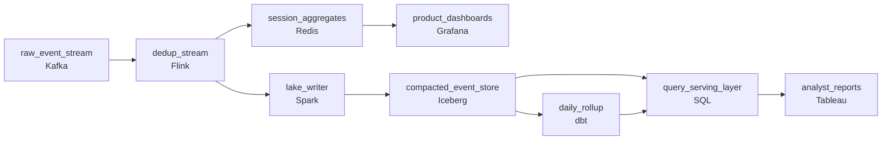

# Two Years of Clicks, Cheap
_Two years of clicks. Every query has to be affordable._

- **Domain:** pipeline_architecture
- **Difficulty:** Hard
- **Est. time:** 10 min
- **URL:** https://datadriven.io/problems/two_years_of_clicks_cheap

## Problem

Our platform generates 600 million user interaction events per day through Kafka and we need a cost-efficient architecture to store and query this data for analytics with a two-year retention requirement. Query latency and storage cost are both first-class constraints. Design the end-to-end ingestion, storage, and query architecture.

**Concepts tested:** `paBatchProcessing`, `paBatchVsStreaming`, `paColumnarVsRow`, `paCompression`, `paDagOrchestration`, `paDataLake`, `paDataQuality`, `paDeduplication`, `paEltVsEtl`, `paEventDriven`, `paEventPlatforms`, `paIdempotency`, `paLambdaArch`, `paLateData`, `paMedallion`, `paMicroBatchVsTrue`, `paMonitoring`, `paPartitioning`, `paSchemaEvolution`, `paStreamProcessing`, `paTableFormats`

## Requirements

- The VP of Engineering wants the bill to come down without losing the two years of history analysts depend on.
- Analysts run trend reports going back two years; recent queries have to be fast and older queries can be slower as long as they still complete.
- Product dashboards show what users just did and need to feel current, not yesterday's.
- Some events arrive twice from client retries; for purchase events that directly distorts the revenue numbers finance reads.

## Must-have components

- 600M events per day at two-year retention is hundreds of billions of rows of history; only a cold-storage data lake (S3/GCS/ADLS, Iceberg/Delta/Hudi) holds it cost-effectively. Without a cold-storage tier there's nowhere to keep two years of history at the required cost.
- Product dashboards need to feel current while finance reconciliation runs nightly. One shared path either over-spends to keep batch reconciliation streaming or starves dashboards of fresh data. Show at least one streaming path and at least one batch path.

**Expected stages:** `raw_event_stream` → `compacted_event_store` → `session_aggregates` → `daily_rollup` → `query_serving_layer`

## Solution walkthrough

### What this really is

This is a storage-tiering problem dressed up as an ingestion question. Getting events out of Kafka is the easy part. The real skill is giving each byte the engine its access pattern deserves: two years of cold history on object storage priced per GB, the last few minutes on a small hot store priced for reads, and scans billed by the bytes they touch. The trap is one big warehouse with a two-year retention setting. It works on day one. Then the bill grows every month, a heavy trend query stalls the product dashboards, and a retried purchase lands twice in the revenue finance reads.

> **Dedup once, then fork by recency**
>
> Split the stream once, right after dedup. One path runs in real time into a small hot store for dashboards. The other runs batched into a partitioned `Iceberg` table on object storage for everything else. The dedup key is the client-minted `event_id`, never the arrival offset: **a retry gets a new offset and keeps the same id**.

### The shape that fits

| node | type | tech | details |
|---|---|---|---|
| raw_event_stream | source | Kafka | parallelism: 16 partitions |
| dedup_stream | transform | Flink | slaFreshness: real-time; idempotencyStrategy: upsert |
| session_aggregates | storage | Redis | slaFreshness: < 1min |
| product_dashboards | consumer | Grafana | slaFreshness: real-time |
| lake_writer | transform | Spark | slaFreshness: < 15min; idempotencyStrategy: upsert |
| compacted_event_store | storage | Iceberg | backfillStrategy: partition_overwrite |
| daily_rollup | transform | dbt | slaFreshness: < 24h; backfillStrategy: partition_overwrite |
| query_serving_layer | transform | SQL | slaFreshness: < 1h |
| analyst_reports | consumer | Tableau | slaFreshness: < 1h |

**Step 1: Put dedup upstream of both tiers**

`dedup_stream` keys its state on `event_id`, with a TTL that covers the client retry window. Place it before the fork and both `session_aggregates` and `compacted_event_store` inherit clean data. Place it after the fork and you now run two dedup implementations that will eventually disagree.

**Step 2: Keep the hot tier small and fresh**

`session_aggregates` holds recent rollups in `Redis`, fed in real time. Dashboards never read the lake, so an analyst's two-year scan cannot slow the page that shows the last minute.

**Step 3: Batch the lake writes and compact them**

`lake_writer` flushes every few minutes, not once per event. `Iceberg` compaction then merges the output into large Parquet files partitioned by `event_date`. Thousands of tiny files an hour is how a cheap lake turns into a slow one.

**Step 4: Roll up nightly for the common questions**

`daily_rollup` builds per-day aggregates on a `< 24h` cadence, and finance reconciles against those tables. Most trend reports read the rollup instead of raw events. `query_serving_layer` falls through to raw partitions only when a question needs event-level detail.

| One warehouse, two-year retention | Tiered lake plus hot store |
|---|---|
| Every event sits on warehouse storage, and every query competes for the same compute. Dashboards and backfills share one queue. Cost tracks retention, so it only ever goes up. | History sits on object storage in compressed columnar files, and recent data sits on a small hot store. Queries pay only for the partitions they prune down to. Cost tracks access, and the dashboard path stays isolated from the scans. |

> **Pruning makes old queries affordable**
>
> At roughly 500 bytes an event, 600M events a day is about 300 GB raw, or about 220 TB over two years. Parquet with zstd typically compresses clickstream 5x to 10x, which leaves tens of TB at object-storage prices. A 30-day query filtered on `event_date` touches about 4% of that. The cheapness comes from pruning partitions, not from a faster engine.

> **Deduping on the offset catches nothing**
>
> Candidates often dedup on the Kafka `partition` and `offset`. That catches broker redelivery, not client retries. A client retry arrives as a new message with a new offset and the same `event_id`. Purchases are the case that matters here, so the key has to be the one the client minted.

> **Name which query hits which tier**
>
> The strong answer states the routing out loud. Dashboards read `session_aggregates`. Trend reports read `daily_rollup`. Only drill-downs scan `compacted_event_store`. If you draw tiers but cannot say where a given query lands, you have drawn boxes, not a design.

- **An event arrives three days after its `event_time`. Which tiers does it touch, and what has to rerun?**
  - _Tests late data. The lake accepts the write into the old partition, and `daily_rollup` needs a partition overwrite for that `event_date`, not a full rebuild._
- **Product adds a new field to every event. What breaks?**
  - _Tests schema evolution. `Iceberg` adds columns without rewriting old files, so two-year queries keep working as long as the change stays additive._
