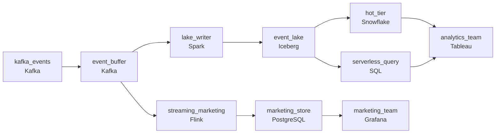

# Two Years of Every Click
_Every click, every aisle, every day for two years._

- **Domain:** pipeline_architecture
- **Difficulty:** Hard
- **Est. time:** 30 min
- **URL:** https://datadriven.io/problems/two_years_of_every_click

## Problem

Our e-commerce site generates 600 million clickstream events per day through Kafka. Analytics needs this data for user behavior analysis, funnel conversion, and A/B test evaluation, and retention policy requires two years of history. Design the storage and ingestion pipeline.

**Concepts tested:** `paBackfill`, `paBatchProcessing`, `paBatchVsStreaming`, `paCompression`, `paDagOrchestration`, `paDataLake`, `paDataQuality`, `paDeduplication`, `paEltVsEtl`, `paEventPlatforms`, `paFullVsIncremental`, `paIdempotency`, `paLateData`, `paMedallion`, `paMonitoring`, `paPartitioning`, `paRetryHandling`, `paSchemaEvolution`, `paSmallFiles`, `paStreamProcessing`, `paTableFormats`

## Requirements

- Most queries hit the last month and need to come back fast; queries on data older than six months are rare but must remain possible.
- During flash sales, marketing watches conversion in near real time; standard analytics tolerates T+1.
- The current bill is unsustainable; the team has been told to bring it down meaningfully without losing query performance for recent data.
- Sales events drive a 10x volume spike; the pipeline can't drop events or fall behind during a sale.

## Must-have components

- Two years of daily clickstream history at this volume can't sit on hot storage at the cost the business will accept. Add a cold-storage / data-lake tier (S3, GCS, ADLS, or a lakehouse format).
- Marketing watches flash sales in near real time while standard analytics tolerates T+1; one shared path either over-spends or under-serves. Show at least one streaming path and at least one batch path.

**Expected stages:** `raw_clickstream_events` → `cleaned_clickstream_events` → `user_sessions` → `funnel_stage_completions` → `experiment_metrics`

## Solution walkthrough

### Why this problem exists in real interviews

Two-year clickstream at 600M events per day with four properties tugging apart: fast recent queries with rare-but-possible older queries, marketing's near-real-time during flash sales, an unsustainable bill that has to come down, and 10x flash-sale spikes the pipeline can't drop. The trap is one warehouse holding two years; cost climbs and queries on older data still scan everything.

The default reach is one warehouse with two-year retention. The bill grows month over month. Queries on older data scan the full table because the layout doesn't match the access pattern. Marketing reads from the same warehouse and the dashboard stutters during a flash sale because the spike saturates compute. A flash sale's 10x burst drops events because nothing buffers.

> **Trick to Solving**
>
> Cold-storage anchor with date partitioning, queue absorbs flash spikes, two cadences for marketing and analytics, recent partitions on a hotter tier.
>
> 1. Most history lives in cheap object storage with date partitioning; recent data is also there but mirrored to a warehouse-grade hot tier for fast recent queries.
> 2. Older queries go through a serverless query engine billed by bytes scanned; rare-but-possible stays cheap.
> 3. Marketing reads a streaming-fed view for near-real-time during flash sales; standard analytics tolerates T+1.
> 4. A queue between events and the consumers absorbs 10x flash-sale spikes; the consumers catch up rather than dropping events.

---

### Walk the requirements

**Step 1: Recent fast, older possible , tier the storage to access pattern**

Most history lives in cheap object storage with date partitioning. Recent data is also there but mirrored to a warehouse-grade hot tier (or the same lake with cluster keys for the common dimensions) so recent queries scan a small slice. Older partitions remain queryable through a serverless engine; older queries are slower and pay per byte scanned but still answerable. A 'one warehouse holds two years' design pays warehouse compute on data nobody touches; the tier is what makes the bill scale with access pattern.

**Step 2: Marketing during flash sales: a streaming path on top of the lake**

Marketing watches conversion in near real time during flash sales. A streaming consumer aggregates events for marketing's view within minutes; standard analytics reads a T+1 batch off the lake. One shared aggregator serving both is the version where standard analytics pays streaming compute or marketing waits for batch; two paths sized for the consumer is the contract.

**Step 3: Bill comes down via partition layout and routing**

Date-partitioned columnar files mean common date-filtered queries scan a slice rather than the full table. Repeated dashboard queries use pre-aggregated rollups so the same scan doesn't run a hundred times a day. Older queries pay for what they scan; recent queries hit the hot tier. The bill comes down because access pattern matches layout, not because the engine got cheaper.

**Step 4: 10x flash-sale spike absorbs in the queue, not in the consumer**

A queue between producers and the consumers buffers spikes; the consumers catch up at their own rate with backpressure visible in queue depth. A 'consumer at peak' approach drops events when the spike exceeds capacity; the queue is what gives the system slack while keeping the SLA for everyone else.

---

### The shape that fits

| node | type | tech | details |
|---|---|---|---|
| kafka_events | source | Kafka | parallelism: 16 partitions |
| event_buffer | queue | Kafka | parallelism: 16 partitions |
| streaming_marketing | transform | Flink | slaFreshness: real-time; idempotencyStrategy: upsert |
| marketing_store | storage | PostgreSQL | slaFreshness: < 1min |
| lake_writer | transform | Spark | slaFreshness: < 15min; backfillStrategy: partition_overwrite |
| event_lake | storage | Iceberg | backfillStrategy: partition_overwrite |
| hot_tier | storage | Snowflake | slaFreshness: < 1h |
| serverless_query | transform | SQL | slaFreshness: < 1h |
| marketing_team | consumer | Grafana | slaFreshness: < 1min |
| analytics_team | consumer | Tableau | slaFreshness: < 1h |

> **What this design gives up**
>
> The tiered layout commits to a query pattern (date and the cluster keys); the streaming path is more compute than batch; the queue costs more than direct writes. Implementation cost is the price; the win is recent queries fast, older queries possible, marketing during flash sales, and a bill that scales with access pattern.

> **What reviewers check**
>
> A reviewer looks at the canvas for these properties:
> - Most history lives in cold storage with date partitioning; recent data also mirrors to a hot tier for fast common queries.
> - A streaming path serves marketing during flash sales; analytics reads on a slower batch path.
> - A queue absorbs flash-sale spikes so events don't drop.
> - Older partitions remain queryable via a serverless engine billed by bytes scanned.

> **The mistake that ships**
>
> What gets shipped puts everything in one warehouse with two-year retention. The bill grows. Older queries scan the full table. Marketing reads from the same warehouse and the dashboard stutters during flash sales. A 10x burst drops events because the consumer can't keep up. The eventual rebuild adds tiered storage, the streaming marketing path, and the buffer.

---

- **A historical query takes too long because the partition column doesn't match the filter. What in this design lets you accelerate it?**
  - _Tests whether the candidate sees the layout knobs available: better partition keys, additional cluster keys on the lake, materialized aggregates over the cold tier, or moving the recurring query onto a path with pre-aggregation. The decision depends on how often the query runs and what it scans._
- **A flash sale's 10x spike lasts an hour. What does this design do during the hour and immediately after?**
  - _Tests whether the candidate sees the queue holding the spike, consumers catching up at their throughput, and queue depth visible to on-call. After the spike, lag shrinks back to baseline; events aren't dropped. The streaming marketing path may show the lag with a freshness flag during the spike's tail._
