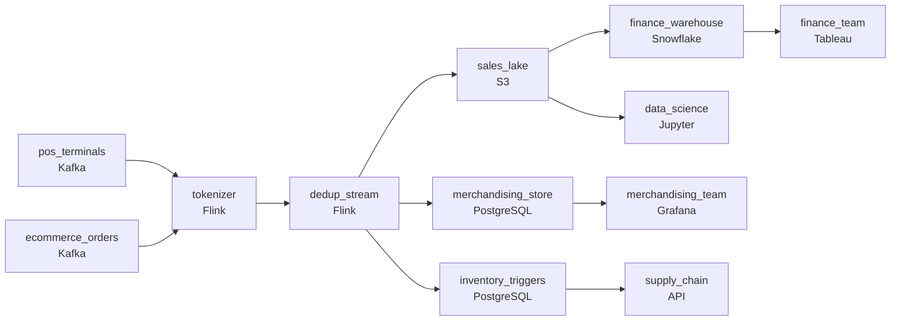

# Under One Roof

- **Domain:** pipeline_architecture
- **Difficulty:** Hard
- **Est. time:** ? min
- **URL:** https://datadriven.io/problems/under_one_roof

## Problem

We run a global retailer with physical stores and e-commerce, and four teams pull the same sales from one long-retention data lake: merchandising watches live performance and needs each transaction within minutes, finance reconciles daily totals, data science trains weekly models, and supply chain fires reorder triggers. Card numbers fall under PCI and can't be written to the lake at all, and both the point-of-sale stream and the e-commerce stream retry, so the same sale can arrive twice. Design the architecture from those two event streams through to each of the four consumers.

**Concepts tested:** `paBatchProcessing`, `paDataLake`, `paDataQuality`, `paDeduplication`, `paEventDriven`, `paFullVsIncremental`, `paIdempotency`, `paLambdaArch`, `paPartitioning`, `paStreamProcessing`

## Requirements

- Merchandising adjusts inventory and pricing on live performance; sales have to land in their dashboard within minutes.
- Merchandising runs interactive dashboards, finance reconciles daily, data science trains weekly, and supply chain reads inventory triggers; one storage layer can't serve all four.
- Card data is regulated; we can't fail a PCI audit on what's stored in the data lake.
- Both ingestion paths can deliver the same sale twice on retry; the merchandising and finance views can't double-count.

## Must-have components

- Merchandising acts in minutes on live performance; the named goal is near-real-time visibility into sales via a streaming data lake. Add a streaming layer on the event sources or set SLA Freshness to real-time / < 1min on the ingestion node.
- Four consumer teams read different shapes of the same data and a long retention is required. Without a cold storage / data-lake tier there's no shared anchor for merchandising, finance, ML, and supply chain. Add S3, GCS, ADLS, or a lakehouse format.

**Expected stages:** `event_sources` → `tokenize_and_dedup` → `sales_lake` → `merchandising_realtime` → `consumer_stores`

## Solution walkthrough

### What this really is

This is a fan-out problem dressed up as retail analytics. You have one sales stream and four query shapes with four cadences, so you need one clean stream feeding several stores. Anyone can draw Kafka into a lake. What separates candidates is where they put the two irreversible steps. Tokenization and dedup have to happen **once, at ingest, before any storage node**. Put them in the lake as a masking view and the auditor finds raw PANs in the underlying files. Dedup per consumer and finance's daily total drifts away from merchandising's live count by exactly the retries.

> **Scrub and collapse once, then fan out**
>
> Both sources feed one tokenizer and one dedup keyed on `transaction_id`. Everything downstream (lake, warehouse, live stores) inherits clean, single-counted, token-only rows, so no consumer can disagree about what a sale is.

### Walk the requirements

**Step 1: Put the tokenizer ahead of every store**

The queue may carry raw card data, but the first storage node may not. Swap the PAN for a token in-stream, so PCI scope shrinks to the tokenizer and its vault instead of every table the sale ever touches.

**Step 2: Dedup on `transaction_id` before fan-out**

POS and e-commerce both retry, so both must converge on the same dedup step. Pair it with an idempotent upsert on the same key, so a replay after a crash rewrites a row instead of adding one.

**Step 3: Give merchandising a real-time path**

`dedup_stream` runs on Flink at real-time freshness and writes straight into `merchandising_store`. The lake is not on this path. Minutes-fresh dashboards cannot wait for a daily partition to land.

**Step 4: Route each team to its own shape**

Finance reads a daily `Snowflake` build from the lake. Data science reads stable lake history for weekly training. Supply chain gets a point-lookup store keyed on SKU for reorder triggers. The lake is the shared long-retention anchor, not the table every team queries.

### The reference design

| node | type | tech | details |
|---|---|---|---|
| pos_terminals | source | Kafka |  |
| ecommerce_orders | source | Kafka |  |
| tokenizer | transform | Flink | errorAction: alert |
| dedup_stream | transform | Flink | slaFreshness: real-time; idempotencyStrategy: upsert |
| sales_lake | storage | S3 | backfillStrategy: partition_overwrite |
| merchandising_store | storage | PostgreSQL | slaFreshness: < 1min |
| finance_warehouse | storage | Snowflake | slaFreshness: < 24h |
| inventory_triggers | storage | PostgreSQL | slaFreshness: < 1min |
| merchandising_team | consumer | Grafana | slaFreshness: < 1min |
| finance_team | consumer | Tableau | slaFreshness: < 24h |
| data_science | consumer | Jupyter | slaFreshness: < 24h |
| supply_chain | consumer | API | slaFreshness: < 1min |

> **A masking view still stores the PAN**
>
> Candidates land raw events in the lake and expose a masked view. The view hides the card number, but the files underneath still hold it, and those files are what the PCI audit reads. Tokenization belongs upstream of `sales_lake`, not on top of it.

| Dedup per consumer | Dedup once at ingest |
|---|---|
| Each store runs its own `DISTINCT` logic with its own window. Finance catches a late retry and merchandising does not, so the two totals never reconcile. | One step keyed on `transaction_id` feeds every store. Downstream upserts on the same key make replays harmless, and every view counts the same sale once. |

> **Name the key before you draw the box**
>
> A dedup node with no key is decoration. Senior candidates say which id collapses a POS retry and an e-commerce retry, and they pair it with idempotent writes so a Flink restart cannot double-count.

> **Four stores cost less than one argument**
>
> More stores means more machinery. But one shared table forces analyst scans, SKU lookups and live dashboards to fight over one layout, and three of the four teams lose that fight.

- **Data science wants original card numbers for fraud features. What does this design allow?**
  - _Tests PCI scope: derive BIN or issuer country at the tokenizer and carry those as fields. Raw PAN access stays a separate, audited path._
- **A late POS retry arrives after the daily finance build. How does the number stay right?**
  - _Tests idempotency plus `partition_overwrite` backfill: rebuild the affected day's partition instead of appending._
