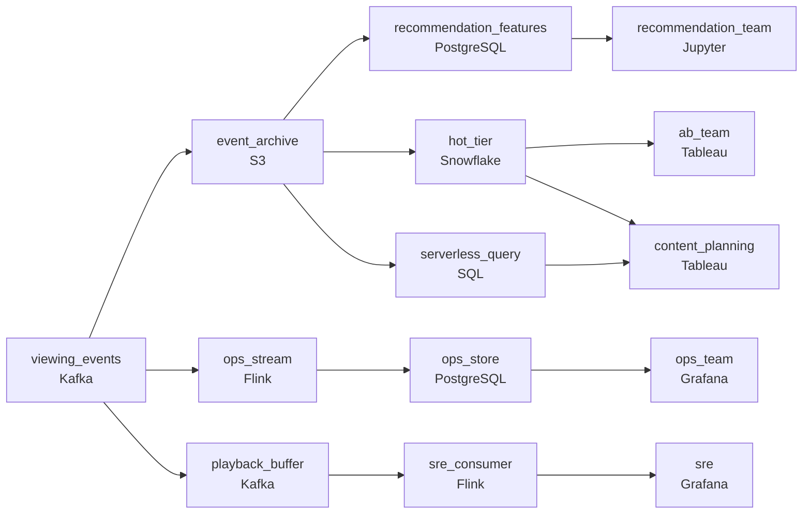

# What Everyone Is Watching
_Someone is watching. Capture everything._

- **Domain:** pipeline_architecture
- **Difficulty:** Hard
- **Est. time:** 30 min
- **URL:** https://datadriven.io/problems/what_everyone_is_watching

## Problem

We need to track what our subscribers are watching. This data feeds everything from our recommendation models to operations dashboards that monitor playback quality in real time. Design a data pipeline for our viewing events.

**Concepts tested:** `paApiIngestion`, `paBatchProcessing`, `paBatchVsStreaming`, `paDataLake`, `paDataQuality`, `paDeadLetterQueue`, `paDeduplication`, `paEventDriven`, `paEventPlatforms`, `paFullVsIncremental`, `paIdempotency`, `paLambdaArch`, `paMonitoring`, `paPartitioning`, `paRetryHandling`, `paStreamProcessing`

## Requirements

- Operations watches concurrent viewer counts during live events and outages; data science training tolerates T+1.
- Operations dashboards, recommendation models, the A/B platform, and content planning each have different access patterns; one storage layer can't serve all four at this scale.
- Most queries hit the last week, some go back ninety days, and queries past that are rare; storage cost dominates and recent queries can't slow down because old data is on hot storage.
- Playback quality events are how SRE detects outages; missing events translate to blind spots that delay incident response.

## Must-have components

- Operations watches concurrent viewers within seconds while training datasets tolerate T+1. One shared path can't satisfy both. Show at least one streaming path and at least one batch path.
- Most queries hit the last week, some go back ninety days, and queries past that are rare; recent fast/old cheap is the cost shape. Without a cold-storage / data-lake tier older data has nowhere cheap to live. Add S3, GCS, ADLS, or a lakehouse format.

**Expected stages:** `event_producers` → `kafka_ingestion` → `stream_processing` → `batch_processing` → `serving_layer`

## Solution walkthrough

### Why this problem exists in real interviews

L6 viewing-event pipeline for a streaming service with four properties: live concurrent counts for ops, four consumer groups with different access patterns, recent-fast/older-rare query economics, and SRE outage detection that can't have blind spots. The trap is one storage layer; cost grows and at least two of the four consumers suffer.

The default reach is one warehouse with retention. Storage cost dominates because hot storage pays for old data that's rarely queried. Recent queries slow as the table grows. Operations during a live event reads the warehouse and the dashboard lags. Playback quality events drop on a streaming hiccup and SRE finds out about the outage from social media.

> **Trick to Solving**
>
> Cold-storage anchor with date partitioning, four consumer paths, recent on a hotter tier, playback events buffered so SRE doesn't go blind.
>
> 1. Most history lives in cheap object storage with date partitioning; recent (last week) mirrors to a hotter tier for fast common queries.
> 2. Four consumer paths off the source: ops streaming for concurrent counts, recommendation features into an online store, A/B platform reading from the warehouse, content planning batch.
> 3. Playback quality events ride a buffered streaming path so SRE detects outages on a sub-minute budget without dropping events.
> 4. Older queries (past ninety days) go through a serverless engine billed by bytes scanned; rare-but-possible stays cheap.

---

### Walk the requirements

**Step 1: Operations during live events on a streaming path; training T+1**

A streaming consumer maintains concurrent viewer counts and updates the ops dashboard within sub-minute. Data science training reads from a T+1 batch off the lake. Without two cadences either ops is on a slow path or training pays streaming compute it doesn't need.

**Step 2: Four consumer paths, four query patterns**

Operations reads the streaming concurrent-counts store; recommendations read pre-computed features from an online store; the A/B platform reads experiment slices from the warehouse; content planning reads weekly aggregates from the lake. All four are derivatives of the same source events; the paths diverge after ingest. Forcing the four onto one shared store means at least three suffer.

**Step 3: Cold-storage anchor; recent fast, older possible**

Most history lives in cheap object storage with date partitioning. Recent (last week) mirrors to a warehouse-grade hot tier for fast common queries; older partitions stay in cold storage and a serverless engine queries them on demand billed by bytes scanned. The bill comes down because hot storage holds only what's accessed often. A 'one warehouse with ninety-day retention on hot' design is the version where the bill grows with retention; tiered storage is the contract.

**Step 4: Playback quality events buffered so SRE doesn't go blind**

Playback quality events drive SRE's outage detection. A queue between the producers and the SRE consumer absorbs streaming hiccups so events don't drop; SRE reads the consumer's output and detects outages on a sub-minute budget. Without the buffer, a streaming hiccup creates a blind spot during the moments SRE most needs visibility; the buffer is what keeps the detection honest.

---

### The shape that fits

| node | type | tech | details |
|---|---|---|---|
| viewing_events | source | Kafka | parallelism: 16 partitions |
| event_archive | storage | S3 | backfillStrategy: partition_overwrite |
| ops_stream | transform | Flink | slaFreshness: real-time; idempotencyStrategy: upsert |
| ops_store | storage | PostgreSQL | slaFreshness: < 1min |
| playback_buffer | queue | Kafka | parallelism: 8 partitions |
| sre_consumer | transform | Flink | slaFreshness: real-time |
| recommendation_features | storage | PostgreSQL | slaFreshness: < 15min |
| hot_tier | storage | Snowflake | slaFreshness: < 1h |
| serverless_query | transform | SQL | slaFreshness: < 1h |
| ops_team | consumer | Grafana | slaFreshness: < 1min |
| sre | consumer | Grafana | slaFreshness: < 1min |
| recommendation_team | consumer | Jupyter | slaFreshness: < 1h |
| ab_team | consumer | Tableau | slaFreshness: < 1h |
| content_planning | consumer | Tableau | slaFreshness: < 24h |

> **What this design gives up**
>
> Four paths is more operational machinery than one shared store; the tiered layout commits to a query pattern; the playback buffer adds infrastructure. Implementation cost is the price; the win is ops live, four consumers each on the right path, a bill that scales with access pattern, and SRE that doesn't go blind during a streaming hiccup.

> **What reviewers check**
>
> A reviewer looks at the canvas for these properties:
> - A streaming path serves operations with sub-minute concurrent viewer counts; data science batch reads on T+1.
> - Four consumer paths off one source, each tuned to its access pattern.
> - Most history lives in cold storage; recent data also mirrors to a hotter tier; older queries go through a serverless engine.
> - Playback quality events ride a buffered path so SRE doesn't lose visibility during streaming hiccups.

> **The mistake that ships**
>
> What gets shipped puts everything in one warehouse with retention. Storage cost grows with retention; recent queries slow; ops during live events sees lag; playback events drop on streaming hiccups and SRE finds out about an outage from social media. The eventual rebuild adds tiered storage, four consumer paths, and the playback buffer.

---

- **A live event drives 10x concurrent viewers. What does this design do, and what does ops see?**
  - _Tests whether the candidate sees the streaming consumer scaling under the spike (with the buffer absorbing it) and ops's dashboard updating with sub-minute lag during the spike. The other consumers are on independent paths and don't slow the ops view._
- **A query against data from over a year ago has to run for an audit. What in this design serves it?**
  - _Tests whether the candidate sees the cold storage as the anchor; the serverless engine queries the older partitions billed by bytes scanned. The query is slower than recent queries and pays for what it scans; the audit gets the answer._
