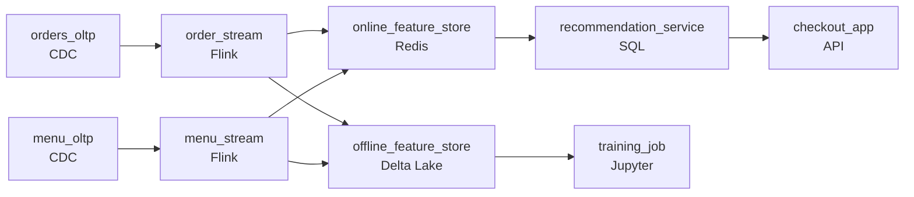

# What Should We Recommend Tonight
_They ordered pad thai twice. That means something._

- **Domain:** pipeline_architecture
- **Difficulty:** Hard
- **Est. time:** 25 min
- **URL:** https://datadriven.io/problems/what_should_we_recommend_tonight

## Problem

We run a meal kit delivery service and want to personalize recipe recommendations for each customer. We have two rich data sources: customer order history and our full menu catalog with nutritional and ingredient data. The recommendations team needs a feature store they can query in real time, but right now orders and menu updates live in separate operational systems that are never joined. Design the ingestion and feature pipeline.

**Concepts tested:** `paApiIngestion`, `paBatchProcessing`, `paDagOrchestration`, `paDataQuality`, `paDeadLetterQueue`, `paDeduplication`, `paEltVsEtl`, `paFileIngestion`, `paFullVsIncremental`, `paIdempotency`, `paMonitoring`, `paPartitioning`, `paRetryHandling`, `paScdPipeline`, `paSchemaEvolution`, `paTableFormats`

## Requirements

- The recommendation model runs at checkout and customers are waiting; the result has to feel instant.
- When a menu item gets a new allergen, recommendations to allergic customers have to reflect that change quickly; an unsafe recommendation is a real problem.
- When the model retrains, training rows for an old order have to use the menu and ingredients as they were on that order's date, not as they are now.
- When 10% of users are on a new model variant, both variants have to read the same feature values for the same user; otherwise the experiment is biased.

## Must-have components

- Recommendations need an offline feature store (training) and an online feature store (serving); those are different freshness tiers. Show at least one streaming path and at least one batch path.
- When a menu item gets a new allergen, recommendations to allergic customers have to reflect the change quickly; batch propagation is a safety problem. Add a streaming path on menu changes or set SLA Freshness to real-time / < 1min on the menu-feature path.

**Expected stages:** `order_ingestion` → `menu_ingestion` → `feature_computation` → `feature_store` → `recommendation_serving`

## Solution walkthrough

### What this really is

This is a dual-store feature platform with a food-safety clock bolted on. Anyone can draw orders and menu flowing into one table the model reads. The real test is seeing that **one store cannot serve two masters**: checkout needs today's value in tens of milliseconds, and training needs the value as it was on each order's date. Collapse them into a nightly join and three things break together. An allergen added at noon keeps being recommended to allergic customers until tomorrow. Training joins today's menu onto last year's orders and learns the future. Checkout waits on a warehouse query.

> **Split by reader, not by source**
>
> Stop organizing around orders and menu. Organize around who reads. The checkout path reads current values from an online store. The training path reads history from an offline store with effective dates. Both are fed by the same stream jobs, so one feature definition produces both copies and they cannot drift apart.

### Walk the requirements

**Step 1: Precompute for checkout**

Customer and item features live in `online_feature_store`, keyed for point lookups. The service fetches them, the model scores, and the page renders inside its budget. Computing features at request time is the design where checkout hangs at dinner rush.

**Step 2: Stream the menu, because allergens are a safety clock**

`menu_stream` tails menu CDC and upserts the item row in the online store within a minute. The same event lands in `offline_feature_store` with its effective date. A nightly refresh here is not a freshness tradeoff; it is an unsafe-recommendation window.

**Step 3: Join training rows as of the order date**

Training reads each historical order against the menu state on `order_date`, not the latest row. That only works if the offline store kept every version, which is why the stream appends history there instead of overwriting.

**Step 4: Read features once per request**

`recommendation_service` fetches the user's features once and hands the same values to whichever variant scores. Two variants with two reads, or two caches, means the experiment measures cache timing as well as the model.

| node | type | tech | details |
|---|---|---|---|
| orders_oltp | source | CDC |  |
| menu_oltp | source | CDC |  |
| order_stream | transform | Flink | slaFreshness: real-time; idempotencyStrategy: upsert |
| menu_stream | transform | Flink | slaFreshness: real-time; idempotencyStrategy: upsert |
| online_feature_store | storage | Redis | slaFreshness: < 1min |
| offline_feature_store | storage | Delta Lake | backfillStrategy: partition_overwrite |
| recommendation_service | transform | SQL | slaFreshness: real-time |
| training_job | consumer | Jupyter | slaFreshness: < 24h |
| checkout_app | consumer | API | slaFreshness: real-time |

| One nightly table | Online plus offline store |
|---|---|
| Checkout queries the warehouse. A noon allergen change waits for tomorrow's run. Training joins the current menu onto old orders, so offline metrics beat production. | Checkout hits `online_feature_store` in milliseconds. `menu_stream` pushes allergens in under a minute. `training_job` reads `offline_feature_store` as of each `order_date`. |

> **An as-of join needs history you kept**
>
> Candidates draw a Delta Lake offline store and say 'point-in-time' but have the stream upsert the latest row there too. Then nothing is left to join against. The online store upserts; the offline store appends versions with effective dates.

> **Allergens change the SLA argument**
>
> The senior tell is refusing to treat menu freshness as a nice-to-have. Say out loud that the allergen path is a safety requirement, so it earns streaming, while a heavy batch feature can stay nightly in the same store.

- **A new feature needs a heavy nightly computation. How does it still serve at checkout latency?**
  - _Freshness is per feature: batch computes it, writes `online_feature_store`, and reads stay milliseconds._
- **`menu_stream` is down for 20 minutes during an allergen update. What do you want to happen?**
  - _Tests whether the candidate alerts on stream lag and fails safe by suppressing affected items rather than serving stale rows._
