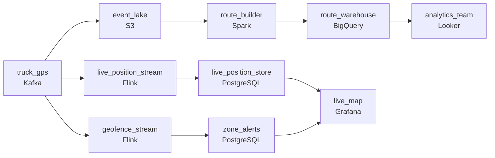

# Where Is Every Truck, Right Now
_Trucks are moving. Every ping counts._

- **Domain:** pipeline_architecture
- **Difficulty:** Medium
- **Est. time:** 20 min
- **URL:** https://datadriven.io/problems/where_is_every_truck_right_now

## Problem

We operate a last-mile delivery fleet and need to know where every truck is at all times. The operations team wants live tracking on a map and the analytics team needs historical route data for efficiency analysis. Design a pipeline to ingest GPS tracking data from our trucks.

**Concepts tested:** `paBatchVsStreaming`, `paColumnarVsRow`, `paDataLake`, `paDataQuality`, `paDeadLetterQueue`, `paDeduplication`, `paEltVsEtl`, `paEventDriven`, `paEventPlatforms`, `paFullVsIncremental`, `paIdempotency`, `paKappaArch`, `paLateData`, `paMonitoring`, `paPartitioning`, `paRetryHandling`, `paScdPipeline`, `paSchemaEvolution`, `paSmallFiles`, `paStreamProcessing`, `paTableFormats`

## Requirements

- Operations watches every truck on a live map; a position has to appear there within seconds of the truck moving.
- Trucks lose connectivity in tunnels and rural areas; when they reconnect and dump buffered events, the route history has to come out right.
- Operations needs to know when a truck enters or leaves a delivery zone; today they're reading positions off the map manually.

## Must-have components

- Operations watches a live map and analytics runs nightly on historical routes; one shared cadence can't satisfy both economically. Show at least one streaming path and at least one batch path.
- Analytics queries average route time, idle time, and on-time delivery from a warehouse. Without a warehouse tier the analytics team has nowhere to query historical routes. Add BigQuery, Snowflake, Redshift, or Databricks.

**Expected stages:** `gps_device_stream` → `streaming_ingestion` → `stream_processor` → `real_time_serving` → `warehouse_sink`

## Solution walkthrough

### Why this problem exists in real interviews

Two consumers, two latency budgets, and a connectivity reality that punishes naive event-time semantics. Ops wants positions on a map in seconds; analytics wants accurate historical routes from data that came in out of order because trucks went through tunnels. The trap is one path that satisfies the map and corrupts the route, or two paths that each get half the answer right.

Most candidates draw one stream from trucks into a position store the map reads, with a side write to a warehouse. Ops is happy. A truck loses signal in a tunnel and dumps an hour of buffered events when it reconnects; the streaming consumer treats them as 'now' and the warehouse takes them as 'now' too, so the historical route looks like the truck teleported back and forth. Operators try to figure out which trucks are in which zones by eye because nothing is detecting zone entry and exit.

> **Trick to Solving**
>
> Two paths off one stream, event-time ordering on replay, geofencing as a stream-side detection, not a manual eye-check.
>
> 1. A streaming path feeds the live map within seconds; a batch path lands events into the warehouse for analytics on a slower cadence.
> 2. Every event carries `event_time` stamped at the truck. The warehouse partitions and queries on `event_time`; replayed events for a truck are sorted by `event_time` before they land in the route history.
> 3. Geofencing runs as a stream-side detection: per truck, compare current position against zone boundaries, emit zone-entry / zone-exit events when state changes.

---

### Walk the requirements

**Step 1: Live map within seconds, analytics on a slower path**

GPS pings flow through a queue and a stream processor that updates the live position store. Ops's map reads from there; end-to-end is sub-minute. The same events also land in cold storage and a batch loader builds the warehouse route history. Two paths off one source, sized for two consumers. Without two cadences either ops is stuck on a slow map or analytics is paying streaming compute they don't need.

**Step 2: `Event_time` on every event so replay sorts back into the right route**

Each ping carries `event_time` stamped at the truck. The warehouse partitions and queries on `event_time`; the route-builder sorts a truck's events by `event_time` before stitching them into a route, regardless of arrival order. A truck that buffered events in a tunnel and replays them an hour later still produces a smooth route because the events sort back into place. Treating arrival time as canonical is the version where the route looks like the truck teleported.

**Step 3: Geofencing on the stream, zone alerts to ops**

A stream-side detection compares each truck's position against zone boundaries on every ping. When the truck's zone state changes (entered, left), an event is emitted to an ops alert path. Ops sees zone entry and exit on its dashboard, not by comparing positions by eye. The detection is stateful per truck (you have to remember the previous zone) but cheap; the alternative is the operator's eye, which is the named problem.

---

### The shape that fits

| node | type | tech | details |
|---|---|---|---|
| truck_gps | source | Kafka | parallelism: 8 partitions |
| live_position_stream | transform | Flink | slaFreshness: real-time; idempotencyStrategy: upsert |
| live_position_store | storage | PostgreSQL | slaFreshness: < 1min |
| geofence_stream | transform | Flink | slaFreshness: real-time |
| zone_alerts | storage | PostgreSQL | slaFreshness: < 1min |
| event_lake | storage | S3 | backfillStrategy: partition_overwrite |
| route_builder | transform | Spark | slaFreshness: < 24h; idempotencyStrategy: upsert |
| route_warehouse | storage | BigQuery | slaFreshness: < 24h; backfillStrategy: partition_overwrite |
| live_map | consumer | Grafana | slaFreshness: real-time |
| analytics_team | consumer | Looker | slaFreshness: < 24h |

> **What this design gives up**
>
> Two paths off one stream is more pieces than one shared consumer. Event-time ordering on replay means the route-builder can't write final routes until a watermark passes, which adds latency to the analytics view. Stream-side geofencing maintains state per truck. Operational complexity is the cost; the win is a live map that's actually live, a route history that survives connectivity gaps, and zone alerts that don't depend on an operator looking at the screen.

> **What reviewers check**
>
> A reviewer looks at the canvas for these properties:
> - A streaming path serves the live map and zone alerts within seconds.
> - A batch path builds the route history in a warehouse, with events sorted by event-time so replays from buffered offline trucks land in the right route.

> **The mistake that ships**
>
> What ends up in production uses one stream into a position store with a side write to a warehouse keyed on arrival time. Ops sees positions on a map. A truck loses signal in a tunnel and dumps an hour of pings on reconnect; the warehouse records them as a sequence of pings 'happening now,' so the route shows the truck teleporting. An operator misses a zone entry because they were watching a different truck. The team rebuilds with `event_time` ordering and stream-side geofencing. The route history sits corrupted for the weeks before the rebuild, and an operator's missed zone alert sits in someone's postmortem.

---

- **A truck buffers a few hours of events offline and replays them after the `route_builder` has already produced today's routes. What in this design lets the late events update the right route?**
  - _Tests whether the candidate sees the `route_builder`'s idempotency: the late events land in the lake's `event_time` partition (yesterday's), and a rebuild of that day's routes pulls them in. The `route_warehouse`'s partition for that day is replaced with the corrected route._
- **Operations adds a new zone in real time on the map. What in this design absorbs that, and what doesn't?**
  - _Tests whether the candidate sees zone definitions as state the `geofence_stream` has to read; updating the zone definitions live means the next ping evaluates against the new boundaries. Historical zone-entry events are not retroactively re-evaluated unless the `route_builder` is replayed against the new zones._
