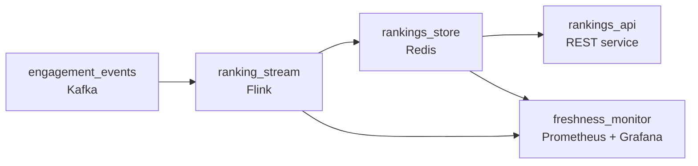

# Where the Crowd Goes

- **Domain:** pipeline_architecture
- **Difficulty:** Medium
- **Est. time:** 30 min
- **URL:** https://datadriven.io/problems/where_the_crowd_goes

## Problem

We run a live-shopping marketplace where the home screen shows a leaderboard of the hottest livestreams right now, scored by live engagement like viewers joining, bids landing, and reactions. Design the pipeline behind the API that serves this leaderboard: millions of clients poll it, and a stream that was quiet a minute ago can suddenly spike, so the board has to reflect engagement within seconds while read traffic never stalls the ranking updates.

**Concepts tested:** `paApiIngestion`, `paDataQuality`, `paDeadLetterQueue`, `paDeduplication`, `paEventDriven`, `paEventPlatforms`, `paIdempotency`, `paLateData`, `paMicroBatchVsTrue`, `paMonitoring`, `paPartitioning`, `paRetryHandling`, `paStreamProcessing`

## Requirements

- When a stream starts popping off, it should climb the board almost immediately, not on the next hourly refresh.
- The whole app hits this endpoint constantly and read traffic keeps growing; it can't get slower or knock out the ranking updates when everyone opens the app at once.
- During a big drop we get sudden floods of activity, and if a processor restarts we can't just lose those events.
- The worst case is the board looks fine but is frozen ten minutes behind reality and nobody notices.

## Must-have components

- Engagement events (joins, bids, reactions) arrive as a firehose and spike unpredictably. Put a durable queue in front so the ranking compute can absorb bursts and replay after a restart instead of dropping events.
- Rankings have to move within seconds of engagement, so scores are computed in a streaming job over a sliding window, not in a nightly batch. Add a streaming processor.
- A stream that was quiet a minute ago can spike; the board must reflect that within seconds. Mark the ranking path with a sub-minute freshness tier.
- Millions of clients poll the leaderboard. Serve reads from a low-latency serving store holding precomputed scores, so the API never recomputes rankings per request.
- The streaming job must write computed scores INTO the serving store the API reads. Without that edge, the serving store is stranded and rankings never update.

**Expected stages:** `Engagement event ingest` → `Ranking stream processor` → `Rankings serving store` → `Rankings REST API` → `Freshness monitoring`

## Solution walkthrough

### Why this problem exists in real interviews

The prompt says 'design a REST API for rankings' and that framing is the trap. Candidates spend the hour on request/response shapes, auth, and pagination, and never notice that the whole difficulty lives BEHIND the endpoint. This is a freshness-versus-read-scale problem wearing an API costume: millions of clients poll a board that must move within seconds of a live spike. The moment you decide the API computes rankings, you have coupled read QPS to compute cost and you lose both. The real question is whether you split the system into a streaming path that decides WHAT the ranking is and a serving path that decides how fast you can HAND IT OUT.

The naive design has the API query the event store and rank on the fly. It demos fine with one viewer. At a few million pollers every few seconds, the ranking query fans out over the raw event volume on every request, p99 latency detonates, and the same database that computes rankings is now getting hammered by reads, so freshness dies exactly when engagement is highest. You cannot cache your way out either, because a cache short enough to feel live is a cache that never hits.

> **Trick to Solving**
>
> Separate 'what is the ranking' from 'how fast can I serve it.' Compute scores ONCE in a streaming job; serve them MANY times from a read store.
>
> 1. A stream processor keeps a sliding window of engagement velocity per stream and continuously publishes top-N scores.
> 2. A low-latency serving store holds those precomputed scores; the API does a cheap keyed read, never a ranking computation.
> 3. Read spikes hit the serving store, not the compute path, so a flood of pollers can never stall the freshness of the board.

---

### Break down the requirements

**Step 1: Buffer the engagement firehose**

Joins, bids, and reactions arrive in the hundreds of thousands per second and spike hard during a drop. Land them in a durable queue first. That gives the stream processor a shock absorber for bursts and, just as important, a replay log: when the processor restarts mid-drop, it resumes from its offset instead of dropping the exact window of events that mattered most.

**Step 2: Score on a sliding window, not a running total**

'Hot right now' is engagement VELOCITY over a recent window (say 1 to 5 minutes), not lifetime popularity, or the same big sellers sit on top forever. Use a sliding window so a stream that was quiet a minute ago climbs within seconds of spiking. A tumbling window would make the board jump at boundaries; sliding keeps it smooth. Rankings are an approximate ordering, so at-least-once with idempotent aggregation is enough; do not spend an exactly-once budget reshuffling a board every few seconds.

**Step 3: Publish scores to a read-optimized serving store**

The stream processor writes the current top-N (globally and per category/region) into a low-latency serving store. The API's job shrinks to a keyed lookup that returns in single-digit milliseconds. This is the load-bearing decision: the store decouples read scale from compute, so the endpoint holds its latency budget under millions of pollers while the streaming job independently keeps the numbers fresh.

**Step 4: Make staleness loud, and degrade gracefully**

The dangerous failure is a frozen board still returning 200s. Track event-processing lag and ranking freshness; alert when the window falls behind. Because reads come from the serving store, an outage in the compute path degrades to a stale-but-available board carrying a freshness timestamp, which beats an outage as long as you actually measure and surface the staleness.

---

### The shape that fits

| node | type | tech | details |
|---|---|---|---|
| engagement_events | source | Kafka | parallelism: high-partition |
| ranking_stream | transform | Flink | slaFreshness: real-time |
| rankings_store | storage | Redis | slaFreshness: < 1min |
| rankings_api | consumer | REST service | slaFreshness: < 1min |
| freshness_monitor | consumer | Prometheus + Grafana | monitorAlert: Ranking window lag above threshold |

> **Scale + Cost**
>
> The read side scales with the serving store: a keyed top-N lookup is O(1)-ish and holds sub-100ms p99 at millions of pollers regardless of event volume. The compute side scales with engagement, sized by queue partitions and stream parallelism. Cost concentrates in the streaming job's state (windowed aggregates across tens of thousands of live streams), not in serving. The bottleneck to watch is stream-processor lag during a viral drop, which is exactly why freshness is a first-class metric.

> **Interviewers Watch For**
>
> The tell of a strong candidate is that they split compute from serving without being asked, and can say WHY: read QPS and freshness are different budgets served by different components. Bonus signals: sliding vs tumbling window reasoning, at-least-once being acceptable for an approximate ranking, and treating staleness as a monitored SLA rather than assuming the pipeline is always live.

> **Common Pitfall**
>
> Ranking inside the API request. It passes the demo and dies in production: every poll recomputes over raw events, so read traffic and freshness fight over the same database and both lose under load. The second pitfall is a board that fails silently: no lag metric, so a stalled streaming job serves a frozen leaderboard that still returns 200s and nobody notices until users do.

---

- **A single mega-stream draws 20x the viewers of anything else and its partition becomes a hotspot that lags the whole job. How do you keep it from stalling everyone else's rankings?**
  - _Tests key-skew remediation: sub-keying or salting the hot stream, isolating its aggregation, or pre-aggregating hot keys so one viral room doesn't back up the window for tens of thousands of others._
- **Product now wants rankings personalized per viewer instead of one global board. What in this design changes, and what breaks?**
  - _Tests whether the candidate sees that a single precomputed top-N no longer serves everyone: they need per-segment precomputation plus a feature/serving layer, and must reason about the explosion in serving-store cardinality versus computing a personalized re-rank at read time._
