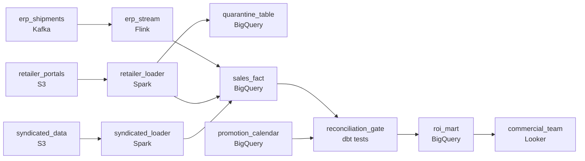

# Which Promotion Is Actually Working
_Was the promotion worth it? The data knows._

- **Domain:** pipeline_architecture
- **Difficulty:** Hard
- **Est. time:** 10 min
- **URL:** https://datadriven.io/problems/which_promotion_is_actually_working

## Problem

We're a consumer goods company running dozens of trade promotions at once across hundreds of retail partners, and the commercial team needs promotion ROI fresh enough to cut the ones that are wasting money. Shipment events stream out of our ERP in near-real time, retailer sell-through arrives as daily files, and third-party market data lands once a week, and all of it converges in an analytics warehouse where every sale is credited to the promotion that was running when it happened. The retailer files are messy (duplicate rows and bad product codes), so the bad rows have to be set aside for review rather than dropped, and before the ROI numbers go out they have to reconcile against ERP shipment totals. Design the ingestion and warehouse architecture, keeping each source on a cadence that matches how fresh its consumer needs it.

**Concepts tested:** `paApiIngestion`, `paBatchProcessing`, `paBatchVsStreaming`, `paDataQuality`, `paDeadLetterQueue`, `paDeduplication`, `paEltVsEtl`, `paEventDriven`, `paFileIngestion`, `paFullVsIncremental`, `paIdempotency`, `paLambdaArch`, `paLateData`, `paMedallion`, `paMonitoring`, `paPartitioning`, `paRetryHandling`, `paStreamProcessing`

## Requirements

- Commercial analytics wants to know which promotions are working and which are wasting money, with data fresh enough to act on.
- A sale during a promotion has to be credited to the promotion that was running at the time, not whatever promotion is active now.
- Finance can't sign off on sales numbers that don't reconcile to the ERP shipment totals.
- Retailer files contain duplicate rows and bad product codes; the commercial team wants to review them, not have them silently dropped.

## Must-have components

- Commercial analytics queries promotion ROI from a warehouse; without a warehouse tier, there's nowhere for the unified sales fact, the promotion calendar dimension, or the ROI mart to live. Add a warehouse (BigQuery, Snowflake, Redshift, or Databricks).
- ERP shipments need near-real-time visibility while syndicated market data only arrives weekly. One shared cadence under-serves the fast source or wastes compute on the slow one. Show at least one streaming path and at least one batch path.

**Expected stages:** `retailer_sales_raw` → `erp_shipment_events` → `promotion_calendar` → `trade_promotion_fact` → `roi_analytics_mart`

## Solution walkthrough

### The real problem

This is a point-in-time join across four sources on four different clocks, dressed as promotion ROI. The skill: credit every sale to the promotion that was running when it happened, and reconcile the total to the ERP before anyone reads it. The trap is treating the four sources as one nightly load and the join as 'pick today's promotion.' Both shortcuts produce numbers that look right and aren't: a sale gets this week's promotion instead of last week's, and finance's total quietly excludes whatever the validator dropped.

> **Per-source cadence, as-of join, reconcile before publish**
>
> Three moves crack it. Each source lands in the warehouse on its own cadence (ERP near real-time, retailer files hourly, syndicated weekly). Sales join the promotion calendar as a slowly-changing dimension on `sale_date BETWEEN valid_from AND valid_to`, not on the current promotion. Reconciliation against ERP shipments is a `quality_gate` that halts the run, not a report emailed after the fact. Bad retailer rows go to a quarantine table; the good rows keep moving.

---

### Walk the requirements

**Step 1: Each source on its own cadence into the warehouse**

ERP shipments stream near real-time; retailer files arrive hourly; syndicated data lands weekly. Each gets its own loader writing to a staged table, and the unified `sales_fact` reads from all three. One shared schedule wastes compute on the weekly source and starves the streaming one; per-source cadence sizes the work to the consumer that needs it. The warehouse tier is where the fact, the calendar, and the ROI mart live.

**Step 2: Attribute each sale to the promotion running then**

Promotions are a slowly-changing dimension keyed on (`promotion_id`, `valid_from`, `valid_to`). A sale joins on `sale_date BETWEEN valid_from AND valid_to`, so a late sale from last week still gets last week's promotion. Joining on 'the current promotion' mis-credits every prior sale the moment a new promotion starts.

**Step 3: Reconcile to the ERP as a gate, not a comment**

Before `roi_mart` publishes, a check compares pipeline sales totals to ERP shipment totals for the same window. If the gap exceeds tolerance the run halts and pages, so no half-published mart. Finance reads the published numbers; if they don't match the ERP, finance stops trusting the warehouse. The gate in the run is what keeps that trust.

**Step 4: Quarantine bad partner rows; keep the good ones moving**

Retailer files carry duplicate rows and bad product codes. Validation routes those to a quarantine table with a rejection reason; the rest of the file continues into `sales_fact`. The commercial team triages the quarantine on their own time. Silently dropping the bad rows loses count of the problem and leaves finance reconciling against a total that quietly excluded part of the file.

---

### The shape that fits

| node | type | tech | details |
|---|---|---|---|
| erp_shipments | source | Kafka |  |
| retailer_portals | source | S3 |  |
| syndicated_data | source | S3 |  |
| erp_stream | transform | Flink | slaFreshness: real-time |
| retailer_loader | transform | Spark | slaFreshness: < 1h |
| syndicated_loader | transform | Spark | slaFreshness: < 24h |
| quarantine_table | storage | BigQuery |  |
| sales_fact | storage | BigQuery |  |
| promotion_calendar | storage | BigQuery |  |
| reconciliation_gate | quality_gate | dbt tests |  |
| roi_mart | storage | BigQuery | slaFreshness: < 1h |
| commercial_team | consumer | Looker | slaFreshness: < 1h |

> **What this design gives up**
>
> Per-source cadence means ingest infra and monitoring per source instead of one nightly load. The range-based as-of join costs more than an equi-join. Reconciliation as a gate halts everything on a mismatch, louder than a quiet drift. You trade pipeline simplicity and steady-flow availability for numbers that reconcile and a commercial team that trusts them.

> **What reviewers check on the canvas**
>
> Each source ingests on its own cadence and converges in a unified warehouse fact. Sales join `promotion_calendar` as a slowly-changing dimension at sale-time. A `reconciliation_gate` compares pipeline totals to the ERP before `roi_mart` publishes. Invalid retailer rows route to a quarantine without halting the rest of the file.

> **The version that ships and gets walked back**
>
> The first cut runs one nightly load over all three sources, joins sales to the current promotion, silently filters bad rows, and writes `roi_mart` with no reconciliation. Commercial calls a promotion a winner on mis-credited sales; finance signs off a quarter, then a manual ERP comparison finds a gap. The rebuild treats per-source cadence, the as-of join, and the gate as load-bearing, not afterthoughts.

---

- **A syndicated file lands twice in a week with overlapping rows. What protects you here, and what doesn't?**
  - _Tests whether they see the upsert sink dedups exact-id duplicates but not same-key rows with different values; the fix is a deterministic source-of-truth ranking or quarantining the conflicts._
- **Commercial wants intra-day ROI for one high-value promotion while everything else stays as-is. What changes?**
  - _Tests scaling freshness without rebuilding: a partial materialization on the streaming side for that promotion's sales, joined against the same `promotion_calendar`._
